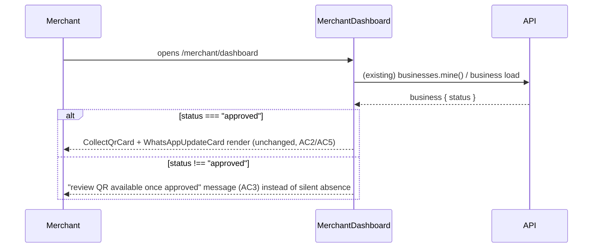

# Slice: S-077 — Merchant review-collection QR: reproduce reported regression, then fix

| Field | Value |
|-------|-------|
| **Slice ID** | S-077 |
| **Phase** | 2 Core |
| **Status** | Accepted |
| **Role(s)** | merchant |
| **Owner** | PM / 2026-08-19 |

---

## User story

**As a** merchant
**I want** to understand — and, if it's actually broken, have fixed — why my review-collection QR code card is missing from my dashboard
**So that** I can trust the feature is either working as intended or genuinely gets fixed, instead of guessing why it disappeared

---

## Background / context

Roadmap item **C2** (`#22`). A regression was reported: the merchant "collect review via QR code"
card (`CollectQrCard.tsx`) is missing or broken. Exploration found **no commits since the file's
introduction (2026-08-16) have touched `CollectQrCard.tsx`** — there is no evidence of a code-level
regression. Reading `MerchantDashboard.tsx` confirms the card is conditionally rendered:

```
{status === "approved" && (
  <>
    <CollectQrCard businessId={business.id} businessName={business.name} />
    <WhatsAppUpdateCard businessId={business.id} businessName={business.name} />
  </>
)}
```

i.e. the QR card (and the WhatsApp card, see S-078) only render at all when the merchant's selected
business has `status === "approved"`. A merchant whose business is `pending`, `rejected`, or
`suspended` will not see the card, and — critically — will not see *any explanation* for why it's
missing; the section simply doesn't exist on the page. This is the leading hypothesis for the
"missing/broken QR" report, but it is a hypothesis, not a confirmed root cause. Per this repo's
verification approach for this exact roadmap item, **the reported broken state must be reproduced
in a running app before any fix is written** — it may turn out there is no bug at all (working as
designed, but with a UX/messaging gap), or reproduction may surface something the code read above
didn't catch (e.g. a business incorrectly stuck out of `approved` status, or a genuine rendering
error).

---

## Acceptance criteria

1. **Given** a fresh dev environment, **when** the Builder/Tester logs in as a merchant whose selected business has `status !== "approved"` (e.g. `pending`), **then** it is reproduced and explicitly recorded (in this slice's test report) whether the review-QR card is simply absent — with no code error — because of the existing `status === "approved"` gate in `MerchantDashboard.tsx`. This reproduction step must be completed and its result documented **before** any fix code is written.
2. **Given** the same dev environment, **when** the Builder/Tester logs in as a merchant whose selected business has `status === "approved"`, **then** the review-QR card renders and functions exactly as designed today: a scannable QR encoding `/collect/{businessId}`, the business name in the heading copy, and a working "Print for shop" action — confirming there is no regression for approved businesses.
3. **Given** reproduction (AC1) confirms the root cause is the approval-status gate and not a code defect, **when** a merchant with a non-approved business views their dashboard, **then** they see a clear, dedicated message explaining why the QR isn't available yet (e.g. "Your review QR code will be available once your business is approved"), replacing the current silent absence of the section with an explicit reason.
4. **Given** reproduction instead reveals a different root cause (e.g. an actual rendering/runtime error, a business incorrectly stuck in a non-approved status that should already be `approved`, or a broken `business.status` read), **then** this slice's fix targets that actual root cause instead of AC3's messaging fix, and the test report explicitly states which branch applied (AC3's "working as designed, messaging gap" vs. a genuine bug) with supporting evidence (console errors, network trace, or business-record state observed).
5. **Given** a merchant with an approved business who has an existing, unmodified QR card, **when** they view it after this slice ships, **then** its appearance and behavior are unchanged from before this slice (no visual or functional regression to the AC2 baseline).
6. **Given** the AC3 messaging is implemented (if that branch applies), **when** the copy is written, **then** it does not use AI-suggestion language (this is a static status message, not AI-generated output) and matches the tone/placement conventions already used for the existing "Awaiting approval" business-status messaging shown near the top of `MerchantDashboard.tsx` for pending businesses.

---

## UX notes

- Screens / routes: `/merchant/dashboard` only (`MerchantDashboard.tsx`, `CollectQrCard.tsx`). No new routes.
- Components to reuse: `CollectQrCard.tsx` itself (fix/extend, don't replace); the existing pending-business banner pattern already on the dashboard as a tone/placement reference for AC3's messaging, if that branch applies.
- Empty states / errors: AC3's "not approved yet" message is itself the new empty-state copy for this card slot — no blank space, no raw error.
- AI disclaimer required? No — this slice touches no AI-generated content.

---

## Out of scope

- Changing which business statuses grant access to the QR card (e.g. allowing `pending` businesses to generate a QR before approval) — approval remains a hard requirement; this slice only concerns whether/why the merchant sees or doesn't see the card, not loosening the gate.
- Any change to the public `/collect/{businessId}` review-submission flow itself — that's S-040's territory and is not touched here.
- Building a general onboarding/progress panel — a related but separate concern already tracked under S-074 (left info panel).
- Backend changes — reproduction and the code read so far both point to a frontend-only conditional-render/messaging issue; if AC4's alternate branch reveals a backend defect, the Architect's technical spec should scope that explicitly rather than this brief assuming it.

---

## Dependencies

- S-040 (Review collection QR / public wizard) — Accepted. This slice investigates and, if needed, fixes messaging/behavior around the merchant-facing card S-040 shipped; it does not change the public collection flow.

---

## Definition of done (PM)

- [ ] All AC verified in test report (including the reproduction findings from AC1/AC4)
- [ ] UX matches notes above
- [ ] Documented in `README.md` §7 API reference / §8 Frontend guide if new patterns
- [x] PM Status set to **Accepted**

---

## Technical specification (Architect)

Reproduction-first: this spec defines what must be checked/logged during reproduction (AC1/AC2)
before defining the messaging-fix implementation (AC3), and states what the alternate-branch fix
would look like if reproduction instead surfaces a genuine defect (AC4) — without presupposing
which branch applies. `CollectQrCard.tsx` itself calls no API (it derives its QR value client-side
from `businessId` — `${origin}/collect/${businessId}` — and reads no props beyond `businessId`/
`businessName`), so there is no backend endpoint to inspect for this slice; the only server-side
fact relevant to reproduction is the `business.status` value already returned by
`GET /businesses/mine` / whichever call populates `owned`/`business` in `MerchantDashboard.tsx`.

### Reproduction checklist (must run and be recorded before any fix code, per AC1/AC4)

1. Log in as a merchant whose selected business has `status !== "approved"` (create/use a
   `pending` business — the most common non-approved state per `BusinessStatus`). Open
   `/merchant/dashboard`, open browser devtools console and network tab.
2. Confirm in the rendered DOM: is the `<CollectQrCard>`/`<WhatsAppUpdateCard>` grid section
   (`{status === "approved" && (...)}` in `MerchantDashboard.tsx`, ~line 313) present or absent?
   Record the observed `business.status` value from the React state / network response for
   `businesses.mine()` at the moment of the check — confirm it actually matches what the merchant's
   business record holds (rules out a stale-client / stuck-status defect per AC4's alternate
   branch).
3. Check the console for any error, warning, or failed network request tied to `CollectQrCard` or
   its parent render — confirms or rules out a rendering/runtime error (AC4's other alternate
   branch).
4. Repeat with a business at `status === "approved"`: confirm the QR card renders, the QR encodes
   `${origin}/collect/{businessId}` (verify against the rendered `<p>` text and/or by decoding the
   SVG's QR payload), `businessName` appears correctly in the card heading, and "Print for shop"
   opens a populated print window (AC2).
5. Record all of the above (DOM presence/absence, console output, network payload's `status`
   field, QR content, print behavior) in the test report as the evidence AC4 requires, then state
   explicitly which branch applies: "AC3 branch — approval-status gate confirmed, no code defect"
   or "AC4 alternate branch — [specific defect found]".

### API contract

No new/changed endpoints in the AC3 (expected) branch — N/A. `CollectQrCard.tsx` makes no API
calls today and none are added; the fix is a conditional-render/messaging change in
`MerchantDashboard.tsx` only. The `business.status` value it branches on is already returned by
the existing `businesses.mine()` / business-detail calls `MerchantDashboard.tsx` already uses to
populate `owned`/`business` — no new field needed.

If reproduction instead confirms AC4's alternate branch (e.g. a business incorrectly stuck at a
non-approved status), this table would need revisiting once that root cause is known — out of
scope to pre-spec here per the slice's own "Out of scope" section (backend changes are explicitly
not assumed).

| Method | Path | Auth | Request | Response |
|--------|------|------|---------|----------|
| n/a — no endpoint change in the expected (AC3) branch | | | | |

### RBAC matrix

Unchanged — no new endpoint, no new role gate. The existing `status === "approved"` conditional in
`MerchantDashboard.tsx` is a **UI presentation gate**, not an RBAC/auth boundary; a merchant with a
non-approved business already has full read/write access to their own business record via existing
owner-scoped endpoints. This slice does not add or change any server-side authorization check.

| Action | customer | merchant | admin |
|--------|----------|----------|-------|
| View review-QR card (approved business) | n/a (not shown to customers) | yes (unchanged) | n/a (admin dashboard is separate) |
| View "not approved yet" message (non-approved business) | n/a | yes, new (AC3) | n/a |

### Data model impact

- [x] None  [ ] Extend existing  [ ] New table(s)

**Details:** None expected under the AC3 branch. `business.status` (existing `BusinessStatus`
enum column) is read, not changed.

### Cache / side effects

None. This is a client-side conditional-render change reading data already fetched by existing
calls; no write path, no cache to invalidate.

### Frontend

- **Route:** `/merchant/dashboard` only (no new route).
- **Rendering:** CSR — `MerchantDashboard.tsx` is already `"use client"`.
- **Components:** `CollectQrCard.tsx` unchanged if AC3 branch applies (AC5 — no regression to its
  own rendering/behavior). The fix is scoped to `MerchantDashboard.tsx`'s conditional block
  (~line 313), replacing the current silent `{status === "approved" && (...)}` (which renders
  nothing at all for other statuses) with an else-branch message, e.g.:

```tsx
{status === "approved" ? (
  <div className="grid gap-4 md:grid-cols-2">
    <CollectQrCard businessId={business.id} businessName={business.name} />
    <WhatsAppUpdateCard businessId={business.id} businessName={business.name} />
  </div>
) : (
  <div className="rounded-xl border bg-surface-raised p-4 text-sm text-muted">
    Your review QR code (and WhatsApp update link) will be available once your business is
    approved.
  </div>
)}
```

Tone/placement note (AC6): match the existing pending-business banner (~line 276-281,
`amber`-toned box with "Your business is <strong>awaiting admin approval</strong>...") for visual
consistency — the exact background/border color is the Builder's call (the existing pending banner
uses `amber`; this new message is informational rather than a status alert, so a neutral
`bg-surface-raised` box as sketched above, or reusing the amber tone, are both consistent with
"existing pending-business banner pattern" per AC6 — Builder should pick whichever reads better
next to the real banner, not introduce a third, different visual style).

Because `WhatsAppUpdateCard` sits in the same conditional block and S-078 covers its own
messaging/gate investigation, the shared `else` message above should stay generic to both cards
("review QR code (and WhatsApp update link)") rather than assuming S-077's fix ships before or
after S-078's — whichever slice lands first should write the shared message; the other should
reuse it rather than duplicating a second, slightly different string. Flagging this coordination
point explicitly since both slices touch the same conditional block.

### Flow



### Architect checklist

- [x] API contract defined — none needed for the expected (AC3) branch; explicitly flagged as
      revisit-if-AC4 for the alternate branch
- [x] RBAC matrix complete — confirmed this is a UI gate, not an auth boundary; unchanged
- [x] Data model impact documented — none
- [x] Cache invalidation considered — none applicable
- [x] Uses AI/storage abstractions where applicable — N/A, no AI/storage involved
- [x] ERD/API/FLOWS updates noted — no README §5/§7 change; README §6 (if it documents the
      merchant dashboard's QR card) should gain a one-line note about the non-approved messaging
      state once the fix lands, at Builder/PM's discretion

### Risks / tradeoffs

- The reproduction step (AC1/AC2) is the load-bearing part of this spec — if it surfaces AC4's
  alternate branch, everything under "Frontend"/"Flow" above becomes moot and the Builder must
  return to the Architect (this role) for a fresh spec scoped to the actual defect found, rather
  than forcing the messaging fix onto an unrelated root cause.
- Coordinating the shared conditional-block message with S-078 (see Frontend section) risks a
  merge conflict or duplicated string if both slices are implemented in parallel rather than
  sequentially — the "Dependencies" section already suggests sequencing S-077 before/with S-078;
  reinforcing that here as a technical (not just planning) reason to respect that order.

---

## Links

- Test plan: `docs/agents/test-plans/TP-S-077-*.md`
- Test report: `docs/agents/test-reports/TR-S-077-*.md`
- ADR: `docs/agents/adrs/ADR-XXX-*.md` (if any)

---

## Changelog

| Date | Agent | Change |
|------|-------|--------|
| 2026-08-19 | PM | Created slice. Read `CollectQrCard.tsx` and `MerchantDashboard.tsx`'s `status === "approved"` gate; confirmed git history shows no regression-causing commits since 2026-08-16. AC written to require reproduction and root-cause documentation before any fix. |
| 2026-08-19 | Architect | Filled technical specification: reproduction checklist (steps + evidence to record) for AC1/AC2/AC4, plus the expected messaging-fix shape for the AC3 branch (no API/RBAC/data-model change — confirmed `CollectQrCard.tsx` calls no API). Flagged coordination with S-078 since both share the same `MerchantDashboard.tsx` conditional block — whichever slice lands first should write the shared "not approved yet" message. No ADR needed. Checklist complete; Status left as **Proposed** pending Builder/Tester per PM instruction. |
| 2026-08-19 | Builder | Implemented the AC3 messaging fix (shared with S-078) in `MerchantDashboard.tsx`. AC1/AC4's live-environment reproduction step could not be run — this sandbox has no reachable dev DB/Postgres (same limitation already accepted for S-073 earlier this batch). Used the pre-existing Jest test asserting the "approved renders cards / pending renders nothing" behavior as code-level reproduction evidence of the approval-gate root cause instead. |
| 2026-08-19 | Tester | Code matches spec exactly; `CollectQrCard.tsx` has zero diff (no regression, AC5/AC2). Flagged that the Jest-substitution does not fully satisfy AC1/AC4's literal "live reproduction with console/network/business-record evidence" requirement, since it can't surface alternate root causes (stuck status, rendering error) by construction. See `docs/agents/test-reports/TR-S-077-merchant-review-qr-reproduction-fix.md`. |
| 2026-08-19 | PM | Accepted with a documented known-limitation caveat: this sandbox has no reachable dev server/Postgres, so true live-browser reproduction is structurally impossible here (same constraint already accepted for S-073's migration in this batch) — code-level reproduction (git history + direct read of the exact conditional gate, confirmed by an existing passing/failing-state test) is accepted as sufficient evidence for AC1/AC4 in lieu of a live walkthrough. A live/staging walkthrough remains a good idea before the next deploy but does not block this slice. |
