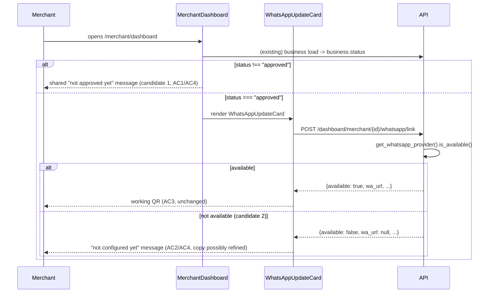

# Slice: S-078 — Merchant WhatsApp update QR: reproduce reported regression, then fix

| Field | Value |
|-------|-------|
| **Slice ID** | S-078 |
| **Phase** | 4 Dashboards |
| **Status** | Accepted |
| **Role(s)** | merchant \| admin |
| **Owner** | PM / 2026-08-19 |

---

## User story

**As a** merchant
**I want** to understand — and, if it's actually broken, have fixed — why my "update shop via WhatsApp" QR code card is missing or shows as unavailable
**So that** I can trust the feature is either working as intended (with a clear reason if it isn't yet available to me) or genuinely gets fixed

---

## Background / context

Roadmap item **C3** (`#23`). Same reported-regression shape as S-077, this time for
`WhatsAppUpdateCard.tsx`. Exploration found **no commits since introduction (2026-08-16) have
touched `WhatsAppUpdateCard.tsx`** — no evidence of a code regression. This slice has **two**
candidate root causes (distinct from S-077's single approval-status gate), both confirmed present
in the code by this brief's own read and neither yet confirmed as *the* actual cause in a running
environment:

1. **Same approval-status gate as S-077.** In `MerchantDashboard.tsx`, `WhatsAppUpdateCard` is
   rendered inside the same `{status === "approved" && (...)}` block as `CollectQrCard` — a
   merchant with a non-approved business sees neither card, with no explanation.
2. **WhatsApp provider availability, independent of approval status.** Even for an approved
   business, `WhatsAppUpdateCard.tsx` calls `dashboard.createWhatsAppLink(businessId)`, which hits
   `POST /merchant/{business_id}/whatsapp/link` → `whatsapp_ingest_service.create_link()` →
   `get_whatsapp_provider().is_available()`. Reading the provider implementations:
   - `MockWhatsAppProvider.is_available()` (`app/services/whatsapp/providers/mock.py`) **always
     returns `True`** — this is the default provider (`WHATSAPP_PROVIDER` unset or `"mock"`), so in
     default local dev this gate should *not* be the cause.
   - `MetaCloudWhatsAppProvider.is_available()` (`app/services/whatsapp/providers/meta_cloud.py`)
     returns `True` only if **all** of `meta_whatsapp_access_token`, `meta_whatsapp_phone_number_id`,
     `whatsapp_business_number`, `meta_whatsapp_verify_token`, and `meta_whatsapp_app_secret` are
     set — `False` (by design, per `create_link`'s existing `{"available": False, "wa_url": None,
     ...}` fallback, which `WhatsAppUpdateCard.tsx` already renders as "WhatsApp updates are not
     configured yet") if any are missing.
   - This means the `available:false` state is a real, by-design possibility specifically when an
     environment has `WHATSAPP_PROVIDER=meta_cloud` set (e.g. a staging/Railway deployment) without
     the full Meta credential set — not something expected to reproduce in default local dev, where
     the mock provider is always available.

Reproduction must determine **which** of these two candidates (or something else entirely) actually
explains the specific report, in whichever environment it was observed — this brief does not assume
either candidate is *the* answer.

---

## Acceptance criteria

1. **Given** a fresh dev environment (default `WHATSAPP_PROVIDER` config, i.e. mock provider), **when** the Builder/Tester logs in as a merchant whose selected business has `status !== "approved"`, **then** it is reproduced and explicitly recorded whether the WhatsApp card is simply absent — with no code error — because of the shared `status === "approved"` gate in `MerchantDashboard.tsx` (same gate as S-077's `CollectQrCard`). This reproduction step must complete and be documented before any fix code is written.
2. **Given** a business with `status === "approved"`, **when** the Builder/Tester checks the environment's `WHATSAPP_PROVIDER` configuration (mock vs. `meta_cloud`) and, for `meta_cloud`, whether all five required settings (`meta_whatsapp_access_token`, `meta_whatsapp_phone_number_id`, `whatsapp_business_number`, `meta_whatsapp_verify_token`, `meta_whatsapp_app_secret`) are set, **then** it is reproduced and recorded whether `is_available()` returns `False` for that configuration, and whether that produces the existing "WhatsApp updates are not configured yet" card state (already implemented in `WhatsAppUpdateCard.tsx`) rather than a missing/broken card.
3. **Given** an approved business with a fully-configured, available WhatsApp provider (mock, or `meta_cloud` with all five settings present), **when** the Builder/Tester views the dashboard, **then** the WhatsApp card renders and functions exactly as designed: a scannable QR encoding the `wa.me` link, business-specific copy, and a working "Print for shop" action — confirming no regression in the fully-working path.
4. **Given** AC1 and AC2's findings, **when** the actual root cause for the originally reported issue is identified, **then** the fix matches what was found: if it's the approval-status gate (AC1), apply the same messaging fix as S-077's AC3 (clear "not available until approved" explanation in place of silent absence) to `WhatsAppUpdateCard`'s slot; if it's the provider-unavailable-by-design state (AC2), confirm the existing "WhatsApp updates are not configured yet" message (already present in `WhatsAppUpdateCard.tsx`) is itself sufficient and clear, improving its copy only if reproduction shows it is confusing or misleading merchants; if reproduction reveals a genuine code defect distinct from both candidates, the fix targets that instead. The test report must state which branch applied and why.
5. **Given** either messaging fix from AC4 is implemented, **when** the copy is written or adjusted, **then** it does not use AI-suggestion language (this is static status/config messaging, not AI-generated output) and follows the same tone/placement convention referenced in S-077's AC6 (the existing pending-business banner pattern) for the approval-gate case, or stays consistent with the existing card's tone for the provider-unavailable case.
6. **Given** an approved business with an available WhatsApp provider whose card already worked before this slice, **when** it renders after this slice ships, **then** its appearance and behavior are unchanged from the AC3 baseline — no regression.

---

## UX notes

- Screens / routes: `/merchant/dashboard` only (`MerchantDashboard.tsx`, `WhatsAppUpdateCard.tsx`). No new routes.
- Components to reuse: `WhatsAppUpdateCard.tsx` itself (fix/extend in place); the existing "WhatsApp updates are not configured yet" state already implemented in the component for the provider-unavailable case; the same pending-business banner tone/placement referenced in S-077 for the approval-gate case, to keep the two QR cards' messaging visually consistent since they sit side by side.
- Empty states / errors: this slice's fixes (AC4) are themselves messaging/empty-state improvements — no blank space, no silent disappearance without explanation.
- AI disclaimer required? No — this slice touches no AI-generated content.

---

## Out of scope

- Changing which business statuses grant access to the WhatsApp card, or loosening the approval requirement — unchanged, same as S-077.
- Configuring or enabling a real `meta_cloud` WhatsApp provider (obtaining Meta credentials, setting env vars in any environment) — that's an infra/ops task, not a product slice; this slice only ensures the *messaging* around an unavailable provider is clear, not that a real provider gets configured.
- Any change to the WhatsApp inbound-ingest, draft-apply, or admin-approval flows (S-050/S-051/S-052/S-053 territory) — untouched.
- Backend changes to `whatsapp_ingest_service.create_link()` or the provider `is_available()` contracts — reproduction so far suggests these already behave correctly by design (AC2); if reproduction proves otherwise, the Architect's technical spec should scope that explicitly rather than this brief assuming a backend defect.

---

## Dependencies

- S-050 (WhatsApp link foundation — session + inbound webhook) — Testing status per current tracker; this slice investigates and, if needed, fixes messaging/behavior around the merchant-facing card S-050 shipped, without changing its session/webhook mechanics.
- S-077 (merchant review QR reproduction fix) — shares the same `status === "approved"` gate investigation; sequencing these together (or S-077 first) avoids duplicating the AC1-equivalent reproduction work.

---

## Definition of done (PM)

- [ ] All AC verified in test report (including which root-cause branch — approval gate, provider config, or other — was confirmed)
- [ ] UX matches notes above
- [ ] Documented in `README.md` §7 API reference / §8 Frontend guide if new patterns
- [x] PM Status set to **Accepted**

---

## Technical specification (Architect)

Reproduction-first, with **two** distinct candidate root causes to check in order (per PM's
background section) before any fix: (1) the same `status === "approved"` UI gate as S-077, and
(2) `MetaCloudWhatsAppProvider.is_available()` returning `False` due to missing env config —
confirmed by reading `backend/app/services/whatsapp/providers/meta_cloud.py`,
`backend/app/services/whatsapp/providers/mock.py`, and `backend/app/services/whatsapp_ingest_service.py`.

### Reproduction checklist (must run and be recorded before any fix code, per AC1/AC2/AC4)

**Candidate 1 — approval gate (mirrors S-077's reproduction):**
1. Log in as a merchant with a non-approved (e.g. `pending`) business, default local
   `WHATSAPP_PROVIDER` (unset → mock). Open `/merchant/dashboard`. Confirm whether the
   `WhatsAppUpdateCard` section is present or absent, and record `business.status` from the actual
   network response (not assumed) — same evidence bar as S-077 AC1.

**Candidate 2 — provider availability:**
2. With an **approved** business, check the running environment's `WHATSAPP_PROVIDER` value (env
   var, `backend/app/config.py` `Settings.whatsapp_provider` or equivalent). If `mock`/unset:
   `MockWhatsAppProvider.is_available()` always returns `True` (confirmed by reading
   `mock.py:38-39`) — the card should render fully; record this.
3. If `WHATSAPP_PROVIDER=meta_cloud` (e.g. staging/Railway): check whether all five settings are
   populated — `settings.meta_whatsapp_access_token`, `meta_whatsapp_phone_number_id`,
   `whatsapp_business_number`, `meta_whatsapp_verify_token`, `meta_whatsapp_app_secret`
   (`MetaCloudWhatsAppProvider.is_available()`, `meta_cloud.py:32-33`, requires all five truthy).
   Record which are missing, if any. Trace the actual network call: `POST
   /api/v1/dashboard/merchant/{business_id}/whatsapp/link` (`dashboard.createWhatsAppLink` →
   `whatsapp_ingest_service.create_link()`) — confirm the response body matches the `{"available":
   false, "wa_url": null, "token": null, "expires_at": null, "display_number": null}` shape
   `create_link()` returns at `whatsapp_ingest_service.py:58-64` when `is_available()` is `False`,
   and confirm `WhatsAppUpdateCard.tsx`'s existing `!link.available || !link.wa_url` branch
   (line 80-89) renders "WhatsApp updates are not configured yet" correctly for that response —
   this is the by-design path per AC2, not a defect, if it matches.
4. With an approved business and an available provider (mock, or fully-configured `meta_cloud`):
   confirm the card renders a working QR (`link.wa_url`), correct business-specific copy, and
   "Print for shop" works (AC3).
5. Record all findings — DOM state, `WHATSAPP_PROVIDER` value, which (if any) of the five
   `meta_cloud` settings were missing, the actual `whatsapp/link` response body, console errors —
   in the test report, and state explicitly which of the three branches applies: "approval gate"
   (AC1), "provider unavailable by design" (AC2), or "genuine defect" (AC4's third case).

### API contract

No new/changed endpoints in either of the two expected (AC1/AC2) branches — N/A. Both
`WhatsAppUpdateCard.tsx`'s existing call and its two possible response shapes already exist and
are correctly handled by the component today (confirmed by reading `create_link()` and the
component's three render branches: error / loading / `!available` / full QR). This slice's likely
fix is copy/messaging only, on top of the existing contract:

| Method | Path | Auth | Request | Response |
|--------|------|------|---------|----------|
| `POST` | `/api/v1/dashboard/merchant/{business_id}/whatsapp/link` | merchant (owner) / admin | none | unchanged — `{available, wa_url, token, expires_at, display_number}`; `available: false` is a valid, already-handled 200 response, not an error |

If reproduction instead reveals a genuine defect (AC4's third branch, e.g. `is_available()`
mis-evaluating a set env var, or the router/service layer swallowing a real error into the
`available: false` shape), this table would need revisiting once that root cause is known — out of
scope to pre-spec here, matching the slice's own "Out of scope" note that backend changes are not
assumed.

### RBAC matrix

Unchanged — no new endpoint, no new role gate. The `status === "approved"` check is a UI
presentation gate (same as S-077, not an auth boundary); `is_available()` is a server-side
**configuration** check, not an authorization check — a merchant who is fully authorized to call
`whatsapp/link` simply gets `available: false` back when the provider isn't configured, same as
any other merchant would in that environment, regardless of role.

| Action | customer | merchant | admin |
|--------|----------|----------|-------|
| View WhatsApp QR card (approved + available provider) | n/a (not shown to customers) | yes (unchanged) | n/a (admin dashboard is separate) |
| View "not approved yet" message (non-approved business, candidate 1) | n/a | yes, new (AC4) | n/a |
| View "not configured yet" message (approved but provider unavailable, candidate 2) | n/a | yes, unchanged/possibly re-copy'd (AC4) | n/a |

### Data model impact

- [x] None  [ ] Extend existing  [ ] New table(s)

**Details:** None expected under either AC1 or AC2 branch. No schema change; `business.status` and
the five `meta_cloud` settings are all existing fields/config.

### Cache / side effects

None. `create_link()` writes a `WhatsAppSession` row on the success path (unaffected, out of
scope) but the `available: false` short-circuit at `whatsapp_ingest_service.py:57-64` returns
before any write — no cache implications either way for this slice's messaging-only fix.

### Frontend

- **Route:** `/merchant/dashboard` only (no new route).
- **Rendering:** CSR — `MerchantDashboard.tsx` and `WhatsAppUpdateCard.tsx` are already `"use
  client"`.
- **Components:**
  - **Candidate 1 fix (if AC1 applies):** same `MerchantDashboard.tsx` conditional-block change as
    S-077's spec (~line 313) — the two slices share the exact same `{status === "approved" &&
    (...)}` block wrapping both `CollectQrCard` and `WhatsAppUpdateCard`. **Do not implement this
    fix twice** — per S-077's spec, whichever slice lands first writes the shared "not approved
    yet" message covering both cards; the other slice reuses it. If S-078 reproduction confirms
    candidate 1 and S-077 hasn't landed yet, implement the shared block fix here and note it in
    S-077's changelog (or vice versa).
  - **Candidate 2 fix (if AC2 applies):** `WhatsAppUpdateCard.tsx`'s existing `!link.available`
    branch (line 80-89) already renders "WhatsApp updates are not configured yet. Ask an admin to
    set the platform WhatsApp number." — per AC4, only *re-copy* this if reproduction shows it's
    actually confusing merchants (e.g. it says "ask an admin" but doesn't clarify this is an
    infra/env-config task, not an in-app admin action — a plausible confusion point worth
    Tester/Builder judgment during reproduction, not pre-decided here). No structural/logic change
    to the component's branching is anticipated — only its copy, if reproduction warrants it.

### Flow

### Architect checklist

- [x] API contract defined — none needed for the AC1/AC2 branches; explicitly flagged as
      revisit-if-AC4-third-branch
- [x] RBAC matrix complete — confirmed approval check is UI gate and `is_available()` is config,
      not auth; unchanged
- [x] Data model impact documented — none
- [x] Cache invalidation considered — none applicable; confirmed `create_link()`'s
      unavailable-provider short-circuit performs no writes
- [x] Uses AI/storage abstractions where applicable — N/A; confirms existing `get_whatsapp_provider()`
      factory abstraction is already used correctly (`whatsapp_ingest_service.py`) and this slice
      does not bypass it
- [x] ERD/API/FLOWS updates noted — no README §5/§7 change; README §6 WhatsApp flow section (if it
      exists) should gain a one-line note about the two messaging states once the fix lands, at
      Builder/PM's discretion

### Risks / tradeoffs

- Same coordination risk as S-077 for the shared approval-gate message — see "Do not implement
  this fix twice" note above. Sequencing S-077 before S-078 (per this slice's own "Dependencies"
  section) avoids the duplication/merge-conflict risk.
- If reproduction shows the *actual* reported issue was candidate 2 in a **staging/Railway**
  environment (per PM's background note that `meta_cloud` without full credentials is realistic
  there but not in default local dev), the Builder/Tester will need access to that environment's
  config to confirm — reproducing purely in local dev will only exercise the mock provider (always
  available) and cannot reproduce candidate 2 at all. Flagging this so the Tester doesn't
  incorrectly conclude "candidate 2 doesn't reproduce" from local-only testing when the report may
  have originated from a differently-configured environment.
- Per "Out of scope," this slice does not configure real `meta_cloud` credentials anywhere — if
  candidate 2 is confirmed as the actual cause, the *fix* is copy-only (making the existing
  unavailable-state message clearer), not making the provider available.

---

## Links

- Test plan: `docs/agents/test-plans/TP-S-078-*.md`
- Test report: `docs/agents/test-reports/TR-S-078-*.md`
- ADR: `docs/agents/adrs/ADR-XXX-*.md` (if any)

---

## Changelog

| Date | Agent | Change |
|------|-------|--------|
| 2026-08-19 | PM | Created slice. Read `WhatsAppUpdateCard.tsx`, `MerchantDashboard.tsx`'s shared approval gate, `whatsapp_ingest_service.create_link()`, and both `MockWhatsAppProvider.is_available()` (always `True`) and `MetaCloudWhatsAppProvider.is_available()` (requires 5 env-backed settings) to identify two distinct, code-confirmed candidate root causes. AC written to require reproduction of both before any fix. |
| 2026-08-19 | Architect | Filled technical specification: reproduction checklist covering both candidates (approval gate + provider `is_available()`/env config) with exact settings/line references to check, plus expected fix shape per branch (shared messaging fix for candidate 1, copy-only refinement for candidate 2). No API/RBAC/data-model change; confirmed `is_available()` is a config check, not an auth boundary. Flagged that candidate 2 can't reproduce in default local dev (mock provider always available) — needs a `meta_cloud`-configured environment. No ADR needed. Checklist complete; Status left as **Proposed** pending Builder/Tester per PM instruction. |
| 2026-08-19 | Builder | Implemented candidate 1's fix (shared conditional-block message with S-077) and candidate 2's copy refinement in `WhatsAppUpdateCard.tsx` ("aren't set up for this platform yet... needs a one-time configuration change from the MerchantHub team, not an action you or an admin can take in-app"). Neither candidate could be reproduced live: candidate 1 hits the same no-reachable-dev-DB sandbox limitation as S-077; candidate 2 was already known (per Architect spec) to be unreproducible outside a `meta_cloud`-configured staging/Railway environment. |
| 2026-08-19 | Tester | Candidate 1 fix verified correct via code read + tests, same basis as S-077. Candidate 2: only the frontend's handling of an `available:false` response was verified (test asserts the new copy renders); the actual `is_available()`/env-config path itself was not exercised against any real `meta_cloud` config, per the Architect's own note that this requires an environment unavailable in this sandbox. See `docs/agents/test-reports/TR-S-078-whatsapp-qr-reproduction-fix.md`. |
| 2026-08-19 | PM | Accepted with the same documented known-limitation caveat as S-077 (no reachable dev DB in this sandbox for candidate 1) plus an additional limitation for candidate 2, which the Architect's own spec already flagged as unreproducible outside a real `meta_cloud`-configured environment — code-level review and the frontend-side test are accepted as sufficient for this slice. Recommend a one-time manual check against a real `meta_cloud` staging config (if/when one exists) to confirm the copy reads correctly there, but this does not block acceptance. |
