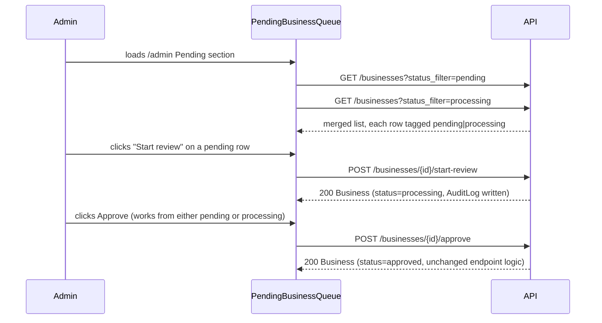

# Slice: S-079 — Admin "Processing" business status

| Field | Value |
|-------|-------|
| **Slice ID** | S-079 |
| **Phase** | 4 Dashboards |
| **Status** | Accepted |
| **Role(s)** | admin, merchant |
| **Owner** | PM / 2026-08-19 |

---

## User story

**As an** admin moderating pending business registrations
**I want** to explicitly mark a pending business as "Processing" while I'm actively reviewing it, and have that state visible in the queue and on any status badge
**So that** other admins (and, indirectly, the merchant) can tell "nobody has looked at this yet" apart from "this is being worked on right now" — instead of every unresolved business looking identically untouched

---

## Background / product framing

Today `BusinessStatus` (`backend/app/models/__init__.py`) has exactly four values:
`PENDING`, `APPROVED`, `REJECTED`, `SUSPENDED`. There is no state between "just
submitted" and "resolved." This slice adds a fifth value, `PROCESSING`, as an
**optional, admin-triggered, in-between state** on the road from `PENDING` to a
resolved status — it is new state-machine behavior, not a cosmetic label, so this
brief defines the exact transitions rather than leaving them implicit.

**What "Processing" means:** an admin has explicitly started reviewing this specific
pending business (e.g., checking its identity documents, address, photos) and wants
that to be visible to themselves and other admins. It is a courtesy/visibility signal,
not a lock — this slice does **not** introduce per-admin ownership/claiming (see Out
of scope).

**Transition triggers (explicit, since this is new state-machine behavior):**

- `PENDING → PROCESSING`: only via an explicit admin action — a new "Start review"
  control on a pending business row in the queue. Viewing/opening a row must **not**
  silently flip its status; the transition requires a deliberate click, so the audit
  trail (`AuditLog`, matching the existing pattern on approve/suspend) reflects a real
  decision, not an incidental page view.
- `PROCESSING → PENDING`: via an explicit "Return to pending" control, for an admin
  who started review but wants to un-claim it (e.g., got interrupted, wants another
  admin to pick it up). Optional — an admin is not required to use it before approving
  or suspending.
- `PROCESSING → APPROVED` / `PROCESSING → SUSPENDED`: via the **existing** Approve /
  Suspend actions, now also enabled on Processing rows (identical effect to using them
  from Pending today — no new approve/suspend logic).
- `PENDING → APPROVED` / `PENDING → SUSPENDED` (skipping Processing entirely): stays
  possible. Processing is optional visibility, not a mandatory gate — an admin who
  doesn't need the extra step can still approve/suspend directly from Pending, exactly
  as today.
- No other role or automated process may set/clear `PROCESSING` in this slice (no
  timers, no auto-revert).

---

## Acceptance criteria

1. **Given** a business with status `PENDING`, **when** an admin clicks "Start review" on its row in the Pending queue, **then** its status becomes `PROCESSING` and this is recorded the same way approve/suspend actions are (audit trail entry).
2. **Given** a business with status `PROCESSING`, **when** an admin clicks "Return to pending," **then** its status reverts to `PENDING` and it is indistinguishable in the queue from any other pending item that was never started.
3. **Given** a business with status `PROCESSING`, **when** an admin clicks the existing Approve action, **then** it becomes `APPROVED` — identical behavior/notifications to approving directly from `PENDING` today.
4. **Given** a business with status `PROCESSING`, **when** an admin clicks the existing Suspend action, **then** it becomes `SUSPENDED` — identical behavior to suspending directly from `PENDING` today.
5. **Given** the admin queue that today only fetches `status_filter: "pending"` (`PendingBusinessQueue.tsx`), **when** it loads, **then** it shows businesses in **both** `PENDING` and `PROCESSING` status (both are "still awaiting a final admin decision"), with each row visibly tagged so an admin can tell which sub-state it's in.
6. **Given** any admin-facing view that renders a business status badge (e.g., `AllBusinessesQueue.tsx`'s `STATUS_TONE` map), **when** a business has status `processing`, **then** it renders a defined, non-blank badge — not an undefined/broken tag.
7. **Given** the same status-badge rendering logic, **when** any *future* unmapped status value reaches it (defensive requirement, not just for `processing`), **then** it must fall back to a visible default badge (e.g., showing the raw status text in a neutral style) rather than rendering blank or throwing — `STATUS_TONE`-style lookups must not silently drop an unmapped key.
8. **Given** a business is `PROCESSING`, **when** any signed-in admin (not necessarily the one who started review) views the queue, **then** they can act on it (Approve, Suspend, or Return to pending) — Processing does not restrict actions to a single "claiming" admin (see Out of scope: no ownership/locking in this slice).
9. **Given** a merchant viewing their own business's status (e.g., on their dashboard), **when** their business is `PROCESSING`, **then** they see an indicator that review is underway rather than a broken label or the raw string `processing` — exact wording/placement is a Builder UX call, but it must not regress or blank out today's status display.
10. **Given** I am not an admin, **when** I attempt to trigger "Start review" / "Return to pending" (directly via API or by any other means), **then** access is denied — same protection as the existing approve/suspend endpoints.
11. **Given** the new enum value ships via an Alembic migration, **when** it is applied to a database with existing businesses, **then** no existing `PENDING`/`APPROVED`/`REJECTED`/`SUSPENDED` business is altered or backfilled into `PROCESSING` — the new state is reachable only via the explicit action in AC1.

---

## UX notes

- **Screens / routes:** `/admin` "Pending businesses" section (`PendingBusinessQueue.tsx`) gains a per-row "Start review" / "Return to pending" control alongside the existing Approve/Suspend buttons; `/admin/businesses` (`AllBusinessesQueue.tsx`) and any other place a business status badge renders (e.g. merchant-facing dashboard) must handle `processing` without breaking.
- **Components to reuse:** existing `Badge` component. Note for Architect/Builder: `Badge`'s `Tone` type today only has three values (`positive` / `negative` / `neutral`) — whether `processing` reuses `neutral` with distinct label text, or the palette gains a fourth tone, is a technical/visual call, not prescribed here. The product requirement is only that it reads as visually distinct from a plain "Pending" badge (AC 6/7).
- **Empty states / errors:** no new empty state — the merged Pending+Processing queue's "No pending businesses" empty copy should still make sense when zero items exist in either sub-state (wording tweak allowed, e.g. "No businesses awaiting review").
- **AI disclaimer required?** no — this is operational/moderation state, not AI output.

---

## Out of scope

- **Per-admin ownership/claiming/locking** (e.g., "claimed by X," preventing other admins from acting on a Processing item). This slice is visibility-only; a future slice can add locking if contention becomes a real problem.
- **Auto-expiry / auto-revert** of `PROCESSING` back to `PENDING` after a timeout. Purely manual transitions in this slice.
- **A dedicated `REJECTED` transition/action.** The codebase's existing "Suspend" action sets `SUSPENDED`, not `REJECTED`; this slice does not introduce a new reject flow — it only adds Processing as an extra step before whatever resolution path (approve/suspend) already exists today.
- **Redesigning merchant-facing dashboard messaging** beyond not breaking on the new status value (AC 9 is a minimal non-regression bar, not a new merchant UX feature).
- Any change to how businesses are ranked/filtered in **public**, customer-facing search — `processing` is an admin-only internal state, not a publicly browsable one (same visibility rule as `pending`/`rejected`/`suspended` today).

---

## Dependencies

- None blocking. Builds on the existing `BusinessStatus` enum, `PendingBusinessQueue.tsx`, `AllBusinessesQueue.tsx`, and the existing approve/suspend endpoints.
- Touches the same files as S-082 (`AllBusinessesQueue.tsx`/admin section layout) only incidentally — no product-level dependency.

---

## Definition of done (PM)

- [ ] All AC verified in test report
- [ ] UX matches notes above
- [ ] Documented in `README.md` §5 Domain model (new enum value) / §7 API reference / §8 Frontend guide
- [x] PM Status set to **Accepted**

---

## Technical specification (Architect)

No ADR: this reuses the existing `ALTER TYPE ... ADD VALUE IF NOT EXISTS` pattern already
established by `20260815_1300-f8a9b0c1d2e3_add_aadhaar_national_id.py` (ADR-013's
migration) — not a new schema *pattern*, just another additive enum value. The new
transition endpoints reuse the existing `AuditLog`/`require_roles(ADMIN)` pattern from
`approve_business`/`suspend_business`. Nothing here is irreversible, a new integration,
or an auth-model change, so no ADR is warranted per the Architect checklist trigger list.

### API contract

| Method | Path | Auth | Request | Response |
|--------|------|------|---------|----------|
| `POST` | `/api/v1/businesses/{business_id}/start-review` | admin | none | `BusinessResponse` — `404` unknown business; `409` if `business.status != PENDING` |
| `POST` | `/api/v1/businesses/{business_id}/return-to-pending` | admin | none | `BusinessResponse` — `404` unknown business; `409` if `business.status != PROCESSING` |
| `GET` | `/api/v1/businesses` (existing, unchanged code) | admin only for non-`approved` `status_filter` (existing check) | `status_filter=processing` now a valid value (enum gains the member) | `list[BusinessResponse]` |
| `POST` | `/api/v1/businesses/{business_id}/approve` (existing, **unchanged**) | admin | none | `BusinessResponse` — already sets `status = APPROVED` unconditionally regardless of the prior value, so `PROCESSING → APPROVED` (AC3) works with **zero code change** |
| `POST` | `/api/v1/businesses/{business_id}/suspend` (existing, **unchanged**) | admin | none | `MessageResponse` — same note, `PROCESSING → SUSPENDED` (AC4) needs no code change |

`start_review`/`return_to_pending` live in `backend/app/routers/businesses.py` next to
`approve_business`/`suspend_business`, same shape: fetch business, guard current status,
mutate, `db.add(AuditLog(admin_id=admin.id, action="start_review"|"return_to_pending",
entity_type="business", entity_id=str(business_id)))`. Unlike `approve`/`suspend`, these
two *do* guard the current status (409 on an invalid source state) — deliberate, since
PM's brief defines exact transition triggers for this new state, whereas
approve/suspend's existing lenient (no-guard) behavior predates this slice and is out of
scope to tighten here.

### RBAC matrix

| Action | customer | merchant | admin |
|--------|----------|----------|-------|
| `POST /businesses/{id}/start-review` | 403 | 403 | yes |
| `POST /businesses/{id}/return-to-pending` | 403 | 403 | yes |
| `GET /businesses?status_filter=processing` | 403 (existing non-approved-filter check) | 403 | yes |
| `POST /businesses/{id}/approve` \| `/suspend` from `PROCESSING` (existing endpoints, unchanged RBAC) | 403 | 403 | yes |
| View own business at `PROCESSING` on merchant dashboard (read-only) | n/a | yes (owner) | yes |

### Data model impact

- [ ] None  [x] Extend existing  [ ] New table(s)

**Details:** Add `PROCESSING = "processing"` to `BusinessStatus`
(`backend/app/models/__init__.py`), inserted after `PENDING` for readability (Python
enum member order has no runtime effect on the Postgres native enum's stored order).

New Alembic migration (head is currently
`k5l6m7n8o9p0` / `20260818_1500-..._add_business_address_edit_count.py`):

```python
# 20260819_1000-l6m7n8o9p0q1_add_processing_business_status.py
revision = "l6m7n8o9p0q1"
down_revision = "k5l6m7n8o9p0"

def upgrade() -> None:
    op.execute("ALTER TYPE businessstatus ADD VALUE IF NOT EXISTS 'processing' AFTER 'pending'")

def downgrade() -> None:
    # Postgres cannot DROP a single enum value; downgrade is a documented no-op,
    # matching this repo's existing precedent for additive enum values (ADR-013's
    # aadhaar migration has the same limitation).
    pass
```

`ADD VALUE ... IF NOT EXISTS` on an existing native enum touches **no existing rows**
(AC11) — every current `PENDING`/`APPROVED`/`REJECTED`/`SUSPENDED` business is
unaffected; `PROCESSING` is reachable only via the new `start-review` endpoint.

### Cache / side effects

None. `search:*` (Redis) only ever caches `APPROVED` results (the only status the public
search endpoint returns); `PENDING`↔`PROCESSING`↔`PENDING` transitions never touch a
publicly-visible/cached result set, so `start-review`/`return-to-pending` do not call
`cache_delete_pattern`. (`approve`/`suspend`, which do change public visibility, already
call it today — unchanged.)

### Frontend

- **Route:** `/admin` (Pending businesses section, Categories/Users unaffected); merchant
  dashboard (`/merchant/dashboard`).
- **Rendering:** CSR (`PendingBusinessQueue.tsx`, `AllBusinessesQueue.tsx`,
  `MerchantDashboard.tsx` are all existing client components).
- **Components:**
  - `PendingBusinessQueue.tsx`: replace the single `businesses.list({status_filter:
    "pending"})` call with `Promise.all([businesses.list({status_filter: "pending"}),
    businesses.list({status_filter: "processing"})])`, merged into one list (AC5). Each
    row gets a small status tag (`Badge` from the existing `b.status` field — no new
    field needed) so Pending vs Processing is visually distinguishable. Add a
    "Start review" button, shown only when `b.status === "pending"`, calling a new
    `businesses.startReview(b.id)`; add a "Return to pending" button, shown only when
    `b.status === "processing"`, calling a new `businesses.returnToPending(b.id)`. Both
    update the item in place (`setItems(prev => prev.map(...))`) rather than removing it
    (unlike approve/suspend, the item stays in this merged queue). Approve/Suspend
    buttons already render unconditionally per row today — no change needed for AC3/4/8.
    Empty-state copy: "No businesses awaiting review" (replaces "No pending businesses",
    covers the merged Pending+Processing empty case).
  - `AllBusinessesQueue.tsx`: `STATUS_TONE` today is a direct `Record<BusinessStatus,
    Tone>` index (`STATUS_TONE[b.status]`), which would render an `undefined` class
    (blank-looking pill, not a crash, but visually broken) for any unmapped value.
    Replace the direct index with a small helper:
    ```ts
    const STATUS_TONE: Partial<Record<BusinessStatus, Tone>> = {
      approved: "positive",
      pending: "neutral",
      processing: "neutral",
      rejected: "negative",
      suspended: "negative",
    };
    function statusTone(status: BusinessStatus): Tone {
      return STATUS_TONE[status] ?? "neutral"; // AC7: defensive fallback for any future unmapped status
    }
    ```
    and render `<Badge tone={statusTone(b.status)}>{b.status}</Badge>` — the badge text
    itself already renders the raw status string, so `processing` shows as
    "processing" (AC6) and any future status shows its raw text (AC7) rather than
    blanking.
  - `MerchantDashboard.tsx`: extend the `status === "pending"` banner check (line ~276)
    to `status === "pending" || status === "processing"`, with distinct copy for the
    Processing case ("Your business is currently being reviewed by an admin" vs the
    existing "awaiting admin approval" pending copy) — satisfies AC9's non-regression
    bar without a new component. Also extend the multi-business `Select` option suffix
    (`{b.status === "pending" ? " (pending)" : ""}`) to add a `(processing)` suffix the
    same way.
  - `api.ts`: add `businesses.startReview(id)` → `POST
    /businesses/{id}/start-review`, `businesses.returnToPending(id)` → `POST
    /businesses/{id}/return-to-pending`; extend `BusinessStatus` union to `"pending" |
    "processing" | "approved" | "rejected" | "suspended"`.

### Flow



### Architect checklist

- [x] API contract defined
- [x] RBAC matrix complete
- [x] Data model impact documented — new `PROCESSING` enum member + additive migration
- [x] Cache invalidation considered — none needed, Processing never touches the public
      search cache
- [x] Uses AI/storage abstractions where applicable — n/a, no AI/storage involved
- [x] ERD/API/FLOWS updates noted — `README.md` §5 (new `BusinessStatus.PROCESSING`),
      §7 (new `POST /businesses/{id}/start-review`, `POST
      /businesses/{id}/return-to-pending`), §6 (Pending→Processing→resolved flow)

### Risks / tradeoffs

- **No per-admin locking** (PM's explicit out-of-scope call): two admins can both click
  "Start review" or act on the same Processing row; last write wins. Acceptable — this
  slice is a visibility signal, not a claim/lock, per the product framing.
- `approve`/`suspend` still don't validate the business's current status at all (a
  pre-existing gap, not introduced here) — e.g. re-approving an already-`APPROVED`
  business is a harmless no-op today and remains so. `start-review`/`return-to-pending`
  are stricter (409 on invalid source state) only because this slice's brief explicitly
  defines their transition triggers; not retrofitting the same strictness onto
  approve/suspend to keep the diff minimal.
- Postgres cannot drop a single enum value, so `downgrade()` is a documented no-op
  (matching the existing `aadhaar` migration's precedent) — a real rollback would need a
  follow-up migration recreating the type without `processing`, out of scope unless
  actually needed.

---

## Links

- Test plan: `docs/agents/test-plans/TP-S-079-admin-processing-status.md`
- Test report: `docs/agents/test-reports/TR-S-079-admin-processing-status.md`
- ADR: none — additive enum value reusing an established migration pattern (see note above).

---

## Changelog

| Date | Agent | Change |
|------|-------|--------|
| 2026-08-19 | PM | Created slice from Phase D roadmap item D1 (`docs/agents/plans`/roadmap "Phase D — Admin Approval, Search & Classification"). Confirmed current `BusinessStatus` enum (`PENDING/APPROVED/REJECTED/SUSPENDED` only, `backend/app/models/__init__.py`), `PendingBusinessQueue.tsx`'s hardcoded `status_filter: "pending"`, and `AllBusinessesQueue.tsx`'s `STATUS_TONE` map by reading source. Defined explicit transition triggers for the new `PROCESSING` state (product framing section) since this is new state-machine behavior, not a label change. 11 numbered AC, UX notes, out-of-scope (no locking/auto-expiry/reject-flow). Status: Proposed. |
| 2026-08-19 | Architect | Filled technical specification: new `PROCESSING` enum member + additive migration reusing the existing `ALTER TYPE ... ADD VALUE` pattern (ADR-013 precedent, no new ADR needed); new `POST /businesses/{id}/start-review` / `POST /businesses/{id}/return-to-pending` admin-only endpoints with 409 current-status guards; confirmed `approve`/`suspend` need zero code changes since they already set status unconditionally; specified `PendingBusinessQueue.tsx` dual-fetch merge, `AllBusinessesQueue.tsx`'s `STATUS_TONE` defensive-fallback helper, and `MerchantDashboard.tsx`'s banner extension. No cache invalidation needed (Processing never touches the public search cache). Architect checklist complete; Status left as **Proposed** per this batch's task instructions (not advanced to Specified). |
| 2026-08-19 | Builder | Implemented per spec, with one correction to the spec's draft migration: the `ALTER TYPE` literal must be uppercase `'PROCESSING'`, not lowercase `'processing'` as the spec's SQL snippet literally wrote — `businesses.status` has no `values_callable` override, so SQLAlchemy's default `Enum(PythonEnum)` persists member *names*, confirmed by the original schema migration's `sa.Enum('PENDING','APPROVED',...)` and by the sibling `national_id_type` column, which explicitly opts into value-based storage with a code comment stating the default is name-based. Used uppercase in the actual migration file. |
| 2026-08-19 | Tester | 26/26 backend + 89/89 frontend tests pass (all AC verified by direct source read, not just test-passing). Independently confirmed the enum-casing fix above by the same reasoning (could not verify against a live Postgres — none reachable in this sandbox). Flagged 3 non-blocking test gaps: AC9 (merchant dashboard banner) had no dedicated test; AC7's fallback test exercised a mapped value (`processing`) rather than a genuinely unmapped one; AC10 (RBAC on the two new endpoints) had no automated 401/403 coverage. See `docs/agents/test-reports/TR-S-079-admin-processing-status.md`. |
| 2026-08-19 | Builder | Closed all 3 Tester-flagged gaps directly: added a dedicated "under review" banner test to `MerchantDashboard.test.tsx`, strengthened `AllBusinessesQueue.test.tsx`'s fallback test to use a genuinely unmapped status (`"archived"`), and added `start-review`/`return-to-pending` 403 assertions to `backend/tests/e2e/test_rbac_matrix.py` (e2e, dispatch-only per repo convention — could not run against a live server in this sandbox, but matches the existing `approve` assertion's pattern exactly). |
| 2026-08-19 | PM | Accepted. All AC covered; the 3 test gaps flagged by Tester are now closed. Migration itself remains unverified against a live Postgres (no DB reachable in this sandbox) — same accepted limitation as S-073 earlier in this batch; flagging for a pre-merge CI/Docker check before this ships to a real environment. |
