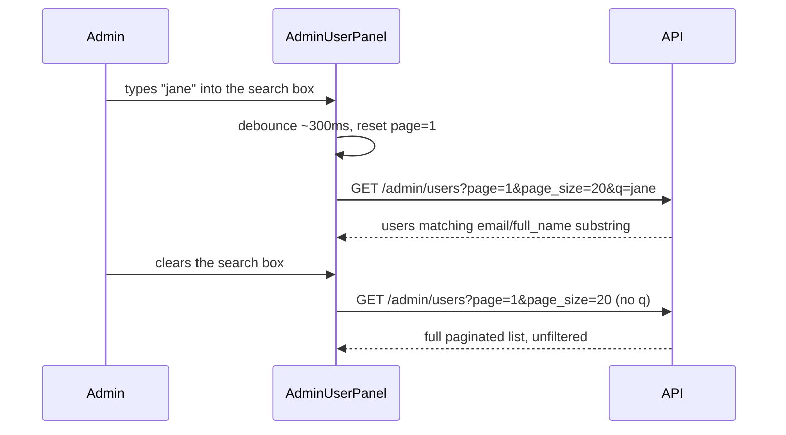

# Slice: S-080 — Admin user search box

| Field | Value |
|-------|-------|
| **Slice ID** | S-080 |
| **Phase** | 4 Dashboards |
| **Status** | Accepted |
| **Role(s)** | admin |
| **Owner** | PM / 2026-08-19 |

---

## User story

**As an** admin
**I want** to search the Users panel by name or email
**So that** I can find a specific customer or merchant account without paging through the full list

---

## Background

Confirmed by reading `backend/app/routers/admin.py`: `GET /admin/users` already accepts
an optional `q` query param and does a case-insensitive substring match on email or
`full_name` server-side (`admin_users_service.list_users(db, page, page_size, q)`).
`AdminUserPanel.tsx` (`frontend/src/lib/api.ts`'s `admin.users(...)` call) never passes
`q` and has no search input — this is a **frontend-only** fix; no backend change is
required.

---

## Acceptance criteria

1. **Given** I am signed in as admin viewing the Users section on `/admin`, **when** the section loads, **then** a search input is visible above the user list (e.g., placeholder "Search by name or email").
2. **Given** I enter a search term and it executes, **when** results load, **then** the request passes that term as the existing `q` param to `GET /admin/users` and only matching users (case-insensitive substring on email or full name, per existing backend behavior) are shown.
3. **Given** I clear the search box back to empty, **when** the list reloads, **then** it shows the full paginated user list exactly as it does today with no search applied.
4. **Given** a search term matches zero users, **when** the list renders, **then** a clear "No users match your search" (or equivalent) empty state is shown — distinct from a blank panel or an error.
5. **Given** I am on page 2+ of results and I enter a new search term, **when** the new results load, **then** pagination resets to page 1 for the new query (no stale page number silently applied to a different result set).
6. **Given** the search input is now present, **when** a non-admin (anonymous, customer, or merchant) attempts to load `/admin` directly, **then** access remains denied exactly as it does today — this slice makes no RBAC change.
7. **Given** the admin user list/search data path (`AdminUserPanel.tsx`, `admin.users()` client call, and the rendered row content), **when** implemented, **then** it is checked for and has removed any leftover placeholder/dummy text (e.g. lorem-ipsum copy, hardcoded fake names) — PM's own read of the current code found none, but this must be explicitly re-verified as part of this slice's build, not assumed.

---

## UX notes

- **Screens / routes:** `/admin` Users section (`AdminUserPanel.tsx`).
- **Components to reuse:** the existing `Input` component (already used in `AdminCategoryPanel.tsx`'s "New category name" field) for visual consistency.
- **Interaction:** search should feel responsive but must not fire a request on every keystroke with no debounce — either a short debounce (e.g. ~300ms) or explicit submit-on-Enter/button is acceptable; exact choice is a Builder implementation call.
- **Empty states / errors:** new "no results for this search" empty state, distinct in wording from the existing "No users found" (zero-users-overall) state, so an admin can tell "nothing matches my search" apart from "there are no users."
- **AI disclaimer required?** no — plain data search, no AI output involved.

---

## Out of scope

- Any backend change — `GET /admin/users?q=` already works server-side.
- Additional filters (e.g., filter by role or active/suspended status) combined with search — a possible future slice, not bundled here.
- Combining this search with category search into one interface — that is S-081 (depends on this slice landing first).
- Any change to the existing suspend/reactivate actions or `protectedAccount` logic.

---

## Dependencies

- None blocking. This slice is frontend-only and self-contained.
- **S-081 (integrated category search) depends on this slice** landing first, to reuse the search UX pattern established here — see S-081's brief.

---

## Definition of done (PM)

- [ ] All AC verified in test report
- [ ] UX matches notes above
- [ ] Documented in `README.md` §8 Frontend guide if new pattern
- [x] PM Status set to **Accepted**

---

## Technical specification (Architect)

Lightweight spec — no backend change, no ADR.

### API contract

| Method | Path | Auth | Request | Response |
|--------|------|------|---------|----------|
| `GET` | `/api/v1/admin/users` (existing, **unchanged**) | admin | query `page` (default 1), `page_size` (default 20, cap 100), `q` (optional substring, already wired end-to-end server-side in `admin_users_service.list_users`) | `list[UserResponse]` |

No new endpoint, no request/response shape change. This slice's only work is the
frontend now actually passing `q` (and resetting `page`) — `admin.users({ page, page_size,
q })` in `frontend/src/lib/api.ts` already accepts `q` today, it's simply never called
with one.

### RBAC matrix

| Action | customer | merchant | admin |
|--------|----------|----------|-------|
| `GET /admin/users?q=...` (existing `require_roles(ADMIN)`, unchanged) | 403 | 403 | yes |
| Load `/admin` page (existing `RequireAuth role="admin"`, unchanged) | denied | denied | yes |

### Data model impact

- [x] None

### Cache / side effects

None. `GET /admin/users` isn't cached (unlike public `search:*`), and this slice touches
no write path — no invalidation to consider.

### Frontend

- **Route:** `/admin` Users section (`#admin-users`, unchanged position).
- **Rendering:** CSR (`AdminUserPanel.tsx`, existing `"use client"`).
- **Components:**
  - `AdminUserPanel.tsx`: add a `q` (search term) state and an `Input` (reusing the same
    component `AdminCategoryPanel.tsx` uses for its "New category name" field, per UX
    notes) rendered above the user list. Debounce ~300ms before firing
    `admin.users({ page, page_size: PAGE_SIZE, q: q.trim() || undefined })` (undefined,
    not `""`, so the querystring omits `q` entirely on an empty box — matches AC3's "no
    search applied" contract and mirrors how `businesses.list`'s existing params are
    filtered by `v != null` in `api.ts`). On every `q` change, reset `page` to `1` before
    the debounced fetch fires (AC5 — no stale page number carried into a new query).
    Two distinct empty-state strings: `q.trim() ? "No users match your search" :
    "No users found"` (AC4 vs the existing zero-users-overall copy). No other change to
    `handleToggle`/pagination/`protectedAccount` logic.
  - `api.ts`: no change — `admin.users({ page, page_size, q })` already exists (S-080's
    Background section confirms this by reading the current source).

### Flow

### Architect checklist

- [x] API contract defined — reuses existing `GET /admin/users?q=`, no change
- [x] RBAC matrix complete — unchanged from today
- [x] Data model impact documented — none
- [x] Cache invalidation considered — none applicable
- [x] Uses AI/storage abstractions where applicable — n/a
- [x] ERD/API/FLOWS updates noted — no `README.md` §5/§7 change needed (no new
      endpoint/schema); §8 Frontend guide gets a one-line note on the debounced-search
      pattern now used by two admin panels (this slice + precedent for S-081)

### Risks / tradeoffs

None material. The only judgment call (debounce vs submit-on-Enter) is explicitly left
to the Builder per the PM's UX notes.

---

## Links

- Test plan: `docs/agents/test-plans/TP-S-080-admin-user-search.md`
- Test report: `docs/agents/test-reports/TR-S-080-admin-user-search.md`
- ADR: none expected — frontend-only wiring onto an already-working backend param.

---

## Changelog

| Date | Agent | Change |
|------|-------|--------|
| 2026-08-19 | PM | Created slice from Phase D roadmap item D2. Confirmed by reading `backend/app/routers/admin.py` that `GET /admin/users?q=` already exists and works server-side, and by reading `AdminUserPanel.tsx` that no search input exists today (frontend-only fix). 7 numbered AC incl. an explicit placeholder-content-removal check. Noted as a soft prerequisite for S-081. Status: Proposed. |
| 2026-08-19 | Architect | Filled technical specification: confirmed no backend change needed (existing `q` param), specified debounced search input + page-reset-on-search-change + two distinct empty states in `AdminUserPanel.tsx`. No ADR. Architect checklist complete; Status left as **Proposed** per this batch's task instructions. |
| 2026-08-19 | Builder | Implemented per spec in `AdminUserPanel.tsx`. No leftover placeholder content found (AC7). |
| 2026-08-19 | Tester | All AC automated and verified by source read; no gaps. 9/9 tests pass. See `docs/agents/test-reports/TR-S-080-admin-user-search.md`. |
| 2026-08-19 | PM | Accepted. Ship-ready, no gaps found. |
