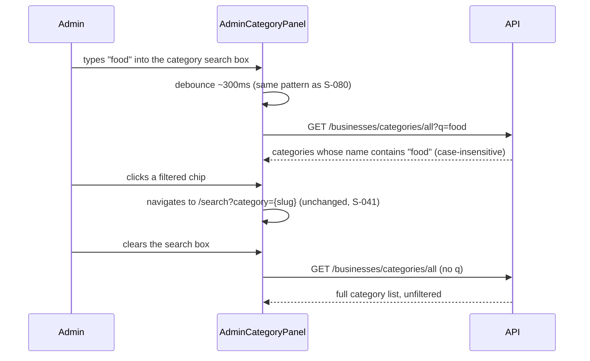

# Slice: S-081 — Category search, in the same pattern as admin user search

| Field | Value |
|-------|-------|
| **Slice ID** | S-081 |
| **Phase** | 4 Dashboards |
| **Status** | Accepted |
| **Role(s)** | admin |
| **Owner** | PM / 2026-08-19 |

---

## User story

**As an** admin
**I want** to search/filter categories by name in the Categories panel, using the same familiar search interaction I already use to find a user
**So that** I can quickly locate a category among a growing list, without scrolling a flat unfiltered chip list

---

## Background

Confirmed by reading `backend/app/routers/businesses.py`: `GET /businesses/categories/all`
has **no** `q` param today — it returns every category, always. Unlike D2 (S-080), this
is **not** frontend-only: the backend needs a new `q` param (or an equivalent combined
endpoint) added to filter by name substring.

**On "integrated":** the roadmap frames this as unifying D2's search UX with category
lookup "into one interface." Read literally, that could mean one search box querying
both users and categories at once. This brief deliberately scopes it narrower: **reuse
the same search interaction pattern** (input placement, debounce/submit behavior, empty
state, reset-on-clear) established by S-080 for the Users panel — applied here to a
**separate** search box on the Categories panel, not a single box that searches two
unrelated entity types in one request. See Out of scope for why.

---

## Acceptance criteria

1. **Given** I am on the `/admin` Categories section, **when** it loads, **then** a search/filter input is visible above the category list, placed and styled consistently with the Users search shipped in S-080.
2. **Given** I type a category-name substring and it executes, **when** the search runs, **then** the request calls the categories endpoint with a `q` param (or equivalent) and only categories whose name contains that substring (case-insensitive) are shown.
3. **Given** I clear the search box back to empty, **when** the list reloads, **then** it shows every category exactly as it does today with no filter applied.
4. **Given** a search term matches zero categories, **when** the list renders, **then** a "No categories match your search" empty state is shown, distinct from the existing "No categories yet" (zero-categories-overall) empty state — so an admin can tell "nothing matches" apart from "nothing exists yet."
5. **Given** category chips remain clickable to open the public search filtered by that category slug (existing behavior from S-041), **when** a filter is active and I click a filtered chip, **then** it still navigates to `/search?category={slug}` unchanged — no regression to that existing link behavior.
6. **Given** the search input's interaction pattern (debounce/submit/reset), **when** built, **then** it follows the same pattern established by the Users search in S-080, for consistency across admin panels.
7. **Given** the "Add category" form on the same panel, **when** a search filter is active, **then** adding a new category still works normally and is unaffected by the active filter (search and add are independent actions).

---

## UX notes

- **Screens / routes:** `/admin` Categories section (`AdminCategoryPanel.tsx`).
- **Components to reuse:** the same `Input` component and interaction pattern as S-080's Users search.
- **Empty states / errors:** new "no categories match your search" state, distinct from the existing "No categories yet" copy.
- **AI disclaimer required?** no — plain data search, no AI output involved.

---

## Out of scope

- **A single combined search box querying both users and categories in one request/UI.** This slice ships two parallel, pattern-consistent search boxes (Users panel from S-080; Categories panel here) rather than merging two unrelated entity types into one search surface — a true combined/global admin search is a materially larger feature (needs a combined response shape, mixed-result rendering, etc.) and should be its own future slice if actually wanted.
- **Repositioning `AdminCategoryPanel.tsx`** on the `/admin` page — that is S-082 (depends on this slice).
- **Differentiating "Add category" error states** (409 vs auth vs network) — that is also S-082.
- Category edit/delete (unchanged from S-041's existing out-of-scope note).

---

## Dependencies

- **Depends on S-080 landing first** (or at minimum, its search UX pattern being settled) — this slice explicitly reuses that pattern for consistency; do not begin Architect/Builder work on this slice before S-080 is Accepted or its pattern is otherwise locked in.
- Builds on the existing `GET /businesses/categories/all` endpoint and `AdminCategoryPanel.tsx`.

---

## Definition of done (PM)

- [ ] All AC verified in test report
- [ ] UX matches notes above
- [ ] Documented in `README.md` §7 API reference (new `q` param) / §8 Frontend guide
- [x] PM Status set to **Accepted**

---

## Technical specification (Architect)

**Confirming scope, no change:** agree with the PM's brief — this ships two parallel,
pattern-consistent search boxes (S-080's Users search; this slice's Categories search),
not one combined query. A true combined search would need a merged response shape (e.g.
`{ users: [...], categories: [...] }` or a tagged union list) and mixed-result rendering
that no current admin component supports; building that speculatively, before anyone has
asked to search users and categories in the same box, would be premature scope. Reusing
the *interaction pattern* (debounce, input placement, empty-state wording shape) gives
the requested consistency without that cost. No ADR — additive query param on an
already-public endpoint, no schema/auth/integration change.

### API contract

| Method | Path | Auth | Request | Response |
|--------|------|------|---------|----------|
| `GET` | `/api/v1/businesses/categories/all` (existing, **extended**) | none (public, unchanged) | new optional query `q` — case-insensitive substring match on `Category.name` (`ilike(f"%{q}%")`) | `list[CategoryResponse]` — same shape, filtered when `q` present, full list when absent (unchanged default) |

Router change (`backend/app/routers/businesses.py`, `list_categories` — a two-line diff,
no new service function needed given the existing inline-in-router pattern for this
endpoint):

```python
@router.get("/categories/all", response_model=list[CategoryResponse])
async def list_categories(q: str | None = None, db: AsyncSession = Depends(get_db)) -> list[CategoryResponse]:
    query = select(Category).order_by(Category.name)
    if q:
        query = query.where(Category.name.ilike(f"%{q}%"))
    result = await db.execute(query)
    return list(result.scalars().all())
```

Stays registered before `/{slug}` in `businesses.py` — already true today (`categories/all`
is a static route already ordered ahead of the dynamic `/{slug}` business-lookup route),
so this change doesn't disturb routing order.

### RBAC matrix

| Action | customer | merchant | admin |
|--------|----------|----------|-------|
| `GET /businesses/categories/all` (with or without `q`) | yes (public, unchanged) | yes | yes |

No RBAC change — this endpoint has never required auth (it also backs the public home
category index and search filters, not just the admin panel), and adding an optional
filter param doesn't change who can call it.

### Data model impact

- [x] None

`Category.name` already exists and is already indexed via the existing `ORDER BY name`
query path; a substring `ilike` scan over the categories table (expected to stay small —
tens, not thousands, of rows) needs no new index for this slice.

### Cache / side effects

None. Categories are not part of the `search:*` Redis cache (that key space covers
business search results only, per `cache_delete_pattern("search:*")`'s existing call
sites in `businesses.py`/`reviews.py`) — reading categories, filtered or not, has no
cache interaction to invalidate.

### Frontend

- **Route:** `/admin` Categories section (`AdminCategoryPanel.tsx`, position unchanged by
  this slice — repositioning is S-082).
- **Rendering:** CSR (existing `"use client"`).
- **Components:**
  - `AdminCategoryPanel.tsx`: add a `q` state and an `Input` above the category chip
    list, following the exact interaction pattern from S-080 (debounce ~300ms, reset to
    the unfiltered/full call when cleared, `q.trim() || undefined` so an empty box omits
    the querystring param entirely). Two distinct empty states: `q.trim() ? "No
    categories match your search" : "No categories yet"` (AC4). The existing "Add
    category" form and chip-click-to-`/search?category={slug}` navigation (S-041) are
    untouched — search and add remain independent actions (AC7), and filtering the
    displayed list has no effect on chip href generation (AC5).
  - `api.ts`: extend `businesses.categoriesAll` to accept an optional params object:
    ```ts
    categoriesAll: (params?: { q?: string }) => {
      const qs = params?.q ? `?q=${encodeURIComponent(params.q)}` : "";
      return apiFetch<Category[]>(`/api/v1/businesses/categories/all${qs}`);
    },
    ```
    Backward compatible — every other existing caller (home page category index,
    `/search` filters) already calls `categoriesAll()` with no arguments and continues to
    receive the full, unfiltered list unchanged.

### Flow



### Architect checklist

- [x] API contract defined — additive `q` param, backward compatible
- [x] RBAC matrix complete — unchanged (public endpoint)
- [x] Data model impact documented — none, existing column/index sufficient at expected
      category-table scale
- [x] Cache invalidation considered — none applicable, categories aren't cached
- [x] Uses AI/storage abstractions where applicable — n/a
- [x] ERD/API/FLOWS updates noted — `README.md` §7 API reference gets the new `q` param
      documented on `GET /businesses/categories/all`; §8 Frontend guide notes the
      debounced-search pattern is now shared by two admin panels

### Risks / tradeoffs

- **Ambiguity resolved, not deferred:** the roadmap's "integrated" wording could be read
  as one combined user+category search box. Per the PM's explicit scoping (and this
  spec's confirmation above), that reading is rejected for this slice as premature scope
  — flagging here again so the Tester/PM don't file "not actually integrated" as a gap;
  it's a deliberate, documented scope call, not an oversight.
- Unauthenticated `q`-based enumeration of category names is not a new exposure — the
  full category list was already public before this slice; substring search doesn't
  reveal anything the unfiltered list didn't already.

---

## Links

- Test plan: `docs/agents/test-plans/TP-S-081-integrated-category-merchant-search.md`
- Test report: `docs/agents/test-reports/TR-S-081-integrated-category-merchant-search.md`
- ADR: none expected — additive query param on an existing public endpoint.

---

## Changelog

| Date | Agent | Change |
|------|-------|--------|
| 2026-08-19 | PM | Created slice from Phase D roadmap item D3. Confirmed by reading `backend/app/routers/businesses.py` that `GET /businesses/categories/all` has no `q` param today (unlike D2's user search, this needs a backend change). Deliberately scoped "integrated" to mean UX-pattern reuse (two parallel search boxes), not one combined user+category search box — flagged the ambiguity in the roadmap wording explicitly. 7 numbered AC, out-of-scope, explicit dependency on S-080 landing first. Status: Proposed. |
| 2026-08-19 | Architect | Filled technical specification: confirmed and endorsed the PM's two-parallel-search-boxes scoping (single combined box explicitly rejected as premature); specified the additive `q` param on `GET /businesses/categories/all` (backward-compatible, no RBAC/cache/data-model impact) and the matching `AdminCategoryPanel.tsx` search input reusing S-080's debounce pattern. No ADR. Architect checklist complete; Status left as **Proposed** per this batch's task instructions. |
| 2026-08-19 | Builder | Implemented per spec: `q` param on `list_categories` (backend), matching debounced search box in `AdminCategoryPanel.tsx`. |
| 2026-08-19 | Tester | All AC automated and verified by source read; no gaps. 4/4 backend + 10/10 frontend tests pass. See `docs/agents/test-reports/TR-S-081-integrated-category-merchant-search.md`. |
| 2026-08-19 | PM | Accepted. Ship-ready, no gaps found. |
