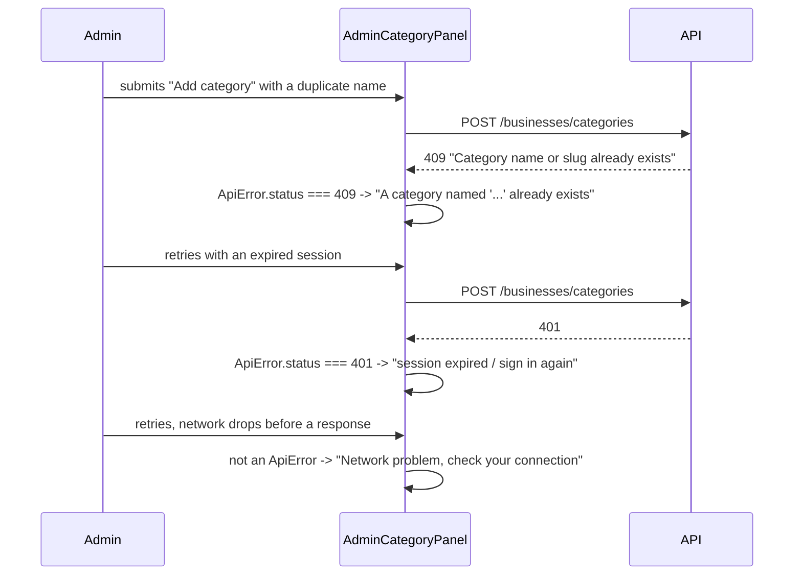

# Slice: S-082 — Reposition category controls, add distinct "Add category" errors

| Field | Value |
|-------|-------|
| **Slice ID** | S-082 |
| **Phase** | 4 Dashboards |
| **Status** | Accepted |
| **Role(s)** | admin |
| **Owner** | PM / 2026-08-19 |

---

## User story

**As an** admin
**I want** the Categories panel positioned near the top of the admin console (with working search), and clear, specific error messages when "Add category" fails
**So that** category management — something I use often and quickly — isn't buried below queues I check less frequently, and I know exactly why an add attempt failed instead of guessing

---

## Background

Confirmed by reading `frontend/src/app/admin/page.tsx`: today's section order is Stats
tiles → Platform trends chart → **Pending businesses** → **Reported reviews** →
**WhatsApp updates** → **Categories** (5th of 6 sections) → Payments → Users. Categories
sits below three moderation queues an admin may check far less often than they add/find
a category.

Confirmed by reading `AdminCategoryPanel.tsx`'s `handleCreate`: every failure — a 409
duplicate-name conflict, a 401/403 auth failure, or a network/5xx error — is caught by
the same generic `catch` block and shown as either the backend's raw `detail` string or
the hardcoded fallback `"Create failed"`. The backend (`backend/app/routers/businesses.py`,
`create_category`) already returns a proper `409` with detail `"Category name or slug
already exists"` on duplicates, so the underlying signal exists server-side — the gap is
that the frontend doesn't branch on status/cause to show a **distinct** message per
failure type.

---

## Acceptance criteria

1. **Given** I load `/admin`, **when** the page renders, **then** the Categories section appears immediately after the stats tiles/trends chart and before Pending businesses, Reported reviews, WhatsApp updates, Payments, and Users (today it renders 5th of 6, after WhatsApp updates).
2. **Given** the Categories section is repositioned, **when** I use the category search/filter box shipped in S-081, **then** it is present and works identically at the new position — no functional regression from the move.
3. **Given** I submit "Add category" with a name that already exists (case-insensitive duplicate the backend rejects with `409`), **when** the request fails, **then** I see a specific message naming the conflict (e.g., "A category named '{name}' already exists") — not the generic "Create failed" shown today.
4. **Given** my session is unauthenticated, expired, or lacks admin permission when I submit "Add category" (`401`/`403`), **then** I see a message telling me to sign in again / that I lack permission — visibly distinct from the duplicate-name message (AC 3) and the network/server message (AC 5).
5. **Given** a network failure or server error (`5xx`, or the request never reaches the server) occurs while submitting "Add category," **then** I see a message indicating a temporary/connection problem and suggesting I retry — distinct from AC 3 and AC 4's messages.
6. **Given** any of the three error states above has occurred, **when** I correct the issue and resubmit (e.g., change the name, re-authenticate, retry after connectivity returns), **then** the previous error clears and the form either succeeds or shows only the newly-relevant error — no stale error message lingers on screen.
7. **Given** the category search/filter box from S-081, **when** it has an active filter, **then** successfully adding a new category is unaffected by the filter (unchanged from S-081's AC 7 — re-confirmed here since this slice touches the same component).

---

## UX notes

- **Screens / routes:** `/admin` — reposition the existing Categories section (`id="admin-categories"`) above Pending businesses/Reported reviews/WhatsApp updates; keep it before Payments/Users.
- **Components to reuse:** `AdminCategoryPanel.tsx` — same form, same `Input`/button; only the error-branching logic and section placement change, not the visual shell.
- **Empty states / errors:** three distinct, plain-language error messages (duplicate name / auth failure / network-or-server problem) replacing today's single generic message. Exact copy is a Builder call; the product requirement is that the three are visibly different, not that specific wording is mandated here.
- **Technical note for Architect:** `frontend/src/lib/api.ts`'s `apiFetch` currently throws a plain `Error` carrying only the backend's `detail` string — it does **not** expose the HTTP status code to callers. Reliably distinguishing 409 vs 401/403 vs network/5xx in the UI (AC 3–5) will likely require `apiFetch` (or a wrapping `ApiError`) to also carry the response status code. This is a technical decision for the Architect step, not prescribed here, but flagged since it affects more than just this one form.
- **AI disclaimer required?** no — no AI output involved.

---

## Out of scope

- Category edit/delete (unchanged from S-041's existing out-of-scope note).
- New category fields (description/icon) in the create form — `createCategory` already accepts optional `description`/`icon` server-side, but exposing them in the UI is not part of this slice.
- Any backend change to `POST /businesses/categories` — it already returns a correct `409` with a useful `detail` message; the gap this slice closes is entirely in how the frontend interprets and displays failures (and, if the Architect determines it's needed, exposing status codes through `apiFetch`).
- Repositioning any other admin section besides Categories.

---

## Dependencies

- **Depends on S-081 (category search/filter)** — this slice repositions the Categories panel and re-verifies the search box at its new location; S-081's search UI must exist first.
- Transitively depends on S-080 (via S-081).

---

## Definition of done (PM)

- [ ] All AC verified in test report
- [ ] UX matches notes above
- [ ] Documented in `README.md` §8 Frontend guide if new error-handling pattern is introduced
- [x] PM Status set to **Accepted**

---

## Technical specification (Architect)

No ADR — pure layout reorder plus a frontend error-handling refinement; no schema,
auth-model, or integration change.

### API contract

| Method | Path | Auth | Request | Response |
|--------|------|------|---------|----------|
| `POST` | `/api/v1/businesses/categories` (existing, **unchanged**) | admin | `CategoryCreate` | `CategoryResponse`, `409` `"Category name or slug already exists"` on duplicate (already correct server-side per PM's research) |

No backend route changes. The only API-adjacent change is a **frontend HTTP client**
change (below) needed to let the UI branch on the status code this endpoint already
returns.

**`apiFetch` change (`frontend/src/lib/api.ts`):** today `apiFetch` throws a plain
`Error` carrying only `detail`, discarding `res.status` — every caller across the app
(`auth`, `businesses`, `admin`, `payments`, etc.) currently does
`e instanceof Error ? e.message : "..."`, so status is unrecoverable case-by-case. Fix:
add a minimal `ApiError` subclass and throw it in place of the bare `Error`, changing
exactly the one `throw` site:

```ts
export class ApiError extends Error {
  status: number;
  constructor(message: string, status: number) {
    super(message);
    this.name = "ApiError";
    this.status = status;
  }
}

// inside apiFetch, replacing the existing `if (!res.ok) { ... throw new Error(...) }`:
if (!res.ok) {
  const err = await res.json().catch(() => ({ detail: res.statusText }));
  throw new ApiError(err.detail || "Request failed", res.status);
}
```

`ApiError extends Error`, so every existing `e instanceof Error ? e.message : "..."`
call site across the codebase (dozens of components) keeps working **unchanged** — this
is additive, not a breaking refactor, per the "minimal change... without a broad
refactor" framing in the PM's brief. A true network failure (the `fetch()` call itself
rejecting — offline, DNS, CORS) throws *before* a `Response` exists, so it is **not** an
`ApiError` (no `.status`); callers that want to distinguish "reached the server and got
4xx/5xx" from "never reached the server" check `e instanceof ApiError` first, falling
through to a generic network message otherwise — both fall under this slice's single
"network/server problem" bucket (AC5 groups 5xx and true network failure together), so
no further branching inside `apiFetch` is needed.

### RBAC matrix

| Action | customer | merchant | admin |
|--------|----------|----------|-------|
| `POST /businesses/categories` (existing, unchanged `require_roles(ADMIN)`) | 403 | 403 | yes |
| Load `/admin` Categories section at its new position (existing `RequireAuth
  role="admin"` on the whole page, unchanged) | denied | denied | yes |

No RBAC change. AC4's "distinguish 401/403" is a **client-side rendering** distinction of
an already-correct server response, not a new permission.

### Data model impact

- [x] None

### Cache / side effects

None. Reordering a page section and refining client-side error branching touch no
server state; `AdminCategoryPanel.tsx`'s existing `load()`/`handleCreate()` cache-adjacent
behavior (re-fetching the category list after a successful create) is unchanged.

### Frontend

- **Route:** `/admin` (`frontend/src/app/admin/page.tsx`).
- **Rendering:** CSR (`AdminCategoryPanel.tsx`, existing `"use client"`; the reorder is a
  JSX move within an already-client-rendered page body).
- **Components:**
  - `frontend/src/app/admin/page.tsx`: move the entire `<section id="admin-categories">`
    block to render immediately after the "Platform trends" `series` block (or, when
    `series` is `null`, immediately after the stats grid) and before `<section
    id="pending-businesses">` (AC1). No `id`, heading text, or `STAT_TARGETS`/
    `STAT_LINKS` change — nothing currently scroll-links to `admin-categories`, so moving
    it has no dangling-anchor risk.
  - `AdminCategoryPanel.tsx`'s `handleCreate` catch block: replace the single generic
    `catch (e) { setError(e instanceof Error ? e.message : "Create failed") }` with:
    ```ts
    } catch (e) {
      if (e instanceof ApiError) {
        if (e.status === 409) setError(`A category named "${trimmed}" already exists`);
        else if (e.status === 401 || e.status === 403) {
          setError("Your session has expired or you don't have permission. Sign in again as an admin.");
        } else {
          setError("Something went wrong on our end. Please try again.");
        }
      } else {
        setError("Network problem — check your connection and try again.");
      }
    }
    ```
    `setError("")` already runs at the top of `handleCreate` before the request fires
    (existing code), so AC6 ("previous error clears on resubmit, no stale message
    lingers") is already satisfied by the existing structure — no additional change
    needed there. The S-081 search box and this create form remain independent
    (unchanged, re-confirms AC7).

### Flow



### Architect checklist

- [x] API contract defined — no new endpoint; documented the one `apiFetch` client
      change needed to expose status codes
- [x] RBAC matrix complete — unchanged
- [x] Data model impact documented — none
- [x] Cache invalidation considered — none applicable
- [x] Uses AI/storage abstractions where applicable — n/a
- [x] ERD/API/FLOWS updates noted — `README.md` §8 Frontend guide gets a short note on
      the new `ApiError` pattern (status-aware error handling) since it's a
      cross-cutting client change other components can now adopt

### Risks / tradeoffs

- **`apiFetch` is used by every API call in the app.** Changing its thrown error type is
  a shared-file edit — low risk because `ApiError extends Error` (every existing
  `instanceof Error` check still matches), but the Builder should grep for any call site
  that does something more specific than `instanceof Error` (e.g. string-matching
  `.message`) before landing, to confirm nothing breaks. None were found in this read of
  `api.ts`'s current callers, but that's a build-time verification step, not a design
  change.
- Only `AdminCategoryPanel.tsx`'s create-error path adopts `ApiError`-based branching in
  this slice — other forms (login, business edit, etc.) keep their current generic
  `e.message` handling. Retrofitting them is out of scope here (PM's brief scopes this to
  "Add category" only); the new `ApiError` class is simply available for a future slice
  to reuse.

---

## Links

- Test plan: `docs/agents/test-plans/TP-S-082-admin-category-controls-fix.md`
- Test report: `docs/agents/test-reports/TR-S-082-admin-category-controls-fix.md`
- ADR: none expected — layout reorder + frontend error-branching only.

---

## Changelog

| Date | Agent | Change |
|------|-------|--------|
| 2026-08-19 | PM | Created slice from Phase D roadmap item D4. Confirmed current section order on `frontend/src/app/admin/page.tsx` (Categories is 5th of 6 sections) and confirmed by reading `AdminCategoryPanel.tsx`'s `handleCreate` and `backend/app/routers/businesses.py`'s `create_category` that the backend already returns a proper `409` on duplicates but the frontend collapses every failure into one generic message. 7 numbered AC, flagged `apiFetch`'s missing status-code exposure as a technical consideration for Architect, explicit dependency on S-081. Status: Proposed. |
| 2026-08-19 | Architect | Filled technical specification: no backend change; specified a minimal additive `ApiError extends Error` class (carrying `status`) replacing `apiFetch`'s single `throw new Error(...)` site, status-branched `handleCreate` error messages (409/401-403/other), and the `admin-categories` section move to immediately after the trends chart. No ADR. Architect checklist complete; Status left as **Proposed** per this batch's task instructions. |
| 2026-08-19 | Builder | Implemented per spec: `ApiError` class, status-branched `handleCreate` errors, section reorder in `admin/page.tsx`. Grepped `api.ts` callers for anything more specific than `instanceof Error` before landing — none found. |
| 2026-08-19 | Tester | All AC automated and verified by source read; no gaps. See `docs/agents/test-reports/TR-S-082-admin-category-controls-fix.md`. |
| 2026-08-19 | PM | Accepted. Ship-ready, no gaps found. |
