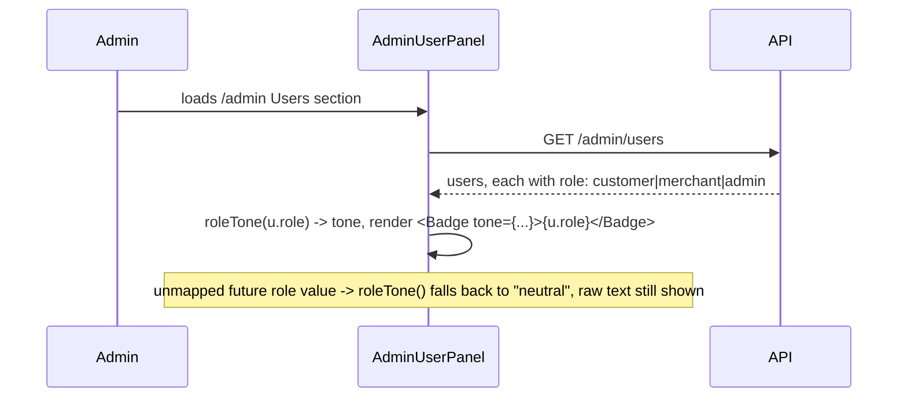

# Slice: S-083 — Visual role classification on the admin Users panel

| Field | Value |
|-------|-------|
| **Slice ID** | S-083 |
| **Phase** | 4 Dashboards |
| **Status** | Accepted |
| **Owner** | PM / 2026-08-19 |
| **Role(s)** | admin |

---

## User story

**As an** admin
**I want** each user's role (customer / merchant / admin) shown as a distinct visual badge instead of raw text
**So that** I can scan the Users list and immediately tell customers, merchants, and fellow admins apart, instead of reading a lowercase word buried in a line of other details

---

## Background

Confirmed by reading `backend/app/models/__init__.py`: `User.role` (`UserRole` enum) has
exactly three values — `customer`, `merchant`, `admin`. Confirmed by reading
`AdminUserPanel.tsx`: today the role is printed as plain inline text, e.g.
`{u.email || u.phone || "no email"} · {u.role}` — no badge, no styling, just the raw
enum string. This mirrors the exact gap `AllBusinessesQueue.tsx` already solved for
business status via its `STATUS_TONE` lookup map (`Record<BusinessStatus, Tone>`); this
slice applies the same pattern to `User.role`.

---

## Acceptance criteria

1. **Given** the Users panel lists users, **when** a row renders, **then** each user's role is shown as a visually distinct badge (not raw enum text inline in the subtext line).
2. **Given** the three known `User.role` values (`customer`, `merchant`, `admin`), **when** badges render, **then** each of the three has its own distinct visual style from the other two — via a lookup map keyed by role, parallel to `STATUS_TONE` in `AllBusinessesQueue.tsx`.
3. **Given** a role value that isn't one of the three currently-known values (defensive/future-proofing case), **when** a row renders, **then** the badge falls back to a visible default style showing the raw value — never a blank or broken badge (same defensive requirement as S-079's status-badge fallback AC).
4. **Given** the existing "Active"/"Suspended" account-status badge already on each user row, **when** the new role badge is added, **then** both badges are visible together on the row without becoming illegible or visually competing (a Builder layout judgment call, not pixel-specified here).
5. **Given** an admin's own row, which today hides the suspend/reactivate button via `protectedAccount` logic, **when** it renders, **then** the role badge still correctly shows "admin" — unaffected by that unrelated button-hiding logic.
6. **Given** the search box shipped in S-080 (once landed) is used to filter the list, **when** filtered results render, **then** role badges still display correctly on every row — no regression from the added search feature.

---

## UX notes

- **Screens / routes:** `/admin` Users section (`AdminUserPanel.tsx`).
- **Components to reuse:** the existing `Badge` component, following the `STATUS_TONE`-style lookup-map pattern from `AllBusinessesQueue.tsx`.
- **Technical note for Architect:** `Badge`'s `Tone` type currently has exactly three values (`positive` / `negative` / `neutral`), already used elsewhere for semantically different things (AI sentiment on `ReviewCard`, active/suspended account status here). Whether the three roles reuse that same three-tone palette directly, or whether role classification needs its own visual treatment (distinct from the "good/bad/neutral" meaning `Tone` carries elsewhere) so it doesn't read as a status judgment on the person, is an Architect/Builder call — not prescribed here.
- **Empty states / errors:** none new.
- **AI disclaimer required?** no — role is stored account data, not AI output.

---

## Out of scope

- **Changing a user's role from the admin UI** (role reassignment/promotion). This slice is display/classification only — no new mutating action.
- **A "filter by role" control.** S-080 adds text search (name/email); filtering specifically by role is a possible future slice, not bundled here.
- Any change to `STATUS_TONE`/`AllBusinessesQueue.tsx` itself — that map's own defensive-fallback fix is covered by S-079's AC 6/7, not repeated here.

---

## Dependencies

- None blocking at the product level — this is a self-contained display change.
- **Soft/file-level note:** shares `frontend/src/components/admin/AdminUserPanel.tsx` with S-080 (search box). No product dependency, but Builder should sequence the two to avoid unnecessary merge conflicts on the same component.

---

## Definition of done (PM)

- [ ] All AC verified in test report
- [ ] UX matches notes above
- [ ] Documented in `README.md` §8 Frontend guide if new pattern
- [x] PM Status set to **Accepted**

---

## Technical specification (Architect)

Lightweight spec — presentation only, no ADR.

**Resolving the `Tone`-palette question flagged in the PM's technical note:** don't reuse
`positive`/`negative` for roles. Those two tones already carry a "good/bad" judgment
meaning elsewhere (`ReviewCard` AI sentiment, `AllBusinessesQueue`/account-status
active-vs-suspended) — mapping `customer`→green and something→red would misleadingly
read as a value judgment on the person, exactly the concern the PM's note raised. Instead,
additively extend `Badge`'s `Tone` union with two new, judgment-neutral values (`"info"`,
`"brand"`) used only for role classification; `neutral` (existing) covers `customer`.
This is a small, additive change to a shared component (new union members + two new
`toneClasses` entries) — every existing caller (`ReviewCard`, `AllBusinessesQueue`,
`AdminUserPanel`'s own active/suspended badge) is unaffected since none of them use the
new tones.

### API contract

| Method | Path | Auth | Request | Response |
|--------|------|------|---------|----------|
| `GET` | `/api/v1/admin/users` (existing, **unchanged**) | admin | — | `UserResponse[]`, already includes `role` |

No backend change — `User.role` is already returned on every `UserResponse`.

### RBAC matrix

| Action | customer | merchant | admin |
|--------|----------|----------|-------|
| View role badges on `/admin` Users panel (existing `RequireAuth role="admin"` gate, unchanged) | denied | denied | yes |

No RBAC change — display-only, no new mutating action (role reassignment is explicitly
out of scope per the PM's brief).

### Data model impact

- [x] None

### Cache / side effects

None.

### Frontend

- **Route:** `/admin` Users section (`AdminUserPanel.tsx`).
- **Rendering:** CSR (existing `"use client"`).
- **Components:**
  - `frontend/src/components/ui/Badge.tsx`: extend `Tone` to `"positive" | "negative" |
    "neutral" | "info" | "brand"`, adding two `toneClasses` entries (e.g. `info:
    "bg-blue-100 text-blue-800 dark:bg-blue-900/40 dark:text-blue-300"`, `brand:
    "bg-brand-100 text-brand-800 dark:bg-brand-900/40 dark:text-brand-300"`, matching the
    existing Tailwind-pair style of the other three). Purely additive — no existing
    `Tone` value or `toneClasses` entry changes.
  - `AdminUserPanel.tsx`: add a `ROLE_TONE` lookup map mirroring `AllBusinessesQueue.tsx`'s
    `STATUS_TONE` pattern (AC2), with the same defensive-fallback shape S-079 introduces
    for `STATUS_TONE` (AC3):
    ```ts
    const ROLE_TONE: Partial<Record<User["role"], Tone>> = {
      customer: "neutral",
      merchant: "info",
      admin: "brand",
    };
    function roleTone(role: string): Tone {
      return ROLE_TONE[role as User["role"]] ?? "neutral"; // AC3: unmapped role -> visible default, never blank
    }
    ```
    Render `<Badge tone={roleTone(u.role)}>{u.role}</Badge>` next to the existing
    `<Badge tone={u.is_active ? "positive" : "negative"}>{...}</Badge>` account-status
    badge (AC1, AC4) — both sit in the same `flex items-center gap-3` row the account
    badge already renders in, so no new layout container is needed; `gap-3` already
    provides visual separation between the two pills. Remove the raw `· {u.role}` text
    currently interpolated into the subtext line (`{u.email || u.phone || "no email"} ·
    {u.role} · ...`), replacing it with the badge — the national-ID suffix on that same
    line is unaffected. `protectedAccount`'s existing suspend/reactivate-button-hiding
    logic is untouched and doesn't gate the new badge (AC5) — the badge renders for every
    row regardless of `protectedAccount`. The S-080 search box (once landed) filters
    which rows appear but doesn't change how each row renders, so role badges keep
    working under an active search filter (AC6) with no extra code.

### Flow



### Architect checklist

- [x] API contract defined — no change, `role` already in `UserResponse`
- [x] RBAC matrix complete — unchanged
- [x] Data model impact documented — none
- [x] Cache invalidation considered — none applicable
- [x] Uses AI/storage abstractions where applicable — n/a
- [x] ERD/API/FLOWS updates noted — `README.md` §8 Frontend guide gets a short note that
      `Badge`'s `Tone` palette now includes `info`/`brand` for non-judgment
      classification (roles), distinct from `positive`/`negative`'s good/bad meaning

### Risks / tradeoffs

- Extending a shared `Badge` component's `Tone` union is additive and low-risk (no
  existing tone renamed/removed, no existing caller passes the new values), but it is a
  shared file — Builder should confirm no snapshot test in `frontend/__tests__` asserts
  the exact literal `Tone` union (e.g. via a type-level test) before landing.
  Behaviorally, nothing changes for existing badges.
- Chose *not* to reuse `positive`/`negative` for roles specifically to avoid the
  "customer is bad, admin is good" misread the PM's technical note anticipated — flagging
  this explicitly since it's the one open design question the brief left to the
  Architect.

---

## Links

- Test plan: `docs/agents/test-plans/TP-S-083-admin-user-role-classification.md`
- Test report: `docs/agents/test-reports/TR-S-083-admin-user-role-classification.md`
- ADR: none expected — presentation-only change, no data-model impact.

---

## Changelog

| Date | Agent | Change |
|------|-------|--------|
| 2026-08-19 | PM | Created slice from Phase D roadmap item D5. Confirmed `User.role`'s exact enum values (`customer`/`merchant`/`admin`, `backend/app/models/__init__.py`) and confirmed by reading `AdminUserPanel.tsx` that role is printed as raw text today, with `AllBusinessesQueue.tsx`'s `STATUS_TONE` map as the direct precedent to mirror. 6 numbered AC incl. a defensive fallback for unmapped role values, flagged `Badge`'s shared 3-tone palette as a technical consideration for Architect. Status: Proposed. |
| 2026-08-19 | Architect | Filled technical specification: resolved the `Tone`-palette question by additively extending `Badge`'s `Tone` union with judgment-neutral `info`/`brand` values (not reusing `positive`/`negative`'s good/bad semantics for roles); specified a `ROLE_TONE` lookup map with the same defensive-fallback shape as S-079's `STATUS_TONE` fix. No backend change, no ADR. Architect checklist complete; Status left as **Proposed** per this batch's task instructions. |
| 2026-08-19 | Builder | Implemented per spec: extended `Badge`'s `Tone`, added `ROLE_TONE`/`roleTone()` to `AdminUserPanel.tsx`, replaced the raw `· {u.role}` text with the badge. |
| 2026-08-19 | Tester | All AC automated and verified by source read; no gaps. 13/13 tests pass. See `docs/agents/test-reports/TR-S-083-admin-user-role-classification.md`. |
| 2026-08-19 | PM | Accepted. Ship-ready, no gaps found. |
