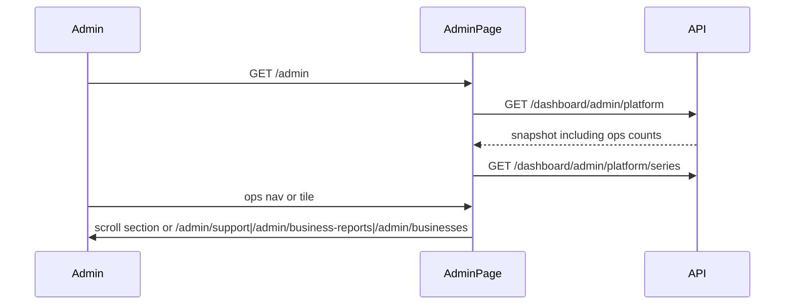

# Slice: S-090 — Admin operational console (G1 + E2)

| Field | Value |
|-------|-------|
| **Slice ID** | S-090 |
| **Phase** | 4 Dashboards |
| **Status** | Accepted |
| **Role(s)** | admin |
| **Owner** | PM / 2026-08-19 |

---

## User story

**As an** admin
**I want** `/admin` to work as an operational console with a compact nav and tiles for queues I actually use
**So that** I can reach users, merchants, approvals, categories, reviews, feedback tickets, and shop reports without hunting a long stat wall

---

## Acceptance criteria

1. **Given** I am signed in as admin on `/admin`, **when** the page loads, **then** an operations nav is visible with links to Users, Merchants (all businesses), Approvals (pending/processing queue), Categories, Reviews, Reported reviews, Support tickets (feedback), Shop reports (complaints), WhatsApp, and Payments — using existing routes or same-page section ids, not new products.
2. **Given** the landing layout, **when** I view `/admin`, **then** the main column is wider than the previous `max-w-4xl` shell (less unused side space) and the existing platform-trends charts still sit under the snapshot tiles.
3. **Given** platform stats load, **when** I view the tile row, **then** I see counts for open support tickets (`open` + `in_progress`), shops at the repeat-report threshold (≥3 reports, distinct shops), and businesses in `processing` status, in addition to the existing five snapshot tiles. These counts are operational facts, not AI.
4. **Given** the new tiles, **when** I activate Open support tickets / Repeat shop reports, **then** I go to `/admin/support` and `/admin/business-reports` respectively; **when** I activate Processing businesses, **then** the page scrolls to the pending/processing queue.
5. **Given** Categories, Users, Pending businesses, Reported reviews, Support (contact + queue links), WhatsApp, and Payments sections, **when** this slice ships, **then** those existing panels remain on `/admin` (S-082 category order among `h2` sections is unchanged: Categories still first among those section headings).
6. **Given** a customer or merchant, **when** they open `/admin` or `GET /dashboard/admin/platform`, **then** they are denied as today (redirect / 403).
7. **Given** S-088 and S-089, **when** this slice ships, **then** support tickets and shop reports stay separate models/queues (ADR-016); Feedback maps to tickets and Complaints map to shop reports — no Inspections or FAQ product.

---

## UX notes

- Screens / routes: `/admin` landing; reuse drill-downs with `AdminBackLink`.
- Components: existing queues/panels, `StatCard` / clickable tile pattern, new compact ops nav.
- Empty states: zero counts are valid (show 0), not an error.
- AI disclaimer required? no — counts are operational facts.

---

## Out of scope

- Inspections / FAQ features
- Merging ticket and shop-report tables
- Full filterable data-grid replacement of existing panels
- Mobile implementation (tracker row `unimplemented`)
- Standalone E2 slice (folded into this slice)

---

## Dependencies

- S-034 (tiles + charts), S-079–S-083 (queue/search/roles), S-086–S-089 **built** on this branch (Tester/PM closeout may still be In Progress; APIs and routes must exist)

---

## Definition of done (PM)

- [x] All AC verified in the single S-091 test report (not a separate TR-S-090)
- [x] UX matches notes above
- [x] README §7 / §8 / §12 / §14 (and §16 if investor-visible)
- [x] PM Status set to **Accepted** after S-091

---

## Technical specification (Architect)

### API contract

| Method | Path | Auth | Request | Response |
|--------|------|------|---------|----------|
| GET | `/api/v1/dashboard/admin/platform` | admin | — | Existing five counts **plus** `open_support_tickets`, `repeat_shop_reports`, `processing_businesses` (all `int`, `COUNT(*)` / grouped count). Additive JSON; no new route. |
| GET | `/api/v1/dashboard/admin/platform/series` | admin | unchanged | unchanged |

Definitions:

- `open_support_tickets`: rows in `support_tickets` with `status` in `{open, in_progress}`
- `repeat_shop_reports`: number of distinct `business_id` values in `business_reports` with `COUNT(*) >= REPEAT_THRESHOLD` (3), matching S-089 `is_repeat`
- `processing_businesses`: `businesses.status = processing`

403 for non-admin; 401 anonymous — existing `require_roles(ADMIN)`.

### RBAC matrix

| Action | customer | merchant | admin |
|--------|----------|----------|-------|
| Load `/admin` console | deny | deny | yes |
| GET platform snapshot (incl. new counts) | 403 | 403 | yes |

### Data model impact

- [x] None  [ ] Extend existing  [ ] New table(s)

**Details:** Snapshot DTO only (`PlatformAnalytics`). No migration.

### Cache / side effects

None. Not on `search:*`.

### Frontend

- **Route:** `/admin` (`frontend/src/app/admin/page.tsx`)
- **Rendering:** CSR (existing)
- **Components:** new `AdminOpsNav.tsx`; extend tile maps; shell `max-w-6xl`; reuse panels/queues; `AdminBackLink` unchanged on drill-downs

### Flow

### Architect checklist

- [x] API contract defined
- [x] RBAC matrix complete
- [x] Data model impact documented
- [x] Cache invalidation considered
- [x] Uses AI/storage abstractions where applicable
- [x] ERD/API/FLOWS updates noted

### Risks / tradeoffs

- Additive fields on the existing snapshot keep one round-trip for tiles (preferred over fetching full ticket/report lists just to count).
- S-082 heading-order tests must ignore the ops nav (nav must not introduce extra `h2`s).

---

## Links

- Test plan: `docs/agents/test-plans/TP-S-091-end-to-end-admin-merchant-pass.md` (batched with H1)
- Test report: `docs/agents/test-reports/TR-S-091-end-to-end-admin-merchant-pass.md`
- ADR: none (extends existing platform snapshot; ADR-016 unchanged)

---

## Changelog

| Date | Agent | Change |
|------|-------|--------|
| 2026-08-19 | PM | Created slice from post-S-089 plan (G1 folding E2). |
| 2026-08-19 | Architect | Spec: additive platform snapshot fields; ops nav; wider shell. Status Specified. |
| 2026-08-19 | Builder | Implemented ops nav, `max-w-6xl`, additive platform counts. Status → In Progress. |
| 2026-08-19 | Tester / PM | TR-S-091 Ship. Status → Accepted. |
