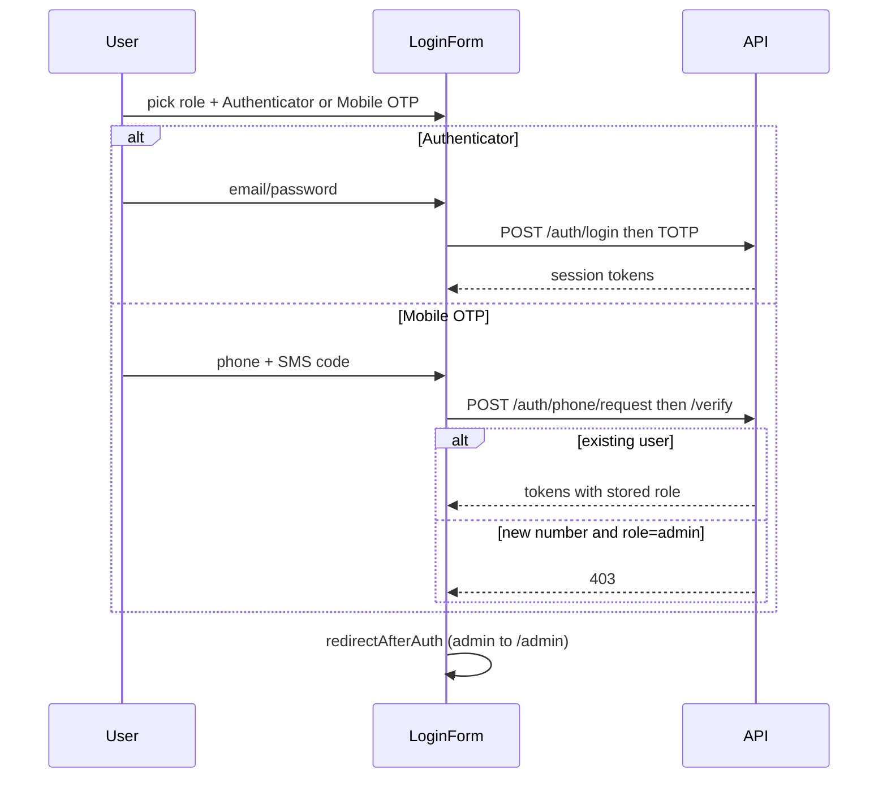

# Slice: S-092 — Authenticator vs mobile OTP for every role

| Field | Value |
|-------|-------|
| **Slice ID** | S-092 |
| **Phase** | 1 Foundation |
| **Status** | In Progress |
| **Role(s)** | customer \| merchant \| admin |
| **Owner** | PM / 2026-08-19 |

---

## User story

**As a** customer, merchant, or admin
**I want** one login (and matching register) screen where I choose **Authenticator** or **Mobile OTP**, not both stacked at once
**So that** each role has a clear, aligned path: password + TOTP, or SMS code — without hunting for a second panel

---

## Acceptance criteria

1. **Given** `/login`, **when** I am on the credentials step, **then** I see a role control (Customer / Merchant / Admin) and a two-option method control (**Authenticator** | **Mobile OTP**) of equal visual weight.
2. **Given** Authenticator is selected, **when** the form is shown, **then** email/password (and Gmail) are visible and the mobile-OTP panel is not in the document; password login still continues into TOTP enroll/verify as today.
3. **Given** Mobile OTP is selected, **when** the form is shown, **then** the SMS panel is visible and email/password (and Gmail) are not in the document.
4. **Given** I pick Merchant (or Customer) and complete a correct SMS verify for an existing account with that phone, **when** the session is issued, **then** I land on that role’s home (merchant dashboard / public home) and TOTP is not required.
5. **Given** I pick Admin and complete a correct SMS verify for an **existing** admin whose `User.phone` matches, **when** the session is issued, **then** I land on `/admin` and TOTP is not required.
6. **Given** I pick Admin and verify a **new** number (no matching user), **when** the API runs, **then** self-register as admin is refused (403); the UI surfaces the error (no silent customer account).
7. **Given** `/register`, **when** I open it, **then** the same Authenticator | Mobile OTP chooser is used; account type stays Customer / Merchant only (no Admin self-register).
8. **Given** demo seed accounts, **when** seed has applied this version, **then** admin, both merchants, and the sample customer have distinct `User.phone` values documented in README so Mobile OTP can be exercised locally (mock SMS logs the code).

---

## UX notes

- Screens: `/login`, `/register` (shared components, not separate merchant/admin login routes).
- Reuse: `PhoneOtpPanel`, `GoogleSignInButton`, existing TOTP steps.
- Method control: segmented buttons (not a third stacked card). Switching methods hides the other path.
- Empty/error: existing OTP errors; admin-new-number 403 copy from API.
- AI disclaimer? no.

---

## Out of scope

- Replacing TOTP for password login (Authenticator path unchanged).
- Allowing public admin registration.
- Mobile Flutter login-screen redesign (parity tracker: unimplemented / later).
- Sending OTP as a second factor after password (this is an alternative primary method).

---

## Dependencies

- S-044, S-068 (phone OTP + merchant-aware login) — Accepted.

---

## Definition of done (PM)

- [ ] All AC verified in test report
- [ ] UX matches notes above
- [ ] Documented in `README.md` §7 / §8 / §12 / §14
- [ ] PM Status set to **Accepted**

---

## Technical specification (Architect)

### API contract

No new routes. Existing:

| Method | Path | Auth | Request | Response |
|--------|------|------|---------|----------|
| POST | `/api/v1/auth/login` | Public | email + password | MFA challenge (unchanged) |
| POST | `/api/v1/auth/mfa/totp/*` | MFA token | code | session tokens (unchanged) |
| POST | `/api/v1/auth/phone/request` | Public | `{ phone }` | generic 200 |
| POST | `/api/v1/auth/phone/verify` | Public | `{ phone, code, full_name?, role? }` | session tokens; **existing user by phone ignores `role`**; new user with `role=admin` → **403** `"Cannot self-register as admin"` |

Clarify §7: `role` on verify is only for **first-time** customer/merchant; existing admin/merchant/customer match is by `users.phone`.

### RBAC matrix

| Action | customer | merchant | admin |
|--------|----------|----------|-------|
| Authenticator login (password + TOTP) | yes | yes | yes |
| Mobile OTP, existing `User.phone` | yes | yes | yes (tokens include `role=admin`) |
| Mobile OTP, new number + `role` hint | yes (creates customer) | yes (creates merchant) | **403** |
| Register UI offers admin | no | no | n/a |

### Data model impact

- [x] Extend existing  [ ] None  [ ] New table(s)

**Details:** Seed writes `User.phone` on the four demo accounts (unique partial index already exists). No migration.

### Cache / side effects

OTP still Redis-hashed (ADR-011). Seed version bump so `if_outdated` applies phones.

### Frontend

- **Route:** `/login`, `/register` (CSR).
- **Components:** new `AuthMethodToggle`; `LoginForm` / `RegisterForm` mount it; `roleLandingPath("admin")` → `/admin`.
- **Rendering:** CSR.

### Flow

### Architect checklist

- [x] API contract defined
- [x] RBAC matrix complete
- [x] Data model impact documented
- [x] Cache invalidation considered
- [x] Uses AI/storage abstractions where applicable
- [x] ERD/API/FLOWS updates noted (README §6/§7)

### Risks / tradeoffs

- Admin OTP is as strong as SMS (same as customer/merchant). Acceptable for demo; production should keep TOTP as the preferred admin path (UI still offers both).
- Demo phones are public; mock SMS logs codes. Do not use these numbers in a real Msg91 production tenant without rotation.

---

## Links

- Test plan: `docs/agents/test-plans/TP-S-092-auth-method-choice.md`
- Test report: `docs/agents/test-reports/TR-S-092-auth-method-choice.md`
- ADR: `docs/agents/adrs/ADR-017-admin-phone-otp-login.md`

---

## Changelog

| Date | Agent | Change |
|------|-------|--------|
| 2026-08-19 | PM | Created slice: aligned Authenticator vs Mobile OTP chooser; admin OTP for existing accounts only. |
| 2026-08-19 | Architect | Spec: reuse phone verify; seed phones; admin landing `/admin`; ADR-017. Status: Specified. |
| 2026-08-19 | Builder | AuthMethodToggle on login/register; admin role; seed phones; roleLandingPath `/admin`. |
| 2026-08-19 | Tester | TP/TR. pytest phone OTP 9 passed; targeted Jest 37 passed. Recommend Ship; AC8 Compose re-seed pending. Status: In Progress. |
