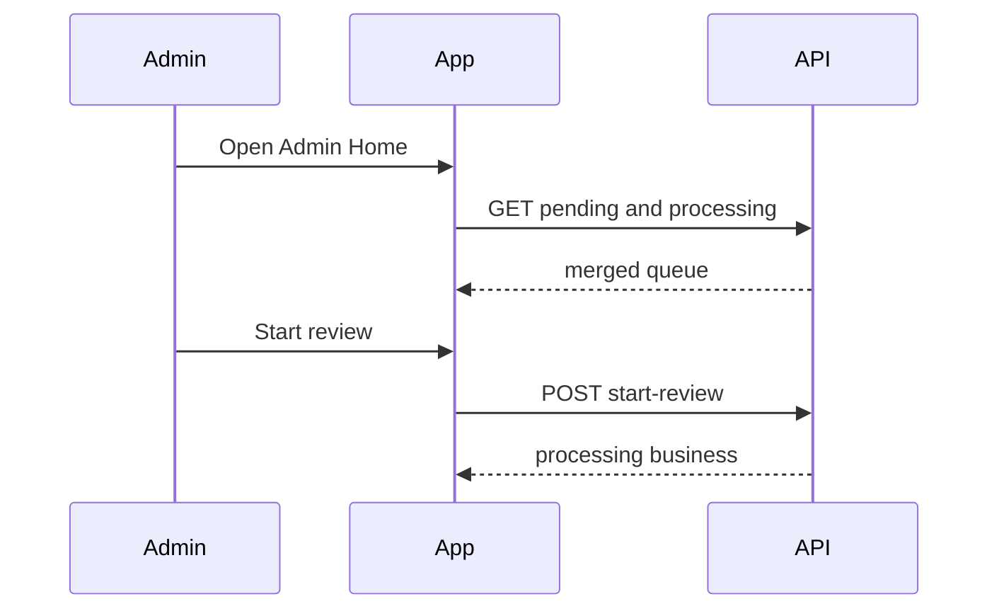

# Slice: S-093 — Mobile admin queue polish (M-81–M-86)

| Field | Value |
|-------|-------|
| **Slice ID** | S-093 |
| **Phase** | 4 Dashboards |
| **Status** | Accepted |
| **Role(s)** | admin \| merchant |
| **Owner** | PM / 2026-08-19 |

---

## User story

**As an** admin on the Flutter app  
**I want** processing listings, user/category search, distinct category errors, role badges, and a clear back path to Admin Home  
**So that** I can do the same queue work I already do on web without switching to a browser

**As a** merchant  
**I want** an “under review” banner when my listing is processing  
**So that** I understand the listing is not stuck or broken

---

## Acceptance criteria

1. **Given** pending and processing listings exist, **when** I open Admin Home, **then** both appear in one queue; processing rows show a Processing badge; pending rows show Start review; processing rows show Return to pending; Approve and Suspend remain on both.
2. **Given** a pending listing, **when** I tap Start review, **then** it becomes processing in place via `POST /businesses/{id}/start-review`.
3. **Given** a processing listing, **when** I tap Return to pending, **then** it becomes pending via `POST /businesses/{id}/return-to-pending`.
4. **Given** All businesses, **when** a row is processing, **then** I see a visible processing badge (not a raw broken label).
5. **Given** I am a merchant whose selected listing is processing, **when** I open Merchant Home, **then** I see an under-review banner and status label “Under review”.
6. **Given** Admin Users, **when** I type in search, **then** after ~300ms debounce the list reloads from `GET /admin/users?q=`.
7. **Given** Admin Users, **when** the list loads, **then** each row shows a role chip (customer / merchant / admin), not only subtitle text.
8. **Given** Admin Categories, **when** I type in search, **then** after debounce the list reloads from `GET /businesses/categories/all?q=`.
9. **Given** Admin Home, **when** I look at ops links, **then** Manage categories is above WhatsApp drafts (promoted, not buried).
10. **Given** I add a duplicate category name, **when** create returns 409, **then** I see `A category named "{name}" already exists`. **Given** 401/403, **then** session/permission copy. **Given** no HTTP status (network), **then** connection copy. **Given** other errors, **then** generic retry copy.
11. **Given** I am on Users, Categories, All businesses, All reviews, or WhatsApp drafts, **when** I tap the Admin back control, **then** I land on `/admin`.
12. **Given** a customer, **when** they open `/admin/*`, **then** they are redirected away (existing role gate unchanged).
13. **Given** AI copy, **when** this slice ships, **then** none of these admin/merchant processing labels are framed as AI judgments.

---

## UX notes

- Native density: search fields, chips, AppBar back labeled Admin (`context.go('/admin')`).
- Queue empty copy: “No businesses awaiting review” when both lists empty.
- Out of chrome clone: do not copy the web footer.

---

## Out of scope

- M-87–M-91 (S-094 / S-095)
- Native app links, FCM, Razorpay SDK
- New backend endpoints

---

## Dependencies

- Web S-079–S-083, S-086 Accepted
- OpenAPI regen of `merchanthub_api` (processing status + start-review / return-to-pending + categories `q`)

---

## Definition of done (PM)

- [x] All AC verified in one combined test report
- [ ] PM Status set to **Accepted** after Tester pass
- [ ] `README.md` §12 M-81–M-86 updated

---

## Technical specification (Architect)

### API contract (existing; no new routes)

| Method | Path | Auth |
|--------|------|------|
| GET | `/api/v1/businesses?status_filter=pending\|processing` | admin for non-approved |
| POST | `/api/v1/businesses/{id}/start-review` | admin |
| POST | `/api/v1/businesses/{id}/return-to-pending` | admin |
| GET | `/api/v1/businesses/admin/all` | admin |
| GET | `/api/v1/admin/users?q=` | admin |
| GET | `/api/v1/businesses/categories/all?q=` | public GET; UI admin-gated |
| POST | `/api/v1/businesses/categories` | admin |

### RBAC matrix

| Action | customer | merchant | admin |
|--------|----------|----------|-------|
| Start review / return / approve / suspend | 403 | 403 | yes |
| User/category search UI | no | no | yes |
| See own processing banner | no | own listing | n/a |

### Data model impact

- [x] None (client regen only)

### Cache / side effects

None new. Mutations already write audit logs server-side.

### Frontend (Flutter)

- **Routes:** existing `/admin`, `/admin/users`, `/admin/categories`, `/admin/businesses`, `/admin/reviews`, `/admin/whatsapp`
- **Rendering:** CSR
- **Components:** `AdminHomeScreen` queue, `AdminUsersScreen`, `AdminCategoriesScreen`, `AdminBusinessesScreen`, `MerchantDashboardScreen`, shared Admin back AppBar
- **Build sequence:** `SECRET_KEY=… python mobile/scripts/generate_api_client.py` before Dart that calls new generated methods. Do not hand-write clients.

### Flow

### Architect checklist

- [x] API contract defined
- [x] RBAC matrix complete
- [x] Data model impact documented
- [x] Cache invalidation considered
- [x] Uses AI/storage abstractions where applicable
- [x] ERD/API/FLOWS updates noted (README §12 only)

### Risks / tradeoffs

- OpenAPI regen may touch unrelated generated files — keep the regen in this slice’s PR.
- Admin back always `go('/admin')` rather than stack pop so deep links still return home.

---

## Links

- Test plan: `docs/agents/test-plans/TP-S-093-mobile-admin-queue-polish.md`
- Test report: `docs/agents/test-reports/TR-S-093-mobile-admin-queue-polish.md`

---

## Changelog

| Date | Agent | Change |
|------|-------|--------|
| 2026-08-19 | PM | Created slice for M-81–M-86 |
| 2026-08-19 | Architect | Specified; existing APIs; regen first |
| 2026-08-19 | Builder | Flutter queue/search/back + OpenAPI models |
| 2026-08-19 | Tester | TR-S-093 Ship |
| 2026-08-19 | PM | Accepted |
