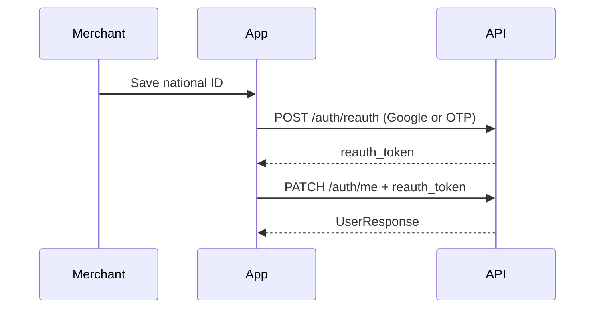

# Slice: S-114 — Mobile Home density + merchant find-shop + step-up ID

| Field | Value |
|-------|-------|
| **Slice ID** | S-114 |
| **Phase** | 5 Polish |
| **Status** | In Progress |
| **Role(s)** | customer \| merchant |
| **Owner** | PM / 2026-08-20 |

---

## User story

**As a** visitor or merchant on the Android app  
**I want** a short Home, a working List-your-business action, a one-line Alerts tab, Account shortcuts to my shop/QR, and confirmation before changing phone or national ID  
**So that** I can find shops quickly, reach merchant tools without guessing tabs, and know sensitive profile edits are mine

---

## Acceptance criteria

1. **Given** the signed-in bottom bar, **when** I view the notifications destination, **then** the label is the single word **Alerts** (does not wrap to two lines) and the unread badge stays inside the icon bounds.
2. **Given** mobile `/home`, **when** it renders, **then** order is hero (search + Explore + List your business) → optional signed-in banner → **Category \| Neighborhood** segmented browse (only one list visible) → social-proof rail → compact featured cards → compact review voices (≤2 lines, no extra nutshell paragraph) → optional trust metrics. Problem section, How it works, and the long merchant CTA block are **absent** on mobile (web `/` unchanged).
3. **Given** Category and Neighborhood both have data, **when** I switch the segment, **then** the other index is hidden without leaving the first screen; taps still open Explore with `?category=` or `?city=`.
4. **Given** a guest, **when** they tap List your business, **then** they go to `/register`. **Given** a signed-in merchant, **then** they go to `/merchant/businesses/new` (not `/register`). **Given** a signed-in customer, **then** a dialog explains this login is a customer — no silent bounce to Home.
5. **Given** a signed-in merchant on Home, **when** they tap the banner action, **then** they open `/merchant` and the button reads **Open Shop**.
6. **Given** a merchant on Account, **when** the screen renders, **then** they see **My shop**, **List a business**, **Share review QR**, and **Grow / payments** in addition to Profile. QR opens the existing share sheet when they have a listing; otherwise it routes to Shop.
7. **Given** a merchant Shop empty state without national ID, **when** they tap create, **then** copy tells them to save a national ID on Profile first (link to `/account/profile`).
8. **Given** a merchant `PATCH /auth/me` that changes **phone** or **national ID** (type/number; masked number is not a change), **when** no valid `reauth_token` is sent, **then** 401. Email remains reauth-gated for every role. Name/address-only saves do not require reauth.
9. **Given** `POST /auth/reauth`, **when** the body is exactly one of password, totp, phone+otp, or Google `credential`, **then** a reauth JWT is issued. Google credential must match this user (`google_sub` or verified email).
10. **Given** mobile Profile for a merchant changing email, phone, or national ID, **when** they save, **then** they pick Password, Phone OTP, Authenticator, or Google (if configured) before PATCH.

---

## UX notes

- Alerts: keep route `/notifications` and screen title **Notifications**; only the tab label shortens.
- Browse default: Category when categories exist, else Neighborhood.
- Featured AI blurb stays labeled as a suggestion; truncate to 2 lines.
- Web Home marketing copy stays; this is a mobile IA split.
- AI disclaimer required? yes on featured suggestion text only.

---

## Out of scope

- Web Home redesign
- Map on Home (Explore map unchanged)
- Role conversion customer → merchant
- Reauth on name/address or every profile field
- FCM

---

## Dependencies

- S-064 (mobile home), S-069 (list business), S-107 (email reauth), S-100 (Shop hub)

---

## Definition of done (PM)

- [ ] All AC verified in test report
- [ ] UX matches notes above
- [ ] Documented in `README.md` §7 / §11 / §12
- [ ] PM Status set to **Accepted**

---

## Technical specification (Architect)

### API contract

| Method | Path | Auth | Request | Response |
|--------|------|------|---------|----------|
| POST | `/auth/reauth` | Bearer | Exactly one of `password`, `totp_code`, `phone`+`otp_code`, `credential` (Google ID token) | `{ reauth_token }` |
| PATCH | `/auth/me` | Bearer | Profile body; `reauth_token` query or `X-Reauth-Token` | `UserResponse`. 401 if email (any role) or merchant phone/national ID changed without token |

### RBAC matrix

| Action | customer | merchant | admin |
|--------|----------|----------|-------|
| PATCH name/address without reauth | yes | yes | yes |
| PATCH email without reauth | no | no | no |
| PATCH phone/national ID without reauth | yes | no | yes |
| POST reauth with Google credential | if identity matches | if identity matches | if identity matches |

### Data model impact

- [x] None  [ ] Extend existing  [ ] New table(s)

### Cache / side effects

None.

### Frontend

- **Route:** Flutter `/home`, `/account`, `/merchant`; web `/profile` + merchant ID card must send reauth when merchant phone/NID changes (avoid 401).
- **Rendering:** CSR
- **Components:** `HomeScreen`, `AppShell`, `AccountScreen`, `ProfileScreen`, `auth.reauth` / `updateMe`

### Flow

### Architect checklist

- [x] API contract defined
- [x] RBAC matrix complete
- [x] Data model impact documented
- [x] Cache invalidation considered
- [x] Uses AI/storage abstractions where applicable
- [x] ERD/API/FLOWS updates noted

### Risks / tradeoffs

- Google-only merchants cannot use password reauth; Google/`credential` is required.
- Aadhaar mock-OTP verify path still writes ID without PATCH (already OTP-gated).

---

## Links

- Test plan: `docs/agents/test-plans/TP-S-114-mobile-home-merchant-find-shop.md`
- Test report: `docs/agents/test-reports/TR-S-114-mobile-home-merchant-find-shop.md`

---

## Changelog

| Date | Agent | Change |
|------|-------|--------|
| 2026-08-20 | PM | Created slice |
| 2026-08-20 | Architect | Spec for Home IA, Alerts label, Account shortcuts, merchant reauth + Google |
