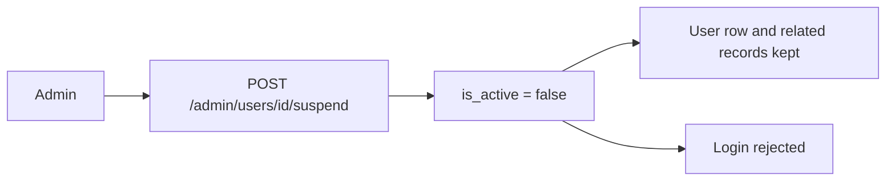

# Slice: S-115 — Admin trends alignment + suspend-only copy

| Field | Value |
|-------|-------|
| **Slice ID** | S-115 |
| **Phase** | 5 Polish |
| **Status** | In Progress |
| **Role(s)** | admin |
| **Owner** | PM / 2026-08-21 |

---

## User story

**As an** admin on `/admin`  
**I want** the Platform trends charts to line up, and a clear statement that I can only suspend (not delete) users  
**So that** the dashboard looks aligned and I know reviews and account records stay after suspend

---

## Acceptance criteria

1. **Given** I am signed in as admin viewing Platform trends, **when** “New users” and “Businesses approved” sit side by side, **then** their titles share a header row and their chart (or empty) areas start at the same vertical offset — the approved-series audit subtitle does not push only that plot down.
2. **Given** a series has no counts in the window, **when** its neighbor has a filled chart, **then** the dashed empty state is the same height as a filled chart (`min-h-64`).
3. **Given** I am signed in as admin on `/admin` Users, **when** I read the section helper, **then** it states that suspend/reactivate is the action, suspend blocks sign-in, reviews and account records are kept, and there is no delete.
4. **Given** I am signed in as admin on mobile `/admin/users`, **when** I view the screen, **then** equivalent retain-records copy is visible (not only Suspend/Reactivate buttons).
5. **Given** the Users panel, **when** I look for a Delete/Remove control, **then** none is shown; APIs remain list / suspend / reactivate only.

---

## UX notes

- **Screens / routes:** web `/admin` Platform trends grid + `#admin-users`; mobile `/admin/users` (existing M-64 surface — helper copy only, no new route).
- **Figma:** no new frames; polish on existing admin charts and Users list.
- **Mobile placement:** existing Users hub route.
- **Components:** `SeriesChart` on `frontend/src/app/admin/page.tsx`; `AdminUserPanel` unchanged functionally; `AdminUsersScreen`.
- **Empty states / errors:** keep “No data yet for this window”; only add height so it matches filled charts.
- **AI disclaimer required?** No. Trends stay operational facts (existing S-034 copy).

---

## Out of scope

- Profile step-up reauth (already shipped: email all roles; merchant phone/national ID).
- Admin hard-delete, soft-delete, `deleted_at`, or GDPR anonymize.
- Changing FK cascade behavior.
- New admin APIs.

---

## Dependencies

- S-034 (Accepted) — series charts + user suspend/reactivate
- S-061 (Accepted) — mobile M-64 Users screen

---

## Definition of done (PM)

- [ ] All AC verified in test report
- [ ] UX matches notes above
- [ ] Documented in `README.md` §7 (suspend retains records) / §11 index / §12 M-64 note / §14 legal erase still deferred
- [ ] PM Status set to **Accepted** (after Tester)

---

## Technical specification (Architect)

No new REST. Logic unchanged. UI + README only.

### API contract

| Method | Path | Auth | Request | Response |
|--------|------|------|---------|----------|
| GET | `/admin/users` | Admin JWT | unchanged | unchanged |
| POST | `/admin/users/{id}/suspend` | Admin JWT | unchanged | `is_active=false`; row and related records retained |
| POST | `/admin/users/{id}/reactivate` | Admin JWT | unchanged | `is_active=true` |
| — | `DELETE /admin/users/...` | — | **Does not exist. Do not add.** | — |

### RBAC matrix

| Action | customer | merchant | admin |
|--------|----------|----------|-------|
| View `/admin` trends + Users copy | 403 / redirect | 403 / redirect | yes |
| Suspend / reactivate non-admin | no | no | yes (existing) |
| Delete user | no | no | **no** |

### Data model impact

- [x] None  [ ] Extend existing  [ ] New table(s)

**Details:** Continue using `users.is_active` only.

### Cache / side effects

None.

### Frontend

- **Route:** `/admin` (CSR, existing); mobile `/admin/users`
- **Rendering:** CSR
- **Components:** `SeriesChart` always reserves a subtitle slot (`min-h-[2.5rem]`); empty dashed box `min-h-64 flex items-center justify-center`. Users helper on web `#admin-users` and mobile search header.

### Flow

### Architect checklist

- [x] API contract defined (no new endpoints)
- [x] RBAC matrix complete
- [x] Data model impact documented
- [x] Cache invalidation considered
- [x] Uses AI/storage abstractions where applicable (N/A)
- [x] ERD/API/FLOWS updates noted (README §7 prose only)

### Risks / tradeoffs

Reserving subtitle space leaves a blank strip under titles that have no subtitle; that is the intended alignment fix.

---

## Links

- Test plan: (index-row Jest + flutter test; no separate TP required for copy/layout)
- Test report: `docs/agents/test-reports/TR-S-115-admin-trends-alignment-suspend-copy.md`
- ADR: none

---

## Changelog

| Date | Agent | Change |
|------|-------|--------|
| 2026-08-21 | PM | Created slice (Option A: suspend-only; reauth out of scope) |
| 2026-08-21 | Architect | Spec: subtitle slot + empty height; helper copy web/mobile; no DELETE |
| 2026-08-21 | Tester | TR-S-115: 5/5 AC pass; recommend Ship |
