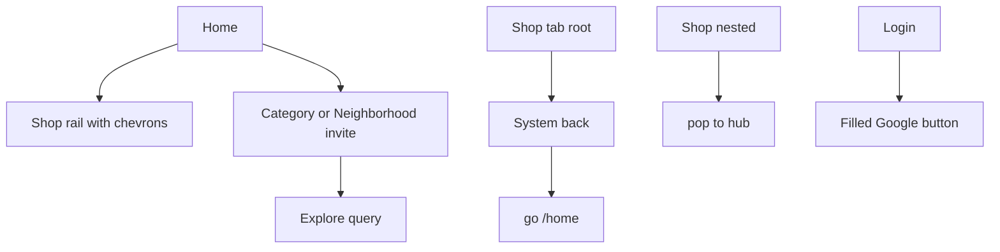

# Slice: S-116 — Home rail slider, browse invites, Shop back, Google button

| Field | Value |
|-------|-------|
| **Slice ID** | S-116 |
| **Phase** | 5 Polish |
| **Status** | In Progress |
| **Role(s)** | customer \| merchant \| admin (guest Home + login) |
| **Owner** | PM / 2026-08-21 |

---

## User story

**As a** visitor or merchant on web Home and the Android app  
**I want** the shop rail to look slideable, Home category/neighborhood to invite a tap, Shop-tab back to stay in the app, and Google sign-in to look like a button  
**So that** I can discover shops and accounts without guessing hidden gestures or exiting by accident

---

## Acceptance criteria

1. **Given** the web Home social-proof rail (“Businesses using MerchantHub”), **when** more shops exist than fit on screen, **then** previous/next controls are visible, the next card peeks, and the horizontal scrollbar is not hidden. No invented counts or percentages appear on the rail.
2. **Given** mobile `/home` “SHOPS ON MERCHANTHUB”, **when** the rail renders, **then** previous/next controls (`socialProofPrev` / `socialProofNext`) are visible and the next card peeks. No invented counts or percentages on the rail.
3. **Given** mobile `/home` has both categories and cities, **when** the browse block loads, **then** I see two invite cards (category and neighborhood), not a `SegmentedButton`, and neither index list is shown until I tap an invite.
4. **Given** I tap a browse invite, **when** I then tap a category or city row, **then** Explore opens with `?category=` or `?city=` as today.
5. **Given** a merchant on the Shop tab root (`/merchant`) with an empty branch stack, **when** they press Android/system back, **then** the app goes to `/home` and does not exit. Nested Shop routes (insights/reviews/grow/editor) still pop to the hub first.
6. **Given** Login or Register with Google configured, **when** “Continue with Google” renders, **then** it is a filled 48px-tall control with a strong border and a leading G mark — not transparent outline-on-canvas. Unconfigured Google still hides the button.

---

## UX notes

- **Screens / routes:** web `/` `SocialProofRail`; mobile `/home`; `AppShell`; `/login` `/register` `GoogleSignInButton`.
- **Figma:** polish on existing Home + auth; no new frames required.
- **Mobile placement:** Home browse stays on `/home` (invite cards, not a new route). Shop back is shell-level.
- **Components:** `SocialProofCarousel` (web client); `_SocialProofRail`; `MhJobTile` invites; `PopScope` on `AppShell`.
- **Empty states:** hide a browse invite when that index is empty; hide Google when client ID unset.
- **AI disclaimer required?** no

---

## Out of scope

- Web Category/City redesign
- Web GIS Google button restyle
- Profile reauth expansion
- Admin user delete
- Changing merchant nested `push` routes
- Baking a Google client ID when none is configured

---

## Dependencies

- S-047 / S-064 (social proof rails)
- S-114 (mobile Home density; AC 2–3 segmented browse **superseded** by this slice)
- S-103 (per-tab stacks)
- S-102 (mobile Google sign-in)

---

## Definition of done (PM)

- [ ] All AC verified in test report
- [ ] UX matches notes above
- [ ] Documented in `README.md` §11 / §12 (M-15, M-16, M-76, M-04, M-11) / §13 / §14 if a gap closed
- [ ] PM Status set to **Accepted** (after Tester)

---

## Technical specification (Architect)

No new REST. UI + shell back handling only.

### API contract

| Method | Path | Auth | Request | Response |
|--------|------|------|---------|----------|
| — | existing public businesses / google-config | unchanged | unchanged | unchanged |

### RBAC matrix

| Action | guest | customer | merchant | admin |
|--------|-------|----------|----------|-------|
| See Home rail + browse invites | yes | yes | yes | yes |
| Shop-tab back → Home | n/a | n/a (Explore/Account same rule) | yes | Hub same rule |
| Google button (if configured) | yes on login/register | n/a when signed in | same | same |

### Data model impact

- [x] None  [ ] Extend existing  [ ] New table(s)

**Details:** None.

### Cache / side effects

None.

### Frontend

- **Route:** web `/`; mobile `/home`, shell, `/login`, `/register`
- **Rendering:** web rail remains a Server Component wrapping a client carousel; Flutter CSR
- **Components:**
  - `frontend/src/components/home/SocialProofCarousel.tsx` (`"use client"`): `overflow-x-auto` **without** scrollbar-hiding classes; peek via card width + end padding; prev/next `aria-label` Previous shops / Next shops (no digits).
  - Mobile `_SocialProofRail`: `ListView` + overlay `IconButton`s; card width ~148 and trailing padding for peek.
  - `_BrowseIndex`: two `MhJobTile`s; expand one list in place; drop `SegmentedButton`.
  - `AppShell`: `PopScope(canPop: false)`; if `context.canPop()` then `pop`; else if path is not `/home` then `go('/home')`; else `SystemNavigator.pop()`.
  - `GoogleSignInButton`: `OutlinedButton` with `backgroundColor: surfaceContainerLowest`, `side` `onSurface` 0.35 / 1.5px, `Icons.g_mobiledata`, height 48.

### Flow

### Architect checklist

- [x] API contract defined (no new endpoints)
- [x] RBAC matrix complete
- [x] Data model impact documented
- [x] Cache invalidation considered
- [x] Uses AI/storage abstractions where applicable (N/A)
- [x] ERD/API/FLOWS updates noted (README §12/§11 only)

### Risks / tradeoffs

Tab-root back always returns to Home, not the previous tab (Account → My shop → back is Home). Nested `canPop` must be checked first so Insights still pops to Shop.

---

## Links

- Test plan: (index-row Jest + flutter test)
- Test report: `docs/agents/test-reports/TR-S-116-home-rail-browse-shop-back.md`
- ADR: none

---

## Changelog

| Date | Agent | Change |
|------|-------|--------|
| 2026-08-21 | PM | Created slice: rail chrome, invite cards (supersedes S-114 segmented browse), Shop PopScope, Google button fill |
| 2026-08-21 | Architect | Spec: client carousel, PopScope rules, Google OutlinedButton fill, no APIs |
| 2026-08-21 | Builder | Implemented web/mobile rail chrome, Home invite cards, AppShell PopScope, Google button fill |
| 2026-08-21 | Tester | TR-S-116: 6/6 AC pass; recommend Ship |
