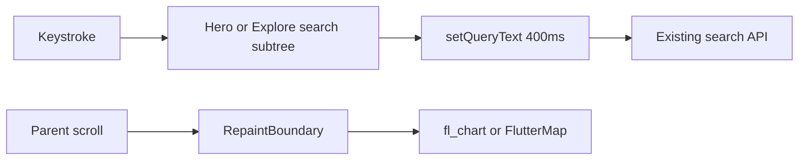

# Slice: S-117 — Mobile performance cheap wins

| Field | Value |
|-------|-------|
| **Slice ID** | S-117 |
| **Phase** | 5 Polish |
| **Status** | In Progress |
| **Role(s)** | customer \| merchant \| admin (guest Home + Explore) |
| **Owner** | PM / 2026-08-21 |

> Cursor plan file was titled S-116; **S-116** is already [Home rail / browse / Shop back](S-116-home-rail-browse-shop-back.md). This work is **S-117**.

---

## User story

**As a** visitor, customer, merchant, or admin on the Android app  
**I want** Home, Explore, Insights, and Admin charts to do less extra work while I type or scroll  
**So that** the same screens and taps feel less sticky, without a layout or flow change

---

## Acceptance criteria

1. **Given** I am on mobile `/home`, **when** I type in the hero search field, **then** Explore / List-your-business / suggestion keys and copy stay the same, suggestions still appear at two-or-more characters (max 6), and debounce stays 400ms. Search typing does not require the parent Home screen to `setState` (hero owns that state).
2. **Given** I am on Explore (`/businesses`), **when** I type in `searchField`, **then** suggestions still filter the current catalog (name contains, take 6) with the same padding and keys (`searchField`, `searchSuggestions`). List/map toggle keys are unchanged. Debounce still 400ms via `setQueryText`.
3. **Given** Explore list results, **when** I have not tapped Map, **then** `resultsMap` is absent. **When** I tap `mapToggle`, **then** `resultsMap` is present. List path does not watch `mapsConfigProvider`.
4. **Given** Merchant Insights review-volume / rating-mix charts, Admin platform series chart, or any `OsmMapView`, **when** the widget builds, **then** the chart or map is wrapped in `RepaintBoundary`. Existing keys (`reviewVolumeChart`, `ratingDistributionChart`, `platformSeriesChart`, map keys) still find widgets.
5. **Given** network images on `BusinessCard`, Home social-proof rail, review thumbs (64), and gallery thumbs (96), **when** they decode, **then** they pass `cacheWidth`/`cacheHeight` from laid-out logical size × device pixel ratio. Widget sizes, `AspectRatio` 16/10, and lightbox full-res decode stay unchanged.

---

## UX notes

- **Screens / routes:** `/home`, `/businesses`, merchant Insights (`ReviewVolumeChart` / `RatingDistributionChart`), `/admin` (`PlatformSeriesChart`), business detail map (inherits `OsmMapView`).
- **Figma:** no new frames; no pixel changes.
- **Mobile placement:** existing slots only.
- **Components:** existing hero, search paddings, `BusinessCard`, `OsmMapView`, `Mh*` unchanged visually.
- **Empty states / errors:** unchanged.
- **AI disclaimer required?** no

---

## Out of scope

- Splitting `homePayloadProvider` `Future.wait` / extra `listPublic` (Home first-paint still bound by that payload)
- `cached_network_image` or other new packages
- Pagination of `listPublic()`
- Hub IA, padding, copy, widget order
- Profile step-up expansion (customer phone reauth)
- Changing S-116 Home rail / browse invites

---

## Dependencies

- S-060 / S-061 / S-063 (charts)
- S-028 Explore list/map
- S-064 / S-114 Home
- S-116 Home rail (same `/home` file; do not revert rail/browse)

---

## Definition of done (PM)

- [ ] All AC verified in test report
- [ ] UX matches notes above (no layout change)
- [ ] Documented in `README.md` §11 feature → test index; §14 first-paint split still open
- [ ] PM Status set to **Accepted** (after Tester)

---

## Technical specification (Architect)

No new REST. Flutter-only. `cacheWidth`/`cacheHeight` are **physical pixels** (`logical × MediaQuery.devicePixelRatio`).

### API contract

| Method | Path | Auth | Request | Response |
|--------|------|------|---------|----------|
| — | none | — | — | — |

### RBAC matrix

| Action | guest | customer | merchant | admin |
|--------|-------|----------|----------|-------|
| Use Home/Explore/charts as today | yes | yes | yes | yes |

### Data model impact

- [x] None  [ ] Extend existing  [ ] New table(s)

**Details:** none

### Cache / side effects

None. Image decode cache is in-process Flutter `ImageCache`, not Redis.

### Frontend

- **Route:** unchanged (`/home`, `/businesses`, merchant Insights, `/admin`)
- **Rendering:** Flutter CSR
- **Components:** `_HeroSection` becomes a `ConsumerStatefulWidget` owning the search controller (same chrome). Explore extracts `_ExploreSearchHeader` with the **same two `Padding` blocks**. `RepaintBoundary` inside chart/map widgets. Image `cacheWidth`/`cacheHeight` = logical size × `devicePixelRatio` (inline; no new package).

### Flow

### Architect checklist

- [x] API contract defined (none)
- [x] RBAC matrix complete
- [x] Data model impact documented
- [x] Cache invalidation considered (n/a)
- [x] Uses AI/storage abstractions where applicable (n/a)
- [x] ERD/API/FLOWS updates noted (README §11/§14 only)

### Risks / tradeoffs

- Extracting search with an extra wrapper would shift pixels — forbidden; keep existing `Padding` values.
- Aggressive `cacheWidth` caps can blur photos — use layout × DPR only, no extra cap.
- Parent still `watch`es `searchControllerProvider` on Explore for results; list rebuilds after debounce, not every keystroke.

---

## Links

- Test plan: `docs/agents/test-plans/TP-S-117-mobile-perf-cheap-wins.md`
- Test report: `docs/agents/test-reports/TR-S-117-mobile-perf-cheap-wins.md`

---

## Changelog

| Date | Agent | Change |
|------|-------|--------|
| 2026-08-21 | PM | Created slice (ID S-117; plan labeled S-116) |
| 2026-08-21 | Architect | Flutter-only spec, no API |
| 2026-08-21 | Tester | TP/TR; index-row flutter test 86/86 |
