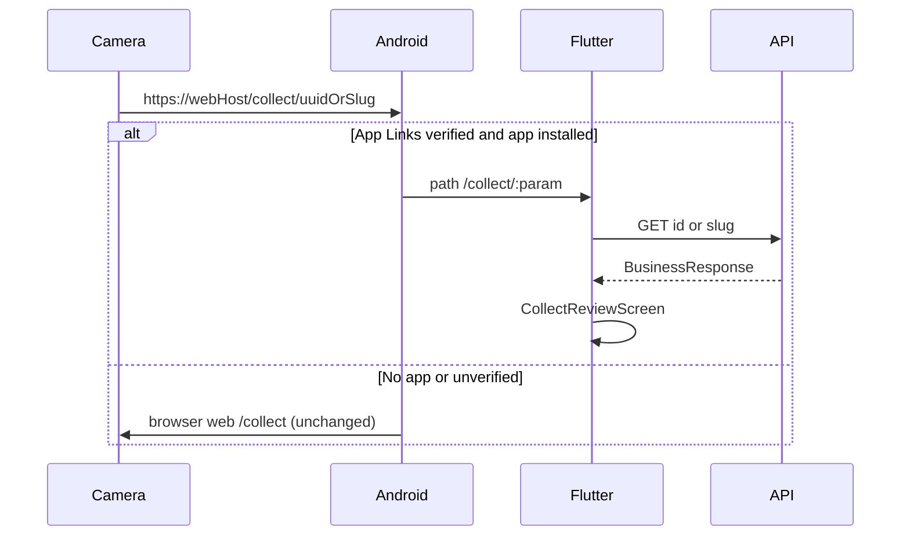

# Slice: S-118 — Cold review QR opens Android collect screen (web unchanged)

| Field | Value |
|-------|-------|
| **Slice ID** | S-118 |
| **Phase** | 5 Polish |
| **Status** | Accepted |
| **Role(s)** | customer \| merchant |
| **Owner** | PM / 2026-08-21 |

---

## User story

**As a** walk-in customer with MerchantHub installed  
**I want** scanning the existing review-collection QR to open the in-app review form  
**So that** I land on the same collect job as the website, without the camera ignoring the app

**As a** customer without the app  
**I want** that same QR to keep opening the website collect page  
**So that** printed shop signs still work

---

## Acceptance criteria

1. **Given** the web merchant dashboard review QR (unchanged `{origin}/collect/{businessId}` UUID payload) and the Android app installed with verified App Links on the deployed frontend host, **when** the customer scans that QR (or Android opens that HTTPS URL), **then** Flutter routes to `/collect/:slug` (UUID in the path segment is allowed) and `CollectReviewScreen` shows that shop’s collect form.
2. **Given** the same QR and the app **not** installed (or App Links not verified), **when** the customer scans, **then** the existing web `/collect/[businessId]` page still loads. No change to collect wizard UI, `CollectQrCard`, or WhatsApp `wa.me` QR.
3. **Given** `/collect/{param}` in the app where `param` is a UUID, **when** the screen loads, **then** the shop is fetched via public `GET /api/v1/businesses/id/{id}` (approved only), matching web `resolveBusiness`.
4. **Given** `/collect/{param}` where `param` is a slug, **when** the screen loads, **then** the shop is fetched via existing `GET /api/v1/businesses/{slug}`; on 404, fall back to id lookup as web does.
5. **Given** an unknown id/slug, **when** collect loads, **then** the existing empty/error state is shown (no crash).
6. **Given** the merchant in-app “Share review link” sheet, **when** they view the QR, **then** it still encodes `{WEB_BASE_URL}/collect/{slug}` (web collect page, never `API_BASE_URL`). WhatsApp shop-update QR stays `wa.me`.

---

## UX notes

- **Screens / routes:** existing mobile `/collect/:slug`; no new hub. Web collect unchanged.
- **Figma:** no new frames.
- **Mobile placement:** cold start of existing collect route.
- **Components:** `CollectReviewScreen`, existing empty states.
- **Empty states / errors:** reuse “This review link is no longer available” / load error copy.
- **AI disclaimer required?** no

---

## Out of scope

- Changing `CollectQrCard.tsx` payload or collect page UI
- WhatsApp QR / `wa.me`
- iOS Universal Links
- Making `http://localhost:3000` App Links work on a physical phone (HTTPS + real host required)
- Password-reset deep links (M-65)

---

## Dependencies

- S-040 (web collect)
- S-059 (in-app collect + share sheet)
- Existing `GET /businesses/id/{id}` (web QR shop header)

---

## Definition of done (PM)

- [x] All AC verified in test report
- [x] Web collect UI unchanged
- [x] `README.md` §11 / §12 M-71 / §14 updated
- [x] PM Status set to **Accepted** (after Tester)

---

## Technical specification (Architect)

No new REST. Reuse public `GET /api/v1/businesses/id/{id}` and `GET /api/v1/businesses/{slug}`. Generated Dart client lacks the id route — add `BusinessRepository.getById` via Dio + `standardSerializers` (same pattern as `listAdminAll`).

### API contract

| Method | Path | Auth | Request | Response |
|--------|------|------|---------|----------|
| GET | `/api/v1/businesses/id/{id}` | Public | path UUID | `BusinessResponse` approved only; 404 otherwise |
| GET | `/api/v1/businesses/{slug}` | Public | path slug | unchanged |

### RBAC matrix

| Action | guest | customer | merchant | admin |
|--------|-------|----------|----------|-------|
| Open collect via App Link | yes (view) | yes | yes | yes |
| Submit review | login `?next=` | yes | yes | yes |

### Data model impact

- [x] None

### Cache / side effects

None. Digital Asset Links is a static file; not a product API.

### Frontend (web)

- **Route:** unchanged `/collect/[businessId]`
- **Rendering:** unchanged CSR wizard
- **Components:** **do not edit** `CollectQrCard`, collect page, `WhatsAppUpdateCard`
- **Non-UI:** `frontend/public/.well-known/assetlinks.json` + optional `Content-Type: application/json` header. Package `com.merchanthub.merchanthub_mobile`. SHA-256 fingerprint: Play Console (app signing cert) and/or `keytool -list -v -keystore mobile/android/sideload.keystore -alias sideload` for sideload APKs. SHA-1 already documented in README is **not** valid for Digital Asset Links.

### Mobile

- `BusinessRepository.resolveCollectTarget(param)`: UUID regex (same as web) → `getById`; else `getBySlug`, on `ApiException.statusCode == 404` → `getById`.
- `collectBusinessProvider` (do not change `businessDetailProvider` slug-only behavior).
- Android: `VIEW`/`BROWSABLE`/`autoVerify` intent-filter, `https`, host `frontend-production-ed77.up.railway.app` (sideload `WEB_BASE_URL` default), `pathPrefix=/collect`. `flutter_deeplinking_enabled=true`. `go_router` already has `/collect/:slug`.
- iOS: out of scope.

### Flow

### Architect checklist

- [x] API contract defined (existing)
- [x] RBAC matrix complete
- [x] Data model impact documented
- [x] Cache invalidation considered (n/a)
- [x] Uses AI/storage abstractions where applicable (n/a)
- [x] ERD/API/FLOWS updates noted (README §12/§14 only)

### Risks / tradeoffs

- Android 12+ will keep opening the **browser** until `assetlinks.json` SHA-256 matches the installed APK cert and Digital Asset Links verification succeeds. Widget tests cannot prove a camera scan.
- `localhost` QRs on a physical phone never open the app.

---

## Links

- Test plan: `docs/agents/test-plans/TP-S-118-cold-qr-app-links.md`
- Test report: `docs/agents/test-reports/TR-S-118-cold-qr-app-links.md`

---

## Changelog

| Date | Agent | Change |
|------|-------|--------|
| 2026-08-21 | PM | Created slice; web UI frozen; WhatsApp out of scope |
| 2026-08-21 | Builder | UUID/slug resolve, App Links, assetlinks placeholder |
| 2026-08-21 | Tester | TR-S-118; widget tests pass; M-001 deferred (no emulator) |
| 2026-08-21 | PM | Status → Accepted |
