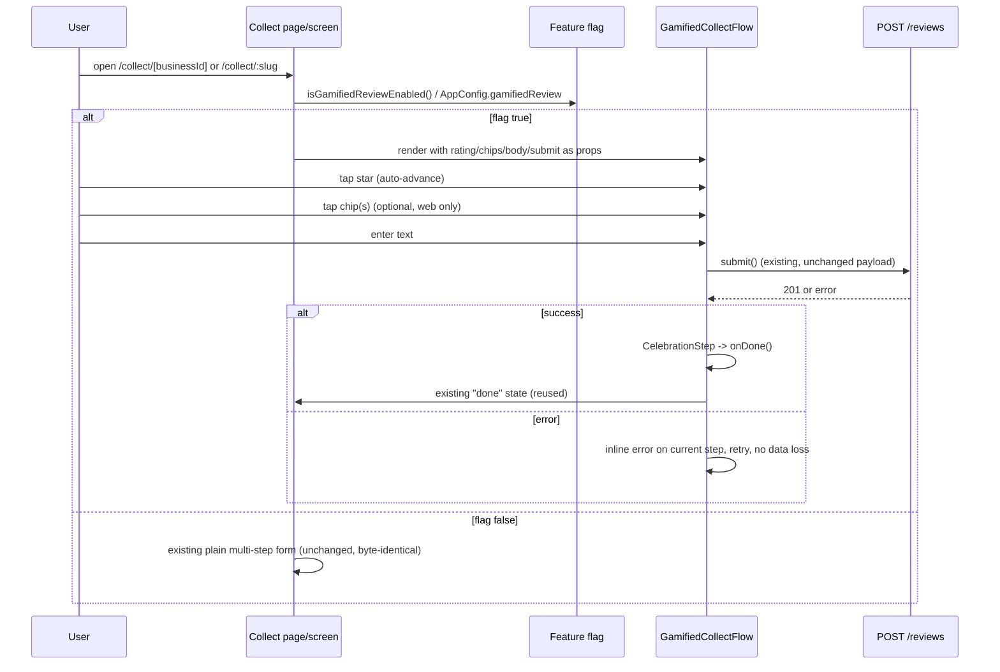

# Slice: S-119 — Gamified (tap-through) review collection experience

| Field | Value |
|-------|-------|
| **Slice ID** | S-119 |
| **Phase** | 2 Core |
| **Status** | Accepted |
| **Role(s)** | customer |
| **Owner** | PM / 2026-08-22 |

---

## User story

**As a** customer scanning a merchant's review QR code
**I want** the review form to feel playful and quick — one tap-answered question at a time, with a celebratory finish — instead of a plain static form
**So that** leaving a review feels rewarding and low-effort, increasing the chance I actually complete it

---

## Acceptance criteria

1. **Given** `NEXT_PUBLIC_GAMIFIED_REVIEW` (web) or `GAMIFIED_REVIEW`/`MOBILE_GAMIFIED_REVIEW` (mobile) is unset or `false`, **when** a customer opens `/collect/[businessId]` (web) or `/collect/:slug` (mobile), **then** the page/screen renders byte-identical to the current plain multi-step form (same DOM structure / widget tree, same steps, same copy) — pure regression, no visible change.
2. **Given** the flag is `true` on web, **when** the customer opens `/collect/[businessId]`, **then** each step (star rating, highlight chips, comment) renders full-screen, one at a time, with a CSS/Tailwind-keyframe pop-in/bounce entrance animation, advanced by tap only (no swipe or drag gesture is wired up or required).
3. **Given** the flag is `true` on mobile, **when** the customer opens `/collect/:slug`, **then** the flow presents star rating → comment text → celebration, one screen at a time, using Flutter `AnimatedSwitcher`/`AnimatedScale` for entrance animation, advanced by tap only. No highlight-chip step is presented on mobile in this slice (see Out of scope).
4. **Given** the flag is `true` (web or mobile), **when** the customer completes all steps and submits, **then** the API payload sent to `POST /reviews` (`business_id`, `rating`, `title?`, `body`) is byte-identical in shape and values to the payload the flag-off flow would send for the same inputs.
5. **Given** the flag is `true`, **when** the customer selects any star rating from 1 through 5, **then** the very next step shown is identical regardless of rating value — no rating triggers a different branch, an intercept screen, a Maps-review redirect, or any funneling (reaffirms S-040's no-rating-gating rule; verify for all 5 ratings).
6. **Given** the flag is `true` and the customer has just submitted, **when** submission succeeds, **then** a brief celebratory "thanks!" acknowledgment (animation + copy, auto-advancing or single-tap-dismiss) is shown, followed immediately by handoff to the existing, unmodified "done" screen/state (same social-proof content and same optional Google Maps review link CTA as today) — no new/duplicate done screen is built.
7. **Given** the flag is `true` or `false`, **when** inspecting `frontend/src/components/CollectQrCard.tsx`, the collect route URL, and the QR/App-Links target, **then** none of them have changed (S-118's frozen contract is untouched; only the internal render branch of the collect page/screen changes).
8. **Given** submission fails (network/server error) in the gamified flow, **when** the error occurs, **then** the customer sees an inline error state on the current step (not a silent freeze) and can retry without losing previously answered steps' values.
9. **Given** the flag is `true` on web, **when** the customer reaches the highlight-chip step, **then** chip selection remains optional (matching today's behavior) and does not block advancing.
10. **Given** a code reviewer or tester inspects the mobile gamified flow, **when** checking for a chip/tag step, **then** none exists — this is documented as an intentional, known parity gap for this slice (not a bug), to be logged in README §12.

---

## UX notes

- Screens / routes: Web `/collect/[businessId]` (existing route, no new route). Mobile `/collect/:slug` (existing route, no new route). Feature flag selects render branch inside the existing page/screen only.
- Figma (mobile file `rk4RnruVFTpKdIsgGJIt9w`) frame + states (default / empty / loading / error): TBD — Architect/UX to confirm frame name for the new tap-through step screens (star step, comment step, celebration step) with default, loading (submitting), and error states, before Builder starts mobile work.
- Mobile placement (named hub slot or new route — never append to a dump-screen): Renders within the existing `/collect/:slug` route only; not added to any hub/dashboard.
- Components to reuse: Existing star `RatingWidget`, existing highlight chip components (web), existing "done" success screen/state (both platforms) — reused unmodified for the post-celebration handoff.
- Empty states / errors: Inline retry on submission failure per step; no partial-answer loss.
- AI disclaimer required? no — this slice has no AI-generated content; it only changes step presentation/animation of the existing manual review form.

---

## Out of scope

- Swipe/drag gestures — explicitly ruled out; tap-only interaction.
- Any change to the `/collect/[businessId]` or `/collect/:slug` URL, the QR code target, or `frontend/src/components/CollectQrCard.tsx` — S-118's frozen route/App-Links contract is reaffirmed and untouched.
- Any rating-based branching, funneling, or gating of the flow — S-040's no-rating-gating rule is reaffirmed; all 5 star values must reach an identical next step.
- Any new frontend dependency (no framer-motion on web) or new Flutter pubspec package on mobile — animations must use existing tooling (Tailwind keyframes; `AnimatedSwitcher`/`AnimatedScale`).
- Backend/API changes — `POST /reviews` payload and contract are unchanged.
- Mobile highlight-chip step — intentionally not built in this slice; mobile v1 is stars → text → celebration only. Logged as a known parity gap in README §12, not solved here.
- Rebuilding or restyling the existing "done" screen — it is reused as-is.
- Any change to flag defaults in production — both flags stay OFF by default; enabling in any environment is a separate rollout decision.

---

## Dependencies

- S-040 (must be Accepted) — no-rating-gating rule this slice must preserve.
- S-118 (must be Accepted) — frozen collect route/QR/App-Links contract this slice must not touch.

---

## Definition of done (PM)

- [x] All AC verified in test report
- [x] UX matches notes above
- [x] Documented in `README.md` §7 API reference / §8 Frontend guide if new patterns (n/a — no new patterns beyond the presentation-layer branch already covered by the Architect spec)
- [x] README §12 Web ↔ mobile feature parity tracker updated with the mobile no-chips gap (M-71 row)
- [x] PM Status set to **Accepted**

---

## Technical specification (Architect)

No backend/API changes on either flag state, either platform. Same `POST /reviews` payload
shape (`business_id`, `rating`, `title?`, `body`) submitted regardless of gamified vs plain
flow. This slice is purely a presentation-layer branch inside the existing `/collect/[businessId]`
page (web) and `/collect/:slug` screen (mobile).

### API contract

| Method | Path | Auth | Notes |
|--------|------|------|-------|
| POST | `/api/v1/reviews` | Public (login redirect if unauth, unchanged) | Unchanged. `ReviewCreate`: `business_id`, `rating`, `title?`, `body`. Both flag states, both platforms, send byte-identical payload shape/values (AC4). |

No new or modified endpoints.

### RBAC matrix

| Action | customer | merchant | admin |
|--------|----------|----------|-------|
| View gamified/plain collect flow | yes (public route) | yes | yes |
| Submit review | yes (login `?next=` if unauth, unchanged) | yes | yes |

Unchanged from today — this route's auth gating is untouched by this slice.

### Data model impact

- [x] None

No schema, migration, or enum changes.

### Cache / side effects

None. No `search:*` or other Redis cache keys are touched — review submission's existing
cache invalidation (if any) is unchanged since the API contract is unchanged.

### Frontend

- **Route:** Web `/collect/[businessId]` (existing, unchanged). Mobile `/collect/:slug` (existing, unchanged). No new routes on either platform.
- **Rendering:** CSR (unchanged) — this is the existing client-rendered wizard; the flag only selects which component tree renders client-side.
- **Components (reuse first):**
  - Web flag: `frontend/src/lib/featureFlags.ts` — `isGamifiedReviewEnabled()` reads `process.env.NEXT_PUBLIC_GAMIFIED_REVIEW === "true"` (build-time, Railway → frontend service → Variables, same convention as `NEXT_PUBLIC_API_URL`).
  - Web new directory `frontend/src/components/collect/gamified/`:
    - `GamifiedCollectFlow.tsx` — orchestrator, internal `screen: "stars" | "chips" | "text" | "celebrate"` state; receives `rating`, `selectedChips`, `body`, `submit`, `mapsHref`, `SocialProof` etc. as props from the parent page — no new data layer, no new fetch/mutation logic.
    - `StepCard.tsx` — full-screen animated shell (pop-in/bounce-in via `key`-based remount + Tailwind keyframes).
    - `StarStep.tsx` — reuses existing `RatingWidget`; tap-only; auto-advances; no rating-based gating (reaffirms S-040).
    - `ChipStep.tsx` — reuses existing `CHIPS` constant from the collect page; selection stays optional (AC9).
    - `TextStep.tsx` — reuses existing `generateDraft` from `frontend/src/components/collect/DraftEngine.ts` unmodified.
    - `CelebrationStep.tsx` — celebration UI; calls `onDone()` prop to flip the parent's existing `step === "done"` state; reuses the existing done-state JSX verbatim (no new success UI, per AC6/Out-of-scope).
  - Web page: `frontend/src/app/collect/[businessId]/page.tsx` — minimal branch: `isGamifiedReviewEnabled() ? <GamifiedCollectFlow ... /> : <existing JSX>`. All existing state/logic (`resolveBusiness`, `rating`, `selectedChips`, `body`, `submit()`, `mapsHref`, `SocialProof`) stays exactly as-is, passed down as props when the flag is on.
  - Web animation: CSS-only via Tailwind — add `pop-in` / `bounce-in` / `celebrate-pulse` keyframes to `frontend/tailwind.config.ts`. **No new npm dependency** (explicitly no framer-motion) — this is the highest-traffic unauthenticated page and the repo carries zero animation libs today.
  - Mobile flag: `mobile/lib/core/config/app_config.dart` — add `static const gamifiedReview = bool.fromEnvironment('GAMIFIED_REVIEW', defaultValue: false);`, following the existing `String.fromEnvironment` pattern (`webBaseUrl`, `googleClientId`). Wired via `--dart-define=GAMIFIED_REVIEW=...` in `.github/workflows/mobile-build-apk.yml` and `mobile-release-aab.yml`, sourced from a new GitHub Actions repo variable `MOBILE_GAMIFIED_REVIEW` (Settings → Secrets and variables → Actions → Variables). Independent of the web Railway var — no shared variable store between the two deploy systems, so both must be flipped together for consistent cross-platform behavior.
  - Mobile new directory `mobile/lib/features/reviews/gamified/`:
    - `gamified_collect_flow.dart` — internal step state via `AnimatedSwitcher` + `AnimatedScale`/`TweenAnimationBuilder` with `Curves.elasticOut`; all built into Flutter core, **no new pubspec dependency**.
    - `star_step.dart` — reuses existing `RatingStars` widget.
    - `text_step.dart` — wraps the existing `TextField`/`_bodyController` pattern.
    - `celebration_step.dart` — transitions into the existing `_SuccessState` widget already defined in `collect_review_screen.dart` (reused, not duplicated).
    - No chip step on mobile — intentional v1 gap (AC10), no Dart port of `DraftEngine` in this slice.
  - Mobile screen: `mobile/lib/features/reviews/collect_review_screen.dart` — minimal branch on `AppConfig.gamifiedReview` inside `build()`, rendering `GamifiedCollectFlow(...)` or the existing form; `_submit`, providers, `_SuccessState`, `_EmptyState` all reused unchanged.

### Flow

### Architect checklist

- [x] API contract defined and matches `README.md` §7 API reference style (unchanged endpoint, explicitly stated)
- [x] RBAC matrix complete (unchanged, public route)
- [x] Data model impact documented (none)
- [x] Cache invalidation considered (n/a — no API/data change)
- [x] Uses AI/storage abstractions where applicable (n/a — no AI content, no storage use in this slice)
- [x] No secrets in design (env vars are non-secret feature flags)
- [x] ERD/API/FLOWS updates noted — none needed for §5/§7; README §12 parity tracker needs a row noting mobile's no-chips gap (per PM DoD), and README §6 flows may note the gamified variant as a UX detail, not a new flow

### Risks / tradeoffs

- **Flag drift across deploy systems:** Railway env var (web) and GitHub Actions repo variable (mobile) are independent stores with no shared source of truth — flipping one without the other yields inconsistent cross-platform UX during rollout. Mitigate operationally (documented in rollout runbook, not enforced in code).
- **`key`-based remount animation (web):** relies on React remounting the full step subtree per `key` change; if `StepCard` state is later needed to persist across steps, this pattern would need revisiting — acceptable for this slice since each step's answer is lifted to the parent's existing state, not local to the step component.
- **Mobile parity gap (no chip step):** intentional and documented per AC10 / PM DoD, but is a real UX asymmetry between platforms until a future slice ports `DraftEngine` or an equivalent to Dart.
- **CSS-only animation ceiling:** Tailwind keyframes are sufficient for pop-in/bounce/celebrate-pulse but would not scale to more complex choreography (e.g., staggered lists) without introducing a dependency — out of scope here, flagged for awareness only.

---

## Links

- Test plan: `docs/agents/test-plans/TP-S-119-*.md`
- Test report: `docs/agents/test-reports/TR-S-119-*.md`
- ADR: `docs/agents/adrs/ADR-XXX-*.md` (if any)

---

## Changelog

| Date | Agent | Change |
|------|-------|--------|
| 2026-08-22 | PM | Created slice |
| 2026-08-22 | Architect | Technical spec filled in; no API/data-model changes; feature-flag + component architecture specified for web and mobile; Status → Specified |
| 2026-08-22 | Tester | 8/10 AC fully automated-pass at first report; AC5 boundary-only (rating 1/5, not full 1-5 sweep) and AC8 (submission-failure inline error + retry) flagged as not automated. Recommendation: Ship, with AC8 gap flagged for PM decision. |
| 2026-08-22 | Builder | Closed AC8 gap: added `page.gamified.test.tsx::shows an inline error and stays on the text step when submission fails, so the customer can retry` (web) and the matching `collect_review_screen_gamified_test.dart` test (mobile, via `_FakeReviewRepository(failNextCreate: true)`) — both assert inline error text, retained field values, and a successful retry. |
| 2026-08-22 | PM | Verified the two new failure-path tests directly (read assertions on both platforms — inline error shown, entered rating/body preserved, retry succeeds and reaches celebration/success). AC5's boundary-only sampling (ratings 1 and 5) accepted as adequate given the shared, non-branching code path noted by the Tester. All other AC previously verified pass. Status → Accepted. |
