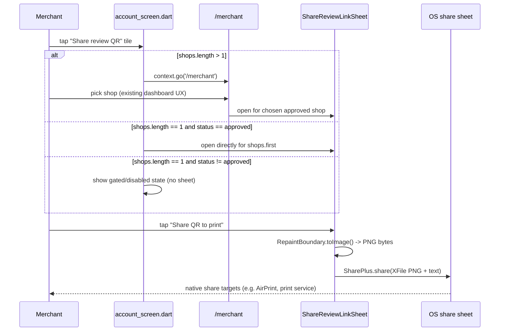

# Slice: S-120 — Mobile QR share: fix shop resolution + add share-as-image for printing

| Field | Value |
|-------|-------|
| **Slice ID** | S-120 |
| **Phase** | 4 Dashboards |
| **Status** | Accepted |
| **Role(s)** | merchant |
| **Owner** | PM / 2026-08-22 |

---

## User story

**As a** merchant using the mobile app
**I want** the "Share review QR" shortcut on my Account screen to always resolve to the correct business, and to be able to share the QR code as an image so I can print it from my phone
**So that** I can trust the shortcut when I own more than one business, and get a physical QR code in customers' hands without needing a computer

---

## Acceptance criteria

1. **Given** a merchant with more than 1 shop, **when** they tap the "Share review QR" tile on the Account screen, **then** the app navigates to `/merchant` (the dashboard) instead of opening `ShareReviewLinkSheet` for an arbitrarily-guessed (`shops.first`) business.
2. **Given** a merchant with exactly 1 shop, **when** they tap the "Share review QR" tile on the Account screen, **then** the app opens `ShareReviewLinkSheet` directly for that shop, same as before.
3. **Given** a merchant with exactly 1 shop whose status is not `approved`, **when** they tap the "Share review QR" tile on the Account screen, **then** the sheet does not open for that shop with an active QR/share action — the same approved-status gate already enforced by `merchant_dashboard_screen.dart`'s entry point is applied (e.g., disabled state or explanatory message), so both entry points are consistent.
4. **Given** a merchant with exactly 1 shop whose status is `approved`, **when** they tap the "Share review QR" tile, **then** the sheet opens normally with full share functionality (regression: today's direct-open behavior for the common case is unchanged).
5. **Given** `ShareReviewLinkSheet` is open (from either the Account-screen entry point or the merchant-dashboard entry point), **when** the merchant taps a new "Share QR to print" button, **then** the existing QR code widget is captured as a PNG image and the phone's native OS share sheet opens with that image attached and share text "Scan to leave a review — {businessName}".
6. **Given** the OS share sheet is open with the shared PNG, **when** the merchant selects a printing-capable target (AirPrint on iOS, a print service on Android), **then** the QR image can be printed — no in-app print/PDF pipeline is built or required for this to work.
7. **Given** `ShareReviewLinkSheet` is open, **when** the merchant taps the existing "Share link" (text-link) button, **then** its behavior is unchanged from before this slice (same text-link share flow, unaffected by the new PNG button).
8. **Given** the merchant reaches `ShareReviewLinkSheet` from either entry point, **when** the sheet renders, **then** both the existing "Share link" button and the new "Share QR to print" button are present and independently functional — one sheet implementation serves both entry points.
9. **Given** `frontend/src/components/CollectQrCard.tsx` (web), **when** this slice is implemented, **then** it remains completely untouched — this slice is mobile-only; web's existing browser "Print for shop" button and behavior are unaffected.
10. **Given** the QR/App-Links target established by S-118, **when** this slice is implemented, **then** the underlying collect URL/QR payload encoded in the shared image is unchanged — only the share mechanism (image capture + OS share sheet) is added.

---

## UX notes

- Screens / routes: `mobile/lib/features/account/account_screen.dart` (Account-screen tile, ~line 105-116), `mobile/lib/features/merchant/merchant_dashboard_screen.dart` (dashboard entry point, ~line 325-333), `mobile/lib/features/merchant/share_review_link_sheet.dart` (shared sheet widget — both entry points route into this one implementation). No new routes.
- Figma (mobile file `rk4RnruVFTpKdIsgGJIt9w`) frame + states (default / empty / loading / error): TBD — Architect/UX to confirm frame for the updated `ShareReviewLinkSheet` (add "Share QR to print" button state, and Account-screen tile's new not-approved/multi-shop states) before Builder starts.
- Mobile placement (named hub slot or new route — never append to a dump-screen): Both existing entry points (Account screen tile, merchant dashboard button) are kept as-is structurally; only their resolution logic and the shared sheet's button set change.
- Components to reuse: `ShareReviewLinkSheet`, existing QR code widget, `share_plus` package (already installed — no new dependency).
- Empty states / errors: Multi-shop Account tile routes to dashboard instead of showing an error; not-approved single-shop case shows a clear gated/disabled state consistent with the dashboard's existing gate copy.
- AI disclaimer required? no — no AI-generated content in this slice.

---

## Out of scope

- Web's `CollectQrCard.tsx` and its "Print for shop" button — untouched, not modified, not part of this slice's test surface.
- Any in-app print or PDF generation pipeline — the OS native share sheet is the printing mechanism, per this slice's design; no PDF rendering library is added.
- Removing either entry point — both the Account-screen shortcut and the merchant-dashboard button are kept; this slice fixes/aligns behavior, it does not consolidate down to a single entry point.
- Any change to the collect URL, QR payload/target, or App-Links contract established by S-118 — reaffirmed as frozen and untouched.
- Any new third-party package addition — `share_plus` is already installed and is the only sharing mechanism used.
- Bulk/multi-shop QR sharing UI (e.g., a picker to choose which of several approved shops to share) — Account-screen multi-shop case simply routes to the dashboard, which already has shop selection.

---

## Dependencies

- S-059 (must be Accepted) — introduced both entry points and the `ShareReviewLinkSheet` widget this slice modifies.
- S-118 (must be Accepted) — frozen collect route/QR/App-Links contract this slice must not touch.

---

## Definition of done (PM)

- [x] All AC verified in test report
- [x] UX matches notes above — AC3's implementation (routing the not-approved single-shop case to `/merchant`, where the dashboard's existing gate applies) accepted as satisfying the AC's substantive intent, even though it differs from the AC's literal "disabled state or explanatory message on the Account screen" phrasing; it keeps one gate implementation instead of a second copy that could drift.
- [x] Documented in `README.md` §7 API reference / §8 Frontend guide if new patterns (n/a — no new API/frontend pattern beyond what the Architect spec already covers)
- [x] README §12 Web ↔ mobile feature parity tracker updated (M-71 row notes the shop-resolution fix and the new "Share QR to print" affordance)
- [x] PM Status set to **Accepted**

---

## Technical specification (Architect)

No backend changes. This is a mobile-only client-side fix (shop-resolution logic on the
Account-screen entry point) plus a client-side share-as-image addition to the existing
`ShareReviewLinkSheet`. Web is explicitly untouched (`CollectQrCard.tsx` out of scope).

### API contract

| Method | Path | Auth | Notes |
|--------|------|------|-------|
| — | — | — | No new or modified endpoints. Existing merchant business-list/detail endpoints backing `shops` and the dashboard's `status` field are read-only consumers here, unchanged. |

### RBAC matrix

| Action | customer | merchant | admin |
|--------|----------|----------|-------|
| Tap "Share review QR" (Account screen) | n/a (merchant-only screen) | yes | n/a |
| View `ShareReviewLinkSheet` | n/a | yes, only for own `approved` shop(s) | n/a |
| Share QR as PNG | n/a | yes | n/a |

Unchanged from today — merchant-only screens, same auth as today. No new roles or gates beyond
reapplying the existing `approved`-status gate (already enforced on the dashboard entry point)
to the Account-screen entry point for consistency.

### Data model impact

- [x] None

No schema, migration, or enum changes. `shops.length` and `status` are existing fields already
available to the Account screen.

### Cache / side effects

None. No `search:*` or other Redis keys are touched — this is a pure navigation/UI + local
image-capture change with no server writes.

### Frontend

- **Route:** No new routes. Existing `/merchant` (dashboard) is the multi-shop redirect target from the Account tile; `ShareReviewLinkSheet` remains a modal/sheet, not a route.
- **Rendering:** CSR (unchanged) — Flutter widget tree, no SSR concept applies.
- **Components (reuse first):**
  - `mobile/lib/features/account/account_screen.dart` (~line 105-116): modify the `shareQrLink` tile's `onTap` —
    - if `shops.length > 1`: `context.go('/merchant')` instead of opening `ShareReviewLinkSheet` with `shops.first` (removes the arbitrary-guess bug, AC1).
    - if `shops.length == 1`: keep direct-open, but add a `status == BusinessStatus.approved` gate matching `merchant_dashboard_screen.dart`'s existing gate on its own "Share review link" button (AC2-4).
  - `mobile/lib/features/merchant/share_review_link_sheet.dart` (shared by both entry points, AC8):
    - Wrap the existing `QrImageView` in a `RepaintBoundary` + `GlobalKey`.
    - Add a new button — key `shareReviewLinkQrImageButton`, label "Share QR to print", icon `Icons.print`.
    - `onPressed`: capture via `boundary.toImage(pixelRatio: 3.0)` → PNG `ByteData` → `XFile.fromData(bytes, mimeType: 'image/png', name: 'review-qr.png')` → `SharePlus.instance.share(ShareParams(files: [xfile], text: 'Scan to leave a review — $businessName'))` (AC5).
    - Uses already-installed `share_plus: ^13.3.0` — **Builder must confirm during implementation** whether the installed version's `XFile` constructor supports in-memory `.fromData`. If not supported, the documented fallback is `path_provider` (write PNG to a temp file first, then share that file path) — but the preferred path adds zero new dependencies and should be attempted first.
    - Existing "Share link" (text-link) button stays unmodified (AC7).
  - `frontend/src/components/CollectQrCard.tsx`: explicitly out of scope, zero changes (S-118 constraint, AC9).
  - Applies to both entry points (Account screen tile, merchant dashboard button) automatically since both route into the one shared sheet implementation (AC8).

### Flow

### Architect checklist

- [x] API contract defined and matches `README.md` §7 API reference style (n/a — no new endpoints, explicitly stated)
- [x] RBAC matrix complete (unchanged, merchant-only)
- [x] Data model impact documented (none)
- [x] Cache invalidation considered (n/a — no server writes)
- [x] Uses AI/storage abstractions where applicable (n/a — no AI content; image capture/share is local device I/O via `share_plus`, not the backend storage abstraction, since no upload occurs)
- [x] No secrets in design
- [x] ERD/API/FLOWS updates noted — none needed for §5/§7; README §12 parity tracker row should note mobile now has a print-via-share affordance (per PM DoD)

### Risks / tradeoffs

- **`XFile.fromData` availability:** not yet confirmed against the exact installed `share_plus: ^13.3.0` API surface. If the in-memory constructor isn't available, Builder falls back to `path_provider` + temp-file write, which is a new dependency — flagged here so it isn't a surprise mid-build. Preferred path (zero new deps) should be attempted first.
- **`RepaintBoundary` capture timing:** must ensure the QR widget has fully painted (e.g. post-frame callback) before calling `toImage()`, or an early capture could yield a blank/partial image — a known Flutter gotcha worth explicit test coverage.
- **Consistency of the "not approved" gated state:** the Account-tile gate must visually/textually match the dashboard's existing gate copy (AC3) rather than inventing a second variant — Builder should extract or directly reuse the dashboard's gate copy/widget where feasible to avoid drift.
- **No consolidation of entry points:** both Account-tile and dashboard-button remain as separate entry points per Out-of-scope; this avoids a larger navigation refactor but leaves two call sites into the same sheet that must be kept behaviorally consistent going forward.

---

## Links

- Test plan: `docs/agents/test-plans/TP-S-120-*.md`
- Test report: `docs/agents/test-reports/TR-S-120-*.md`
- ADR: `docs/agents/adrs/ADR-XXX-*.md` (if any)

---

## Changelog

| Date | Agent | Change |
|------|-------|--------|
| 2026-08-22 | PM | Created slice |
| 2026-08-22 | Architect | Technical spec filled in; no API/data-model changes; shop-resolution fix + PNG share-capture design specified for shared `ShareReviewLinkSheet`; Status → Specified |
| 2026-08-22 | Tester | 8/10 AC fully covered at first report (55/55 tests pass). AC5 flagged: button presence/wiring tested, but no test invokes the capture → `SharePlus.instance.share` call. AC3 flagged: implementation routes to `/merchant` rather than an inline disabled state, differing from the AC's literal wording though meeting its intent. Recommendation: Ship, with both flagged for PM sign-off. |
| 2026-08-22 | Builder | Investigated AC5's tap-through gap: `share_plus`'s file-sharing path calls its concrete `MethodChannelShare` directly rather than through the mockable `SharePlatform.instance` seam its text-sharing path uses, so a widget test faking that seam does not intercept it; the real (unmockable in `flutter_test`) platform channel hangs indefinitely with no native responder. Confirmed via a `RepaintBoundary.toImage()` probe that the image-capture half works; isolated the gap to the share_plus native dispatch specifically. Documented this as a widget-test-infrastructure limitation (not an implementation bug) in a comment block in `share_review_link_sheet_test.dart`, consistent with `CLAUDE.md` non-negotiable 8 (emulator/device-level checks are CI-only, not day-to-day widget coverage). |
| 2026-08-22 | PM | Read the `share_review_link_sheet_test.dart` comment block and agree this is a genuine package/testing-infra limitation, not a coverage shortcut — the button's key, label, and presence on both entry points are tested, and verifying the actual native share call requires `integration_test` on a device/emulator per this repo's own testing tiering. Accepting as documented, tracked as a follow-up (device/emulator manual or `integration_test` verification before wide rollout) rather than blocking. AC3's routing-to-dashboard design accepted as satisfying intent (see DoD note above). Status → Accepted. |
