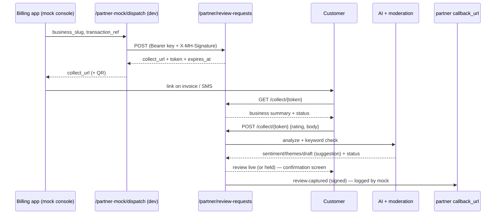

# Slice: S-123 — Partner review channel: end-to-end mock loop

| Field | Value |
|-------|-------|
| **Slice ID** | S-123 |
| **Phase** | 2 Core |
| **Status** | Accepted |
| **Role(s)** | customer, merchant, admin (+ external: partner system) |
| **Owner** | PM (inline) / 2026-08-29 |

---

## Context

`docs/PARTNER_REVIEW_CHANNEL_STRATEGY.md` proposes giving billing / invoicing /
POS apps (Vyapar, Razorpay, PhonePe for Business, Petpooja…) a **free API** that turns
every invoice into a verified review on MerchantHub. The strategy doc sketched a
six-slice build numbered S-120–S-125 — **those IDs are stale** (S-120/121/122 are taken
by unrelated work). This is the real first slice.

Per the 2026-08-29 design refinement, slice 1 is deliberately scoped to **one clickable
end-to-end mock loop** — enough to click through and *experience* the flow before any
real partner outreach. Real onboarding, a self-serve partner console, the read API, the
embed widget, rate limiting, and full merchant auto-provisioning are all **out of
scope** and gated behind a written partner-pilot commitment.

---

## User story

**As a** billing / POS platform integrating with MerchantHub
**I want** to hand MerchantHub a closed transaction and get back a single-use review link
**So that** my merchant collects a review tied to a real purchase, with no MerchantHub
account needed by the customer.

**As a** customer who just paid an invoice
**I want** to tap the link on my receipt, rate the shop, and be done in under 30 seconds
**So that** I never have to create an account or install an app to leave honest feedback.

**As a** merchant on MerchantHub
**I want** partner-sourced reviews marked "verified purchase"
**So that** I and future customers can trust them more than an anonymous web review.

**As the** MerchantHub team
**I want** the whole loop working against mock partners
**So that** we can demo it and decide whether to invest in real partner integration.

---

## Acceptance criteria

1. **Given** a request to `POST /api/v1/partner/review-requests` carrying a valid
   `Authorization: Bearer <partner key>` **and** a matching
   `X-MH-Signature: sha256=<hmac(raw_body, partner_secret)>`,
   **when** `merchant_ref` resolves to an APPROVED business,
   **then** the response is `201` with `{ review_request_id, collect_url, expires_at,
   merchant_status: "matched" }` and `collect_url` is `<public_app_url>/c/<token>`.

2. **Given** the same call **with a missing or wrong bearer key**, **then** the response
   is `401` and no `partner_review_requests` row is written.

3. **Given** the same call **with a valid key but a body signature that does not match**,
   **then** the response is `401` and no row is written.

4. **Given** a call whose `merchant_ref` matches no `partner_merchant_link` and no
   business slug, **then** the response is `404` with detail `merchant_not_onboarded`
   (auto-provision is out of scope for this slice).

5. **Given** a `(partner_id, transaction_ref)` pair that already has a review request,
   **when** the partner calls again with the same pair, **then** the response is `200`
   returning the **existing** request's `collect_url` (idempotent) and no second row is
   written — the `uq_partner_txn_ref` constraint holds.

6. **Given** an optional `customer_phone` in the request body, **then** it is stored only
   as a salted one-way hash in `partner_customer_ref`; the raw phone is never persisted.
   Invoice amounts / line items / customer names are never read or stored.

7. **Given** a valid unexpired token, **when** the customer opens `GET /api/v1/collect/{token}`,
   **then** the response carries the business summary and `status` (`pending` /
   `submitted` / `expired`) with **no authentication required**.

8. **Given** the customer submits `POST /api/v1/collect/{token}` with `{ rating, body }`,
   **then** a native `reviews` row is written with `source = "partner"`,
   `verified_purchase = true`, authored by a pseudonymous shadow user, the token is
   burned (`redeemed_at` set, `status = "submitted"`), and the existing AI-analysis +
   keyword-moderation pipeline runs unchanged.

9. **Given** the review text trips keyword moderation, **then** the review is written with
   `status = "reported"` (held, not live) exactly as an organic review would be, and the
   outbound partner event reflects the held state.

10. **Given** a token that is already redeemed or past `expires_at`, **when** the customer
    submits, **then** the response is `409` (redeemed) or `410` (expired) and no review
    is written.

11. **Given** a clean submission and a partner with a registered `callback_url`, **then**
    a signed `review.captured` event is delivered to that URL — the `mock` provider
    logs the signed payload **and** makes a best-effort HTTP POST (so the loop closes
    visibly in local dev); a delivery failure never fails the review.

12. **Given** the organic collect flow (`/collect/{businessId}`), **then** it is
    **unchanged** — still calls `auth.me()`, still redirects unauthenticated users to
    `/login?next=…`, still enforces `require_roles` and `UNIQUE(author_id, business_id)`.
    The login-free path exists **only** behind a valid token.

13. **Given** a merchant viewing their reviews, **then** a partner-sourced review shows a
    "✓ Verified purchase" badge; an organic review does not.

14. **Given** no `PARTNERS_PROVIDER` env var, **then** the port resolves to `mock`;
    an unregistered value fails at startup (same pattern as `EMAIL_PROVIDER` /
    `PAYMENTS_PROVIDER`).

15. **Given** the dev mock console at `/dev/partner-console` (enabled by
    `NEXT_PUBLIC_ENABLE_PARTNER_MOCK`), **when** the operator picks a demo business,
    enters a transaction ref, and clicks "Send review request", **then** the console
    shows: the customer-facing SMS message the partner would send, the returned
    `collect_url` as a clickable link + QR, a request list that moves
    `pending → submitted` (with a link to the review on the listing) once the review
    is left, and a "Callbacks received from MerchantHub" panel showing the signed
    `review.captured` events as they arrive.

---

## UX notes

- **Screens / routes:**
  - `/c/[token]` — public, login-free collect page. Always uses the S-119 gamified flow.
    States: loading, invalid/expired token, already-submitted, active wizard, done
    (celebration → "your verified review is live" + listing link).
  - `/dev/partner-console` — dev-only mock billing app. Gated by
    `NEXT_PUBLIC_ENABLE_PARTNER_MOCK === "true"`; renders a "DEV / MOCK" banner.
  - Merchant review surfaces — add the "✓ Verified purchase" chip to `ReviewCard`.
- **Figma:** none — `/c/[token]` reuses `GamifiedCollectFlow` / `CelebrationStep`
  verbatim; the console is a dev utility, not a designed surface.
- **Mobile placement:** none this slice. §12 parity rows added as `future` /
  `unimplemented`.
- **Components to reuse:** `GamifiedCollectFlow`, `CelebrationStep`, `RatingWidget`,
  `ReviewCard`, `CollectQrCard`'s QR approach.
- **Empty states / errors:** expired/😵 token → friendly "This review link has expired
  or was already used" with a link to search. Console dispatch error → inline red text.
- **AI disclaimer required?** No new AI surface — the existing suggestion-grade analysis
  runs server-side exactly as today.

---

## Out of scope

- Real partner onboarding, key issuance/rotation UI, a self-serve partner console.
- Partner **read** API (`GET /partner/merchants/{ref}/summary`) and the embed widget.
- Per-partner rate limiting, spike alarms, anomaly detection, first-N hold-for-spotcheck.
- Full merchant **auto-provision** (unknown `merchant_ref` → PENDING stub business +
  claim funnel). This slice 404s on unknown merchants.
- Real outbound HTTP callbacks with retry/backoff + a delivery log (the `http` adapter).
- The partner data-terms / consent one-pager (a legal artifact, tracked in README §14).
- Merging a shadow customer identity into a real account on later signup.
- Mobile parity for any of the above.

---

## Dependencies

- S-040 review collection flow (Accepted) — the wizard being reused.
- S-119 gamified review collection (Accepted) — `GamifiedCollectFlow` / `CelebrationStep`.
- S-050/S-051 WhatsApp session token (Accepted) — the single-use-token precedent.
- S-036/S-008 Razorpay webhook HMAC (Accepted) — the `X-Hub-Signature-256` precedent.

---

## Definition of done (PM)

- [x] All 15 AC verified in the test report (`TR-S-123`)
- [x] UX matches notes above
- [x] `README.md` updated: §3, §5, §6, §7, §9, §11, §12, §14, §15, §16
- [x] `docs/agents/adrs/ADR-019-partner-review-channel-mock.md` written
- [x] Feature → test index row added (§11)
- [x] PM Status set to **Accepted**
- [x] Incidental: fixed a pre-existing merge artifact in `scripts/seed.py`
      (`should_run_seed` returned `None` for an unknown mode — `test_seed_mode` was red on `main`)

---

## Technical specification (Architect)

> Filled inline (acting as Architect), 2026-08-29. ADR-019 carries the rationale.

### API contract

| Method | Path | Auth | Request | Response |
|--------|------|------|---------|----------|
| POST | `/api/v1/partner/review-requests` | Bearer partner key + `X-MH-Signature` HMAC | `{ merchant_ref, transaction_ref, channel?, customer_phone?, occurred_at? }` | `201` new / `200` idempotent: `{ review_request_id, collect_url, expires_at, merchant_status }` |
| GET | `/api/v1/collect/{token}` | none (token is the capability) | — | `{ business: BusinessSummary, status, expires_at }` |
| POST | `/api/v1/collect/{token}` | none (token) | `{ rating, body, title? }` | `201 { review_id, status, business_slug }` |
| POST | `/api/v1/partner-mock/dispatch` | dev-only (`debug && partners_provider=="mock"`) | `{ business_slug, transaction_ref?, customer_phone? }` | `{ collect_url, token, review_request_id, message }` — server signs as the demo partner and calls the real handler |
| GET | `/api/v1/partner-mock/requests` | dev-only | — | `[{ token, business_slug, partner_txn_ref, status, review_id, created_at }]` |
| POST | `/api/v1/partner-mock/callback-sink` | dev-only | signed `review.captured` body | `{ ok: true }` — the mock partner's own endpoint; records the callback into a ring buffer |
| GET | `/api/v1/partner-mock/callbacks` | dev-only | — | `[{ received_at, signature, event }]` — the callbacks MerchantHub delivered back |

`X-MH-Signature` format: `sha256=<hex hmac-sha256(raw_request_body, partner.hmac_secret)>`
— identical scheme to the WhatsApp `X-Hub-Signature-256` and Razorpay webhook checks.

### RBAC matrix

| Action | anonymous | customer | merchant | admin | partner key |
|--------|-----------|----------|----------|-------|-------------|
| `POST /partner/review-requests` | ✗ | ✗ | ✗ | ✗ | ✓ (key + HMAC) |
| `GET/POST /collect/{token}` | ✓ (valid token) | ✓ | ✓ | ✓ | — |
| `POST /reviews` (organic) | ✗ | ✓ | ✓ | ✓ | — |
| see "verified purchase" badge | ✓ | ✓ | ✓ | ✓ | — |
| `/dev/partner-console`, `/api/v1/partner-mock/*` | ✓ **only** when `debug` + `PARTNERS_PROVIDER=mock` | — | — | — | — |

### Data model impact

- [ ] None  [x] Extend existing  [x] New table(s)

**New tables**

`partners`
| col | type | notes |
|-----|------|-------|
| id | UUID PK | |
| slug | String(50) unique | `demo-billing` |
| name | String(255) | display |
| api_key_hash | String(64) unique | `sha256(key)` hex — raw key never stored |
| hmac_secret | String(128) | per-partner body-signing secret |
| callback_url | String(512) null | where `review.captured` is delivered |
| status | String(20) default `active` | `active` \| `suspended` |
| created_at | tz timestamp | |

`partner_merchant_links`
| col | type | notes |
|-----|------|-------|
| id | UUID PK | |
| partner_id | FK partners CASCADE | |
| partner_merchant_ref | String(255) | partner's opaque merchant id |
| business_id | FK businesses CASCADE | |
| created_at | tz timestamp | |
| — | `UniqueConstraint(partner_id, partner_merchant_ref)` → `uq_partner_merchant_ref` | |

`partner_review_requests`
| col | type | notes |
|-----|------|-------|
| id | UUID PK | |
| partner_id | FK partners CASCADE, indexed | |
| business_id | FK businesses CASCADE, indexed | |
| partner_merchant_ref | String(255) | echoed for traceability |
| partner_txn_ref | String(255) | the dedupe key |
| partner_customer_ref | String(128) null | `sha256(secret_key + phone_e164)` or NULL |
| token | String(64) unique indexed | `secrets.token_urlsafe(32)` |
| channel | String(32) default `invoice_link` | |
| status | String(20) default `pending` | `pending` \| `submitted` \| `expired` |
| expires_at | tz timestamp | now + `PARTNER_REVIEW_TOKEN_TTL_HOURS` |
| redeemed_at | tz timestamp null | set on submit |
| review_id | FK reviews SET NULL, null | set on submit |
| created_at | tz timestamp | |
| — | `UniqueConstraint(partner_id, partner_txn_ref)` → `uq_partner_txn_ref` | |

**Extend `reviews`**
- `source` — `String(20)` NOT NULL, `server_default "organic"`. Plain string not enum
  (same reasoning as `ExternalReview.source`: a future source ships without a migration).
- `verified_purchase` — `Boolean` NOT NULL, `server_default false`.

The existing `UNIQUE(author_id, business_id)` is **kept as-is**. Partner reviews get a
real (shadow) `author_id`, so the constraint still means "one voice per identity per
business" — a repeat purchaser who already reviewed gets `409` and can edit instead.
Shadow user: `users` row, `role=customer`, `auth_provider="partner"`, `email=NULL`,
`hashed_password=NULL`, `full_name="Verified customer"`. Keyed on
`(business_id, partner_customer_ref)` when a phone hash exists (reused across that
customer's transactions); a fresh anonymous shadow user per request when no phone.

### Cache / side effects

- On token submit: `update_business_rating(business_id)`, `cache_delete_pattern("search:*")`,
  `background_tasks.add_task(refresh_merchant_ai_summary_bg, business_id)` — identical to
  `reviews.create_review`.
- New `background_tasks.add_task(send_partner_callback_bg, request_id)` after the review
  is committed.
- Merchant "new review" notification + email: reuse `upsert_notice` / `try_send_new_review`
  exactly as the organic path (only when not flagged).
- AI pipeline: extract the shared `AIAnalysis` build into
  `app/services/review_pipeline.py::build_review_ai_analysis(...)`; organic
  `reviews.create_review` switches to it (behaviour identical, covered by existing
  `test_reviews.py`).

### Frontend

- **Route `/c/[token]`:** CSR (`"use client"`) — fetches token context, renders
  `GamifiedCollectFlow` with `authPending={false}` and an `onSubmit` that POSTs to
  `/api/v1/collect/{token}`. No `InlineAuthStep`. Done state → `CelebrationStep` +
  confirmation card.
- **Route `/dev/partner-console`:** CSR, gated by `NEXT_PUBLIC_ENABLE_PARTNER_MOCK`.
  Business `<select>` from `businesses.list({ status_filter: "approved" })`; transaction
  ref (prefilled random); optional phone. Calls `partnerMock.dispatch(...)`; shows the
  `collect_url` + a QR (`qrcode` approach from `CollectQrCard`); polls
  `partnerMock.requests()` for the status table.
- **`api.ts`:** `Review` interface gains `source: "organic" | "partner"` and
  `verified_purchase: boolean`; new `collectToken` and `partnerMock` client sections.
- **`ReviewCard.tsx`:** render the badge when `review.verified_purchase`.

### Flow

### Architect checklist

- [x] API contract defined
- [x] RBAC matrix complete
- [x] Data model impact documented
- [x] Cache invalidation considered
- [x] Uses AI abstraction (`get_ai_provider`) + new `partners` port; no SDK in routers
- [x] ERD/API/FLOWS updates noted (README §5/§7/§6)

### Risks / tradeoffs

- **Shadow `users` rows** appear in admin user search / counts. Accepted for the mock;
  §14 notes it. `auth_provider="partner"` lets a later slice filter them.
- **`hmac_secret` stored plaintext** in `partners`. Matches how `razorpay_webhook_secret`
  lives in env today; a real partner slice would move to a KMS / hashed-at-rest scheme.
- **`/partner-mock/*` endpoints** are a real attack surface if ever shipped with
  `debug=true` in prod — double-gated on `debug` **and** `partners_provider=="mock"` and
  covered by a test that they 404 otherwise.
- **AI-pipeline extraction** touches the organic path. Mitigated by keeping the helper a
  pure move and leaning on existing `test_reviews.py`.

---

## Links

- Test plan: `docs/agents/test-plans/TP-S-123-partner-review-channel-mock.md`
- Test report: `docs/agents/test-reports/TR-S-123-partner-review-channel-mock.md`
- ADR: `docs/agents/adrs/ADR-019-partner-review-channel-mock.md`

---

## Changelog

| Date | Agent | Change |
|------|-------|--------|
| 2026-08-29 | PM (inline) | Created slice — scoped to the mock loop only |
| 2026-08-29 | Architect (inline) | Added technical spec, data model, flow, ADR-019 pointer |
| 2026-08-29 | Builder (inline) | Backend port + tables + router + service; `/c/[token]` page; dev console with SMS-message preview, live request list, and received-callbacks panel; callback now best-effort POSTs |
| 2026-08-29 | Tester (inline) | 33 backend + 22 frontend tests; all 15 AC covered — see `TR-S-123` |
| 2026-08-29 | PM (inline) | **Accepted** |
