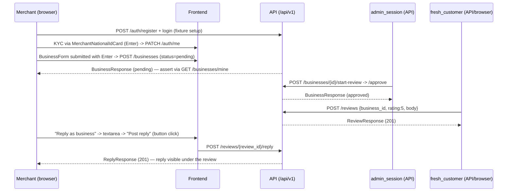

# Slice: S-124 — Human-like predefined-value automation suite (customer / merchant / admin)

| Field | Value |
|-------|-------|
| **Slice ID** | S-124 |
| **Phase** | 5 Polish |
| **Status** | Testing |
| **Role(s)** | anonymous, customer, merchant, admin |
| **Owner** | PM / 2026-08-29 |

---

## Context

The S-010 Playwright (Python) e2e harness (`backend/tests/e2e/`, ADR-009) proves the core
loop with four hand-picked happy-path journeys. It does not systematically visit every
route, does not fill every form, and does not exercise the "press Enter to submit" behaviour
a real user relies on.

S-124 adds an **exhaustive, data-driven journey layer** on top of that harness:

- a central **catalogue** (`form_data.py`) of predefined field values for every form on
  every route — the single auditable "predefined values for every page" surface;
- a **keyboard-centric human driver** (`human.py`) that types per-character, Tabs between
  fields, and submits by pressing **Enter** where the form's real `<form onSubmit>`
  supports it (clicking the submit button only for textarea-terminated forms / widgets
  where Enter does not submit — and in those cases pressing Enter first as a negative
  check);
- per-role **journey modules** (`journeys/test_journey_{anonymous,customer,merchant,admin}.py`)
  walking the full customer / merchant / admin surface with **dual oracles**: UI
  `expect()` plus the backend's own Pydantic response schema / status.

It stays opt-in (`E2E=1`, Compose) and manual-only in CI (`web-e2e.yml`) — never a merge
gate — exactly like S-010. This is **test infrastructure**, not a user-facing web
capability: no README §12 parity row is expected (see Out of scope), matching how S-010
was handled.

Decisions locked with the user:

- Full slice through the mandated PM → Architect → Builder → Tester → PM cycle as S-124.
- Keyboard-centric, **no artificial sleeps** — real per-character typing, Tab between
  fields, Enter to submit where supported, click submit for textarea-terminated forms;
  waits are on DOM / network state, never `time.sleep`. Optional `E2E_SLOWMO_MS` env for
  watching a run (0 in CI).
- Full happy-path **including destructive admin actions** (approve/suspend, moderate, mock
  payment capture/refund, user suspend, WhatsApp draft approve) against the disposable
  Compose DB, operating only on `uuid4`-suffixed throwaway entities — never mutating the
  four seeded demo accounts as a source of truth.

---

## User story

**As a** maintainer of MerchantHub AI
**I want** an opt-in Playwright suite that reacts like a human — typing predefined values
into every form on every route and submitting with Enter wherever the form allows it —
across the anonymous, customer, merchant, and admin surfaces
**So that** the full product functionality for each role is exercised end to end with dual
oracles, regressions in real user flows are caught before release, and the set of
predefined values per page is auditable in one place

---

## Acceptance criteria

Every AC is verifiable by the Tester via an automated test in `backend/tests/e2e/` run
with `E2E=1` against Compose (or an explicit Manual ID). Each numbered item — and each
lettered sub-item — maps one-to-one to a named test in `TR-S-124`.

### 1 — Anonymous surface coverage

1. **Given** Compose is up with mock vendors and `E2E=1`, **when** the anonymous journey
   runs, **then** it visits every public route — `/`, `/search`, `/businesses/[slug]`,
   `/businesses/[slug]/review`, `/collect/[id]`, `/login`, `/register`,
   `/forgot-password`, `/reset-password`, `/support` — and for each route asserts the page
   loaded via one UI `expect()` on stable accessible copy.
   - 1a. For every form on those routes present in the catalogue, the driver fills every
     field from the predefined-value catalogue and submits.
   - 1b. Each submission's success is confirmed by **both** oracles: a UI `expect()` on the
     resulting state and a backend response validated against its Pydantic schema / status
     (where the submission triggers an API call).
   - 1c. Gated actions attempted while anonymous (e.g. submit review, favorite) redirect to
     `/login?next=…` and the redirect target is asserted.

### 2 — Enter submits real forms

2. **Given** a form whose real `<form onSubmit>` handler supports keyboard submission,
   **when** the human driver submits it, **then** it does so by pressing **Enter** in the
   last text input (not by clicking the submit button), and the success oracle passes.
   Applies at minimum to: SearchBar, FilterPanel, LoginForm (every step), RegisterForm,
   ForgotPassword, ResetPassword, SupportTicketForm (text inputs), BusinessForm,
   ProfilePage, ReviewForm title input, MerchantNationalIdCard, AdminCategoryPanel,
   GooglePlacePicker, InlineAuthStep.

### 3 — Enter is a no-op on non-submitting widgets

3. **Given** a widget where Enter does not submit — PhoneOtpPanel, every admin queue search
   box, card-style widgets, and the collect flow "stars" step — **when** the driver presses
   Enter in it, **then** no form submit, navigation, or POST/PATCH occurs (negative
   oracle), **and** the labelled action button then completes the step successfully.

### 4 — Rating is required before review submit

4. **Given** the review form (`/businesses/[slug]/review`) or the collect flow with no star
   rating selected, **when** Enter is pressed in the last text input, **then** an inline
   validation message is shown **and** no `POST /reviews` (or collect submit) request is
   sent.

### 5 — Customer journey

5. **Given** a freshly API-registered customer with a `uuid4`-suffixed email, logged in via
   the browser, **when** the customer journey runs, **then** each of the following completes
   with both oracles passing:
   - 5a. Submit a review on a seeded approved business; the review appears on the business
     profile and `POST /reviews` validates against its response schema.
   - 5b. Edit `/profile` non-sensitive fields (name, phone, address) via Enter submit;
     `PATCH /auth/me` returns 200 and validates.
   - 5c. Change the profile email — the reauth (step-up) component appears, is satisfied
     with the account password, and only then does `PATCH /auth/me` succeed (200 + schema).
   - 5d. Upload a profile avatar via the file input; the new avatar is reflected in the UI
     and the upload response validates.
   - 5e. Favorite a business; the favorited state persists on reload and the API response
     validates.
   - 5f. Report a review; the "reported" confirmation shows and the report API response
     validates.
   - 5g. Log out; a request replaying the pre-logout access token returns **401**
     (blocklist enforced).

### 6 — Merchant journey

6. **Given** a freshly API-registered merchant with a `uuid4`-suffixed email, logged in via
   the browser, **when** the merchant journey runs, **then** each of the following completes
   with both oracles passing:
   - 6a. Complete national-ID KYC via MerchantNationalIdCard (Enter submit); the KYC state
     updates and the response validates.
   - 6b. Create a business via BusinessForm submitted with **Enter**; the business is
     created with `status = pending` and `POST /businesses` validates against its schema.
   - 6c. On the merchant dashboard: change the date-range select, refresh AI insights, and
     download the CSV export — each asserted (date-range change re-queries; insights panel
     re-renders; the download has the expected `suggested_filename`).
   - 6d. The dashboard AIInsights panel renders its **suggestion-grade disclaimer** copy
     (AI output presented as a suggestion, not a definitive judgment) — asserted verbatim
     against live copy.
   - 6e. Edit the business including the address change that triggers a re-verification OTP;
     the OTP step is asserted, satisfied with `DEMO_PHONE_OTP`, and the edit then saves
     (200 + schema).
   - 6f. Use BusinessPhotoManager to add and remove a photo (accepting the `window.confirm`
     dialog on delete); the photo list reflects both operations.
   - 6g. Reply to a review as the business ("Reply as business" → response textarea → "Post
     reply", button-click submit); the reply appears under the review and the response
     validates.
   - 6h. Start the featured-boost mock checkout via FeaturedBoostPanel and complete the
     mock payment; the boost request is recorded and its response validates.

### 7 — Admin journey (destructive actions on throwaway entities)

7. **Given** the seeded admin logged in via the browser, **when** the admin journey runs,
   **then** every `/admin/*` sub-page loads (UI `expect()` per page) and each queue / form
   below is exercised against `uuid4`-suffixed throwaway entities created earlier in the
   same test, with both oracles passing:
   - 7a. Category create via AdminCategoryPanel (Enter submit); then a duplicate-name
     create returns **409** and surfaces an inline error.
   - 7b. A throwaway pending business: "Start review" → "Approve"; the business moves to
     `approved` and each transition response validates.
   - 7c. A throwaway reported review: Hide → Restore → Remove; each moderation action
     updates the review state and validates.
   - 7d. A throwaway user: Suspend → Reactivate; the user status changes both ways and each
     response validates.
   - 7e. A throwaway support ticket: change status and post an admin response; both persist
     and validate.
   - 7f. A throwaway business report: post a thread message and change the report status;
     both persist and validate.
   - 7g. A throwaway WhatsApp update draft: edit the draft text, then Approve one draft and
     Reject another; each outcome validates.
   - 7h. A throwaway mock payment: Approve, Reject, and Refund paths each exercised against
     separate throwaway payments; each capture/refund response validates.
   - 7i. The platform stats / analytics page loads and its payload validates against the
     analytics schema.

### 8 — Multi-step wizards assert every transition

8. **Given** any multi-step wizard — login, register + phone-OTP, collect, KYC → OTP,
   business-edit → address OTP, GooglePlacePicker — **when** it runs, **then** each step
   transition is asserted (`expect()` on the next step's heading / control) before the
   driver proceeds, and TOTP / phone-OTP challenges are satisfied via `pyotp` +
   `DEMO_TOTP_SECRET` / `DEMO_PHONE_OTP` respectively.

### 9 — Catalogue coverage guard

9. **Given** the suite finishes a full `E2E=1` run, **when** the session-teardown coverage
   check runs, **then** it asserts every `FormSpec` in the catalogue was exercised by at
   least one journey, failing loudly if a route/form was added to the catalogue but not
   wired into a journey.

### 10 — Graceful skips, never errors

10. **Given** missing seed data (e.g. no approved business, admin tokens unavailable) or a
    flipped `NEXT_PUBLIC_GAMIFIED_REVIEW` flag, **when** dependent tests collect, **then**
    they `pytest.skip` with a human-readable reason — they never error or hang.

### 11 — Seeded demo accounts are never mutated as source of truth

11. **Given** the whole run, **when** it completes, **then** no test has mutated any of the
    four seeded demo accounts (`admin@merchanthub.ai`, `merchant@example.com`,
    `merchant2@example.com`, `customer@example.com`) or their owned entities as a source of
    truth; every entity the suite creates carries a `uuid4` suffix in its name / email /
    ref. The seeded admin is used only as an actor, and the seeded approved business is
    read-only (reviews authored against it by throwaway customers are acceptable and are
    cleaned up by DB re-seed, not asserted as permanent state).

### 12 — Selector copy-drift canary

12. **Given** there are zero `data-testid` attributes in the frontend, **when**
    `test_selectors_smoke` runs, **then** every stable accessible name / role / placeholder
    / button text the catalogue and page objects depend on resolves to exactly one element
    on its route — a single failing locator names the drifted copy.

---

## UX notes

- **Not a product UI slice.** No new route, screen, nav entry, or component. The
  "inspection UI" is the Playwright Trace Viewer (`playwright show-trace <zip>`) / UI mode.
- **No Figma frame.** Nothing renders to `MerchantHub AI — Mobile` (`rk4RnruVFTpKdIsgGJIt9w`)
  or to any web design surface — this slice ships Python test code only.
- **No README §12 parity row.** This is test infrastructure, not a user-facing web
  capability, so it does not get a Web ↔ mobile feature parity line — consistent with how
  S-010 was handled. (If, and only if, the Builder/Architect must add an `aria-label` to
  product code to make a selector unambiguous, that counts as a user-facing change and the
  PM adds a §12 row then — the default expectation is no product code changes.)
- **Selectors ride on accessible names / roles / placeholders / button text.** There are no
  `data-testid`s. All locators live in page objects under `backend/tests/e2e/pages/`; the
  catalogue references page-object methods, never raw CSS/XPath. Locator copy must match
  the **live** rendered strings (e.g. home `h1` "Local businesses, reviewed with clarity").
- **Watchable runs.** `E2E_SLOWMO_MS` (default 0) lets a maintainer slow the human driver
  to observe a journey; it must be 0 in CI.
- **AI disclaimer:** no new AI surface. AC 6d explicitly asserts the existing AIInsights
  disclaimer copy is present so the "AI output is a suggestion, never a definitive
  judgment" principle is regression-covered by this suite.

---

## Out of scope

- Live Google OAuth sign-in — remains a documented **manual** check per ADR-009 (needs live
  Google credentials); the suite does not automate it.
- Branch protection / making `web-e2e.yml` a required check / merge gate — it stays
  dispatch-only, exactly like S-010.
- Load, concurrency, soak, or performance testing; visual-regression / screenshot diffing.
- Any backend route, schema, or business-logic change; any database migration.
- Mobile (`mobile/`) parity or Flutter e2e — out of scope and no §12 tracker row.
- New product `.md` / `.txt` documentation (docs rule); only `docs/agents/` artifacts and
  the README §11 / §14 edits in the same PR.
- Re-authoring or replacing the four S-010 `test_flow_*.py` journeys — they stay as the
  S-010 minimum pack; S-124 is additive.

---

## Dependencies

- **S-010** — Web functional e2e harness (Playwright). The harness, `conftest.py`
  collection gate, `api_client.py`, `oracles.py`, `pages/`, and `web-e2e.yml` must stay
  working; S-124 extends them additively and must not touch `pytest_collection_modifyitems`
  or `e2e_trace`.
- **ADR-009** — toolchain is fixed: Playwright for Python (`pytest-playwright`), no Cypress
  / Selenium. No new ADR for this slice.
- **S-119** — gamified review collection. The `NEXT_PUBLIC_GAMIFIED_REVIEW` flag changes
  the collect/review UI; dependent tests must `skip` (not fail) when it is flipped from the
  default (AC 10).
- **S-121** — inline auth on submit (`InlineAuthStep`) — referenced by the anonymous /
  collect journeys.
- Running Compose stack with mock AI / email / payments and local storage for opt-in runs;
  seed data from `backend/scripts/seed.py` (shared TOTP secret, `DEMO_PHONE_OTP=123456`).

---

## Definition of done (PM)

- [ ] AC 1–12 (and all lettered sub-items) each mapped to a named passing test or an
      explicit Manual ID in `TR-S-124`, with an AC-coverage matrix.
- [ ] `TP-S-124` written before implementation; `TR-S-124` written after, both under
      `docs/agents/`.
- [ ] `TP-S-010` extended (not replaced) to reference the S-124 catalogue as the systematic
      layer, per the README §11 test-growth rule.
- [ ] Opt-in unchanged: default `cd backend && pytest` still skips `e2e/` and launches no
      browser; `cd backend && pytest tests/e2e` without `E2E=1` collects and skips all.
- [ ] `web-e2e.yml` still has **no** `push` / `pull_request` trigger and no deploy step;
      traces downloadable as an artifact.
- [ ] `README.md` §11 feature → test index has the S-124 row and the new journey files
      appended to the relevant browser-e2e rows; §14 notes the exhaustive predefined-value
      Enter-to-submit catalogue (still manual, still not a merge gate).
- [ ] No README §12 parity row added (confirmed: test infra) unless product `aria-label`
      changes were required — in which case a row is added.
- [ ] Confirmed no §16 "built vs next" entry needed (not investor-visible) — status
      reconciled everywhere it is mirrored (§11, §14).
- [ ] Code on a feature branch (`feat/s-124-human-predefined-value-e2e`) + PR; never
      committed on `main`.
- [ ] PM sets `Status: Accepted` on this slice file after `TR-S-124` shows all AC passing.

---

## Technical specification (Architect)

> Filled inline (acting as Architect), 2026-08-29. No ADR — toolchain is fixed by
> `docs/agents/adrs/ADR-009-web-functional-e2e.md` (Playwright for Python, no Cypress /
> Selenium). This slice ships **test code only**: no backend route, schema, migration, or
> (by default) product-frontend change. Everything below is the shape of the harness the
> Builder implements under `backend/tests/e2e/`.

### API contract

**No new backend HTTP routes, request/response schemas, or migrations.** The suite adds
sync helper methods to `backend/tests/e2e/api_client.py` (`Api`), each wrapping an
**existing** endpoint. The endpoint's own Pydantic response model is the technical oracle
(`Model.model_validate(res.json())` — thin wrappers land in `oracles.py`).

| New `Api` helper | Method + path (under `/api/v1`) | Router | Auth | Request body | Response schema (oracle) |
|---|---|---|---|---|---|
| `reauth_token(token, method="password")` | `POST /auth/reauth` | `auth.py` | Bearer (self) | exactly one of `{password}` / `{totp_code}` / `{phone,otp_code}` / `{credential}` — e2e uses `{password: PASSWORD}` | `ReauthResponse` (`{reauth_token}`) |
| `set_national_id(token, id_type="pan", number="ABCDE1234F")` | `PATCH /auth/me` | `auth.py` | Bearer (self) | `{national_id_type, national_id_number}` | `UserResponse` |
| `update_me_email(token, email, reauth_token)` | `PATCH /auth/me?reauth_token=…` (or `X-Reauth-Token` header) | `auth.py` | Bearer (self) + reauth token | `{email}` | `UserResponse` |
| `upload_avatar(token, file_bytes)` | `POST /auth/me/avatar` | `auth.py` | Bearer (self) | multipart `file` | `UserResponse` |
| `report_review(token, review_id, reason="spam")` | `POST /reviews/{review_id}/report` | `reviews.py` | Bearer (any role) | `ReviewReportCreate` `{reason}` | `MessageResponse` (side-effect: review `status → reported`) |
| `list_reviews(business_id)` | `GET /reviews/business/{business_id}` | `reviews.py` | public | — | `list[ReviewResponse]` |
| `moderate_review(admin_token, review_id, action)` | `POST /reviews/{review_id}/moderate?action=hide\|restore\|remove` | `reviews.py` | Bearer admin | `action` is a **query param**, no body | `MessageResponse` |
| `create_business_report(token, business_id, reason, detail)` | `POST /businesses/{business_id}/reports` | `businesses.py` | Bearer (any role; **not** the owner merchant) | `BusinessReportCreate` | `BusinessReportResponse` (201) |
| `start_review(admin_token, business_id)` | `POST /businesses/{business_id}/start-review` | `businesses.py` | Bearer admin | — | `BusinessResponse` |
| `request_featured_boost(token, business_id, sku_code)` | `POST /payments/featured/checkout` | `payments.py` | Bearer **merchant** (owner) | `FeaturedCheckoutRequest` `{business_id, sku_code}` | `FeaturedCheckoutResponse` (`payment_id`, `provider_order_id`) |
| `mock_complete_payment(admin_token, provider_order_id, outcome="captured")` | `POST /payments/mock/complete` | `payments.py` | Bearer **admin**, **DEBUG-only** (404 when `settings.debug` is false) | `MockCompleteRequest` `{provider_order_id, outcome}` | `WebhookAck` |
| `create_support_ticket(name, phone, issue, business_id=None)` | `POST /support-tickets` | `support.py` (no router prefix) | optional Bearer (works anonymous) | `SupportTicketCreate` `{name, phone, issue, business_id?}` | `SupportTicketResponse` (201) |
| `admin_platform(admin_token)` | `GET /dashboard/admin/platform` | `dashboard.py` | Bearer admin | — | `PlatformAnalytics` |
| `list_users(admin_token, page=1, page_size=20)` | `GET /admin/users` | `admin.py` | Bearer admin | — | `list[UserResponse]` |
| `suspend_user(admin_token, user_id)` | `POST /admin/users/{user_id}/suspend` | `admin.py` | Bearer admin | — | `UserResponse` |
| `reactivate_user(admin_token, user_id)` | `POST /admin/users/{user_id}/reactivate` | `admin.py` | Bearer admin | — | `UserResponse` |
| `dashboard_stats(token, business_id, date_range)` | `GET /dashboard/merchant/{business_id}?date_range=…` | `dashboard.py` | Bearer merchant (owner) | — | `DashboardStats` |
| `reviews_csv(token, business_id, date_range)` | `GET /dashboard/merchant/{business_id}/reviews.csv` | `dashboard.py` | Bearer merchant (owner) | — | `text/csv` (assert `content-type` + header row) |
| `admin_update_support_ticket(admin_token, ticket_id, ...)` | `PATCH /admin/support-tickets/{ticket_id}` | `admin.py` | Bearer admin | status / response fields | `SupportTicketResponse` |
| `admin_update_business_report(admin_token, report_id, ...)` | `PATCH /admin/business-reports/{report_id}` | `admin.py` | Bearer admin | status field | `BusinessReportResponse` |
| `admin_add_report_message(admin_token, report_id, body)` | `POST /admin/business-reports/{report_id}/messages` | `admin.py` | Bearer admin | `{body}` | `BusinessReportMessageResponse` (201) |
| `admin_whatsapp_drafts(admin_token)` / `approve` / `reject` | `GET/POST /admin/whatsapp/drafts[/{draft_id}/approve\|reject]` | `admin.py` | Bearer admin | — / edit body | `WhatsAppDraftResponse` (+ queue schema on list) |
| `admin_list_payments(admin_token)` / `approve` / `reject` / `refund` | `GET /admin/payments`, `POST /admin/payments/{id}/{approve\|reject\|refund}` | `payments.py` | Bearer admin | — | `AdminPaymentRow` list / `PaymentApproveResponse` / `PaymentRejectResponse` / `PaymentRefundResponse` |

Reuse as-is (no change): `register` (429 backoff), `complete_password_login` / `tokens`
(full TOTP enrollment + verify), `seed_admin_tokens`, `list_businesses`, `list_cities`,
`create_business` (does inline KYC + `POST /businesses`), `approve_business`,
`create_review`, constants `PASSWORD`, `DEMO_TOTP_SECRET`. Phone-OTP flows use
`DEMO_PHONE_OTP = "123456"` (add as a constant).

**New `oracles.py` wrappers** (thin `Model.model_validate` over `app/schemas`, keeping
"technical oracle = the backend's own Pydantic model"): `validate_review_list`,
`validate_user`, `validate_dashboard_stats`, `validate_platform_analytics`,
`validate_support_ticket`, `validate_business_report`, `validate_featured_checkout`.

### RBAC matrix

No RBAC change. `README.md` §9 is the source of truth; the journeys are a **regression
net** over the existing per-role rules. Positive (2xx) and the key negative checks the
suite asserts:

| Route / action | customer | merchant | admin | anonymous |
|---|---|---|---|---|
| `POST /reviews`, `POST /reviews/{id}/report`, `POST /favorites`, `PATCH /auth/me` (self) | 2xx | 2xx | 2xx | 401 → UI redirect `/login?next=…` (AC 1c) |
| `POST /reviews/{id}/reply` | 403 | 2xx (own business's reviews) | 403 | 401 |
| `POST /businesses` (+ inline KYC), `POST /payments/featured/checkout` | 403 | 2xx (owner, approved listing) | 403 | 401 |
| `GET /dashboard/merchant/{id}` / `…/reviews.csv` | 403 | 2xx own / **404 another merchant's business** (not 403) | 2xx | 401 |
| `POST /businesses/{id}/start-review` · `/approve`, `POST /reviews/{id}/moderate`, `GET /dashboard/admin/platform`, `GET /admin/users`, `POST /admin/users/{id}/suspend\|reactivate`, `/admin/whatsapp/*`, `/admin/payments/*` | **403** | **403** | 2xx | 401 |
| `POST /payments/mock/complete` | 403 | 403 | 2xx (DEBUG only, else 404) | 401 |
| `POST /businesses/{id}/reports` | 2xx | 403 on **own** listing / 2xx on another | 2xx | 401 |
| Replayed access token after `POST /auth/logout` | 401 | 401 | 401 | — |

Cross-tenant isolation check (merchant → another merchant's business) asserts **404, not
403** — matches the existing "don't leak existence" behaviour in `dashboard.py` /
`businesses.py`.

### Data model impact

- [x] None  [ ] Extend existing  [ ] New table(s)

**Details:** No schema, model, enum, or migration change. The suite only creates rows
through existing endpoints (throwaway `uuid4`-suffixed users / businesses / categories /
reviews / tickets / reports / payments) on the disposable Compose DB. No ERD update.

### Cache / side effects

- **`search:*` Redis staleness.** Cache invalidation is per-write (`cache_delete_pattern("search:*")`
  on review/business writes), but an e2e run races it: a business created milliseconds ago
  may not yet appear in `GET /search/businesses`. **Rule:** journeys assert freshly created
  entities via `GET /businesses/mine` or `GET /businesses/{slug}` (authoritative, uncached);
  `/search` and `/search`-backed UI (`/search` page, `FilterPanel` results) are only asserted
  against **seeded** data, which is stable across the run.
- **Notification poll.** The frontend polls notifications every ~30s; `networkidle` is
  therefore unreliable. Waits are `expect(success_locator)` or a scoped
  `page.expect_response(url_predicate)` around the submit — never `time.sleep`, never bare
  `wait_for_load_state("networkidle")`.
- **Destructive admin actions are safe** because Compose brings up a disposable Postgres
  that re-seeds on boot (`backend/scripts/seed.py`). Suspend / moderate / refund / approve
  operate only on burner entities the same test just created; the four seeded demo accounts
  are actors/read-only fixtures, never mutated as source of truth (AC 11).
- **AI / storage / maps** stay behind their abstraction layers (`AI_PROVIDER=mock`,
  local storage, mock payments/maps in Compose) — the suite adds no direct vendor calls.

### Frontend

- **Route / Rendering / Components:** none added or changed. This is test infrastructure;
  no README §12 parity row (consistent with S-010) — **unless** the conditional below fires.
- **Conditional product change (expected: none).** If the Builder finds a form control with
  **no resolvable accessible name** (no `role`+name, `<label>`, `placeholder`, `aria-label`,
  or `id` association), the *only* permitted fix is a minimal `aria-label` on that control in
  `frontend/src/…`. That is then a user-facing change → the Builder flags it and the **PM adds
  a README §12 parity row** in the same PR. Do not add `data-testid`s. Do not refactor markup.
- **Stable selectors the suite depends on** (locators live in page objects only; the
  `test_selectors_smoke` canary asserts each resolves to exactly one element on its route):

  | Component | Selector (verified against source unless marked *) |
  |---|---|
  | `SearchBar` | `<form action="/search" method="get">`, `input[name="q"]` placeholder `"Search restaurants, salons, shops..."`, submit `<button type="submit">` |
  | `FilterPanel` | `<form action="/search" method="get">`, `input[name="city"]` placeholder `"Any city"`, `Select name="category"`, `name="sort"`, `name="min_rating"`, one submit `<button type="submit">` (text *) |
  | `RatingWidget` | `role="group" aria-label="Rating"`; star buttons `type="button" aria-label="{n} stars"` — **always plural**, incl. `"1 stars"` |
  | `ReviewForm` | `<form onSubmit>`, `input` placeholder `"Title (optional)"`, `textarea` placeholder `"Share details of your experience (min 10 characters)"`, submit `<button type="submit">` |
  | `ProfilePage` * | `id="full_name"`, `id="phone"`, address ×6, `aria-label="National ID type" / "National ID number" / "Confirm with password"`, `aria-label="Change profile photo"` |
  | collect flow * | stars `aria-label="{n} stars"`, chips, `textarea`, button `"Submit review"`, `InlineAuthStep` |
  | merchant dashboard * | `aria-label="Date range"`, buttons `"Export CSV"`, `"Refresh AI insights"`, `"Reply as business"` → placeholder `"Write a response to this review"` → `"Post reply"`, `"Sync now"` |
  | `BusinessForm` * | `"Business name *"`, `"Street address *"`, `"City *"`, State/Country selects, `"Phone *"`, `"Email *"`, `"Website"`, category checkboxes, `aria-label="Address verification code"`, `"Submit for approval"` |
  | `AdminCategoryPanel` * | name input + Enter-submitting `<form>` |

  \* = accessible names taken from the plan's page-object list; the Builder must confirm the
  **live rendered strings** and the `test_selectors_smoke` run locks them. Any mismatch is a
  selector-drift finding, not a spec change.

### Harness architecture

**`form_data.py` — the auditable predefined-value surface.**

```python
@dataclass(frozen=True)
class FieldValue:
    by: str      # {"label","placeholder","role","aria","text","id","name"}
    name: str    # the accessible name / id / attr value to locate by
    value: Any   # str | bool | Path | int
    kind: str    # {"text","textarea","select","checkbox","file","star","otp"}

@dataclass(frozen=True)
class FormSpec:
    route: str                 # e.g. "/businesses/{slug}/review" (templated)
    form_key: str              # short id, unique within its area
    submit_label: str          # button accessible name (used when enter_submits is False)
    enter_submits: bool        # True → press Enter in last text input; False → negative-check then click
    fields: list[FieldValue]
    success: dict              # {"url": <regex|None>, "text": <str|None>,
                               #  "api": (method, path_regex, status, schema_name) | None}
```

- `FORMS: dict[str, FormSpec]` keyed `"<area>.<form_key>"` — e.g. `"anon.search_bar"`,
  `"anon.filter_panel"`, `"customer.review"`, `"customer.profile_basics"`,
  `"merchant.business_create"`, `"admin.category_create"`.
- `DEFAULTS` — a plain value bank (names, phones `+9198765…`, addresses, review bodies,
  PAN `ABCDE1234F`, SKU code) referenced by `FieldValue.value` so predefined values are
  edited in one place.
- `unique_email(role: str) -> str` — `f"{role}+{uuid4().hex[:12]}@e2e.example.com"`; also
  `unique_name(prefix)` for businesses / categories. Every created entity carries a `uuid4`
  suffix (AC 11).

**`human.py` — `HumanForm(page, scope_locator)` keyboard-centric driver.**

| Primitive | Behaviour |
|---|---|
| `fill(field: FieldValue)` | resolve locator by `field.by`; `text`/`textarea` → `locator.click()` then `page.keyboard.type(value, delay=TYPE_DELAY)`; `select` → `select_option`; `checkbox` → `set_checked`; `file` → `set_input_files`; `star` → click `get_by_role("button", name=field.name)` (e.g. `"5 stars"`); `otp` → type digit-by-digit |
| `tab()` | `page.keyboard.press("Tab")` — move between fields like a human |
| `submit(spec)` | if `spec.enter_submits`: focus last `text` field, `page.keyboard.press("Enter")`. Else: **first** press Enter and assert no submit/nav/POST (negative oracle), **then** click `get_by_role("button", name=spec.submit_label)` |
| `fill_and_submit(spec)` | `fill` each field in order (with `tab()` between), then `submit(spec)`, then `settle(spec)` |
| `settle(spec)` | dual oracle: `expect(page).to_have_url(re.compile(success["url"]))` and/or `expect(scope.get_by_text(success["text"]))`; if `success["api"]`, wrap the submit in `with page.expect_response(pred)` and `Model.model_validate(resp.json())` + status check |
| `expect_validation(msg)` | assert inline error text visible **and** no matching `POST`/`PATCH` fired (negative) — AC 4 |
| `wait_for_token()` | `page.wait_for_function("() => !!localStorage.getItem('access_token')")` after a login redirect (mirrors `pages/login.py`'s URL-poll-then-read pattern) |

- `TYPE_DELAY` — module const, default `40` (ms) per keystroke.
- `E2E_SLOWMO_MS` — env var → passed to Playwright `slow_mo` via `browser_type_launch_args`
  fixture override; **0 in CI**, non-zero only for a maintainer watching a run.
- **Never `time.sleep`.** All waits are `expect()`, `page.expect_response`,
  `page.expect_download`, `page.wait_for_function`, or `page.wait_for_url`.
- Global `page.on("dialog", lambda d: d.accept())` for `window.confirm`;
  `page.expect_download()` for CSV export (assert `suggested_filename` only; write nothing
  outside `test-results/`).

**New page objects (`backend/tests/e2e/pages/`)** — each with `goto()`, one
`expect_loaded()`, locators via `get_by_role` / `get_by_label` / `get_by_placeholder` only
(no CSS/XPath): `search.py`, `password_reset.py`, `support.py`, `profile.py`, `settings.py`,
`collect.py` (+ `variant()` probe for `NEXT_PUBLIC_GAMIFIED_REVIEW`), `merchant_dashboard.py`,
`business_form.py`, `admin_categories.py`, `admin_businesses.py`, `admin_reviews.py`,
`admin_users.py`, `admin_support.py`, `admin_reports.py`, `admin_whatsapp.py`,
`admin_payments.py`. Reuse existing `home, login, register, merchant, business_detail, admin`.

**Additive `conftest.py` fixtures — DO NOT touch `pytest_collection_modifyitems` (the E2E
gate) or `e2e_trace`.**

| Fixture | Scope | Provides |
|---|---|---|
| `form_catalog` | session | the `FORMS` dict (+ records which specs were exercised) |
| `human` | function | factory `human(page, scope=None) -> HumanForm` |
| `fresh_customer` | function | API-registers `unique_email("customer")`, logs in, returns `{page, tokens, user}` |
| `fresh_merchant` | function | same for merchant (KYC not yet done — the journey does it) |
| `admin_session` | session | `api.seed_admin_tokens()` or `pytest.skip("seed admin unavailable")` |
| `seeded_business` | session | first `APPROVED` from `api.list_businesses()` or `pytest.skip` |
| `catalog_coverage_check` | session, autouse, E2E-only | teardown calls `assert_every_form_exercised(FORMS, exercised)` (AC 9) |
| `warmup` | session, autouse | one `page.goto("/")` so the first real test isn't paying cold-start |

**Enter-submit decision table** (drives `FormSpec.enter_submits`):

| Form / widget | `enter_submits` | Why |
|---|---|---|
| `SearchBar` | **true** | real `<form action="/search" method="get">` + `<button type="submit">` |
| `FilterPanel` | **true** | same GET `<form>` + submit button |
| `LoginForm` (every step) | **true** | `<form onSubmit>` per step, submit button |
| `RegisterForm` | **true** | `<form onSubmit>` + submit |
| `ForgotPasswordForm` | **true** | `<form onSubmit>` + submit |
| `ResetPasswordForm` | **true** | `<form onSubmit>` + submit |
| `SupportTicketForm` (name / phone / businessId text inputs) | **true** | `<form onSubmit>`; Enter from a text input submits |
| `BusinessForm` | **true** | `<form onSubmit>` + "Submit for approval" (AC 6b requires Enter) |
| `ProfilePage` | **true** | `<form onSubmit>` + submit |
| `ReviewForm` (title text input) | **true** | `<form onSubmit>`; Enter pressed from the **title** input (last non-textarea) submits |
| `MerchantNationalIdCard` | **true** | real `<form onSubmit>` with text inputs |
| `AdminCategoryPanel` | **true** | `<form onSubmit>` + submit |
| `GooglePlacePicker` | **true** | search `<form onSubmit>` (query text input) |
| `InlineAuthStep` (S-121) | **true** | `<form onSubmit>` + submit |
| `PhoneOtpPanel` | **false** | OTP boxes are `type="button"`-driven / segmented; Enter is a no-op → negative check then "Verify" |
| every admin queue **search box** | **false** | filter inputs, not in a submitting `<form>`; Enter must not navigate |
| card widgets (`FeaturedBoostPanel`, `CollectQrCard`, `WhatsAppUpdateCard`) | **false** | button-only, no text `<form>` |
| collect flow **"stars" step** | **false** | rating is a button group; advance via "Next"/"Continue" |
| every **textarea-terminated** form (`ReviewForm` body, collect text step, `ReviewCard` report / reply, `ReportShopButton`, `SupportTicketForm` issue textarea) | **false** | Enter in a `<textarea>` = newline; must click the labelled button |

**Test organisation:**

- `pytestmark = pytest.mark.e2e` on **every** new module (keeps the collection gate working).
- New markers registered in `backend/pytest.ini`: `journey_anonymous`, `journey_customer`,
  `journey_merchant`, `journey_admin`, `catalog`, `slow`.
- **File per role**: `journeys/test_journey_{anonymous,customer,merchant,admin}.py` +
  `journeys/__init__.py` + `catalog_coverage.py`. State/order is role-scoped; the one
  cross-role handoff (merchant needs an admin approval mid-journey) is explicit inside
  `test_journey_merchant` via the `admin_session` fixture.
- Stateless forms are `@pytest.mark.parametrize`d over the role's slice of `FORMS`
  (`test_form[anon.filter_panel]`); stateful wizards stay as ordered functions asserting
  each transition.
- `test_selectors_smoke` — one assertion per catalogue selector resolving to exactly one
  element (copy-drift canary; there are no `data-testid`s).
- `pytest-xdist -n auto` with per-worker `uuid4` emails + staggered start (respect the
  existing `Api.register` 429 backoff); prefer API-created setup, drive the browser only for
  the flow under assertion.
- `.github/workflows/web-e2e.yml`: bump `timeout-minutes` to **60**; keep it
  `workflow_dispatch`-only (no `push` / `pull_request`, no deploy). New modules auto-collect
  under its existing `pytest tests/e2e -v`.

### Flow

Cross-role dependency the merchant journey needs (fresh merchant → admin approve → fresh
customer review → merchant reply):



### Architect checklist

- [x] **API contract defined** — no new routes; every new `Api` helper mapped to an existing
  endpoint + its Pydantic response oracle (table above), verified against
  `backend/app/routers/*.py`.
- [x] **RBAC matrix complete** — per-role 2xx + negative (403 on admin routes for
  customer/merchant, 404 cross-tenant, 401 on replayed token); README §9 is source of truth,
  no change.
- [x] **Data model impact documented** — None; no migration, no ERD change.
- [x] **Cache invalidation considered** — `search:*` staleness called out; journeys assert
  fresh entities via `/businesses/mine` or `/{slug}`, `/search` only against seed data.
- [x] **Uses AI/storage abstractions where applicable** — no direct vendor calls; Compose
  mock providers (`AI_PROVIDER=mock`, local storage, mock payments/maps) only.
- [x] **ERD/API/FLOWS updates noted** — no README §5/§7 change (no endpoints/schema). On
  landing: README §11 feature → test index gets the S-124 row + journey files appended to
  the browser-e2e column of auth/profile/review/dashboard/admin/support/boost rows; §14 gains
  the note; `TP-S-010` extended. No §12 row unless the conditional `aria-label` fix fires.
- [x] **No secrets in design** — only `DEMO_*` seed secrets (`DEMO_TOTP_SECRET`,
  `DEMO_PHONE_OTP=123456`) and the seeded admin password already in `seed.py`; traces stay in
  gitignored `test-results/`.

### Risks / tradeoffs

| Risk | Mitigation |
|---|---|
| Client-side auth / `localStorage` write race after redirect | `HumanForm.wait_for_token()` (`page.wait_for_function`) + follow `pages/login.py`'s URL-poll-then-read pattern before touching storage |
| 30s notification poll / background XHR defeats `networkidle` | Prefer `expect(success_locator)`; scope submits with `page.expect_response(url_predicate)`; never `wait_for_load_state("networkidle")` |
| `search:*` cache staleness — fresh business absent from `/search` | Assert fresh entities via `/businesses/mine` or `/{slug}`; `/search` (and `/search` UI) only asserted against seeded data |
| Zero `data-testid` — selectors ride on accessible names / copy | Locators only in page objects; `test_selectors_smoke` canary; catalogue references page-object methods, never raw CSS/XPath |
| `NEXT_PUBLIC_GAMIFIED_REVIEW` drift changes collect/review UI | `pages/collect.py::variant()` probe + `skipif`; default-off assumption documented in `TP-S-124` |
| Seed-state assumptions (e.g. a prior run already approved `merchant2`) | Fixtures `pytest.skip` with a reason; mutating tests create their own throwaway entities; never assert a seed row's mutable state |
| CI runtime budget (dozens of browser flows) | `pytest-xdist -n auto`, role markers, `timeout-minutes: 60`, API setup + browser only for the asserted flow |
| `/auth/register` + `/auth/login` rate limits (5/min, 10/min) under xdist | Reuse `Api.register` / `complete_password_login` 429 backoff; stagger worker start; prefer API-created accounts |
| `window.confirm` / downloads hang the run | Global `page.on("dialog", accept)`; `page.expect_download` context; write only under `test-results/` |
| `POST /payments/mock/complete` returns 404 unless Compose runs with `DEBUG=true` | Fixture-level probe → `pytest.skip("payments mock/complete needs DEBUG")` if the endpoint 404s; document the Compose env expectation in `TP-S-124` |
| Trace size / secret leakage | Traces already gitignored in `test-results/`; only `DEMO_*` secrets used; `page.content()` captured on failure only |
| Enter-submit table drifts as components are refactored | AC 2 / AC 3 assert the behaviour directly (positive Enter submit; negative Enter no-op) — a refactor that breaks the assumption fails a test, not silently passes |
| `catalog_coverage_check` false-negative if a journey is skipped | Coverage check records *exercised* specs at call time; a skipped journey leaves its specs unmarked and the teardown fails loudly (intended — surfaces an environment gap) |
| `pyotp` clock skew on TOTP verify | Compose containers share the host clock; `pyotp.TOTP().now()` is generated immediately before the call, well inside the 30s window (existing `api_client.py` pattern) |

---

## Links

- Test plan: `docs/agents/test-plans/TP-S-124-human-predefined-value-e2e-catalog.md`
  (to be created by Tester; **extends `TP-S-010`** rather than replacing it)
- Test report: `docs/agents/test-reports/TR-S-124-human-predefined-value-e2e-catalog.md`
  (to be created by Tester; includes the AC-coverage matrix)
- ADR: none — toolchain fixed by
  `docs/agents/adrs/ADR-009-web-functional-e2e.md`
- Approved plan: `after-understanding-this-flow-glowing-blossom.md`

---

## Changelog

| Date | Agent | Change |
|------|-------|--------|
| 2026-08-29 | PM | Created slice from `_TEMPLATE.md`; wrote user story, AC 1–12 (with lettered sub-items for the customer / merchant / admin journeys), UX notes, out of scope, dependencies, PM DoD. Technical specification left as scaffold for the Architect. |
| 2026-08-29 | Architect | Filled Technical specification (API contract — new `Api` helpers → existing endpoints + Pydantic oracles, no new routes; RBAC matrix reaffirmed; data model impact None; `search:*` cache staleness + disposable-DB notes; frontend selector list + conditional `aria-label` rule; `FieldValue`/`FormSpec`/`FORMS`/`HumanForm` harness design; Enter-submit decision table; cross-role flow diagram; risks table; Architect checklist). No ADR (ADR-009 fixes the toolchain). Status Draft → Specified; Builder to implement on `feat/s-124-human-predefined-value-e2e`. |
| 2026-08-29 | Builder | Implemented on `feat/s-124-human-predefined-value-e2e`: `backend/tests/e2e/form_data.py` (FORMS catalogue), `human.py` (HumanForm keyboard driver), `catalog_coverage.py`, 4 `journeys/test_journey_*.py`, `test_selectors_smoke.py`, 9 new page objects, additive `api_client.py` / `oracles.py` / `conftest.py` (collection gate + `e2e_trace` untouched), `pytest.ini` markers, `web-e2e.yml` timeout 45→60 + `E2E_FULL=1`. README §11 index row + cross-refs, §14 note; `TP-S-010` extended. **No product-frontend change** — no README §12 row. Local checks: `pytest tests/e2e --collect-only` = 50 tests, no import errors; catalogue-consistency test passes; default `pytest` still skips e2e. Full `E2E=1` Compose run not possible in the build env (no Docker) — handed to Tester + maintainer. Status Specified → Testing. |
| 2026-08-29 | Tester | Wrote `TP-S-124` (+ extended `TP-S-010`) and `TR-S-124` with the AC-coverage matrix. Verdict: **Hold** — implementation complete, full `E2E=1` Compose run still pending (no Docker in the build env). Locally verified: 52 tests collect clean, catalogue-consistency passes, default `pytest` skips e2e, all 17 catalogue keys mapped to a `record_form`. AC 5c **Blocked** (no `/profile` email-edit control) — reauth step-up covered by AC 6a; PM to accept as Manual or descope. |
| 2026-08-29 | Builder | Tester-feedback fixes: `import re` in `pages/merchant_dashboard.py` (AC 6h `NameError`); `test_admin_payment_actions` no longer shares one `page` across merchant+admin sessions (separate throwaway boosts for approve/reject/refund); added explicit AC 3 Enter-inert checks for the admin search box and the collect stars step; WhatsApp draft test now also edits + approves; coverage guard skips under xdist workers. 52 tests collect clean. |
| 2026-08-30 | Builder | Fixed `web-e2e.yml` (frontend bind-mount `EACCES` on the GitHub runner — red on `main` for months) + added a `suite` dispatch input. 5 CI rounds of test-code fixes (reauth-gated `set_national_id`; `localStorage` token injection instead of UI login to dodge the MFA-verify rate limit; `"City ★"` / `/businesses/id/{id}` / `exact=True` / `.first` selector fixes; nav-race in the API oracle). **CI run [33315709751](https://github.com/krishnaviswa/MEngPlat/actions/runs/33315709751) `suite=journeys` → 40 passed, 2 skipped** (WhatsApp drafts: no seed; email-change: no UI). Coverage guard + selector canary green. Merchant journey passes end-to-end. `TR-S-124` verdict Hold → **Pass**. |
| 2026-08-30 | Builder | Making the workflow run also unmasked pre-existing S-010 `test_flow_*` drift (S-114 reauth, S-072 required Phone/Email, S-122 navbar, profile label rename). Fixed the shared page objects + `create_business` helper + a register 429 retry — all test-code. **CI run [33318504010](https://github.com/krishnaviswa/MEngPlat/actions/runs/33318504010) `suite=all` → 50 passed, 2 skipped** — the whole e2e layer is green. |
