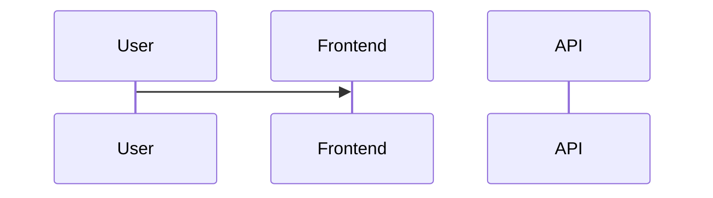

# Slice: S-XXX — [Short title]

| Field | Value |
|-------|-------|
| **Slice ID** | S-XXX |
| **Phase** | 1 Foundation \| 2 Core \| 3 AI \| 4 Dashboards \| 5 Polish |
| **Status** | Draft \| Specified \| In Progress \| Testing \| Accepted |
| **Role(s)** | customer \| merchant \| admin |
| **Owner** | PM name / date |

---

## User story

**As a** [role]  
**I want** [action]  
**So that** [benefit]

---

## Acceptance criteria

1. **Given** … **When** … **Then** …
2. …
3. …

---

## UX notes

- Screens / routes:
- Components to reuse:
- Empty states / errors:
- AI disclaimer required? yes / no

---

## Out of scope

-

---

## Dependencies

- S-XXX (must be Accepted first)
-

---

## Definition of done (PM)

- [ ] All AC verified in test report
- [ ] UX matches notes above
- [ ] Documented in API_REFERENCE / FRONTEND_GUIDE if new patterns
- [ ] PM Status set to **Accepted**

---

## Technical specification (Architect)

> Filled by Architect before implementation.

### API contract

| Method | Path | Auth | Request | Response |
|--------|------|------|---------|----------|
| | | | | |

### RBAC matrix

| Action | customer | merchant | admin |
|--------|----------|----------|-------|
| | | | |

### Data model impact

- [ ] None  [ ] Extend existing  [ ] New table(s)

**Details:**

### Cache / side effects

### Frontend

- **Route:**
- **Rendering:** SSR \| CSR
- **Components:**

### Flow

### Architect checklist

- [ ] API contract defined
- [ ] RBAC matrix complete
- [ ] Data model impact documented
- [ ] Cache invalidation considered
- [ ] Uses AI/storage abstractions where applicable
- [ ] ERD/API/FLOWS updates noted

### Risks / tradeoffs

---

## Links

- Test plan: `docs/agents/test-plans/TP-S-XXX-*.md`
- Test report: `docs/agents/test-reports/TR-S-XXX-*.md`
- ADR: `docs/agents/adrs/ADR-XXX-*.md` (if any)

---

## Changelog

| Date | Agent | Change |
|------|-------|--------|
| | PM | Created slice |
