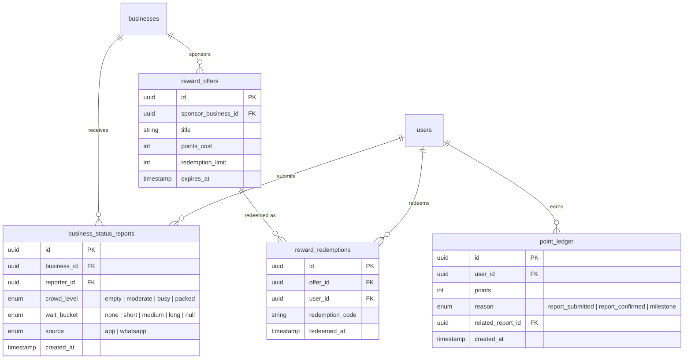

# Pivot option: crowdsourced live status (business model + technical sketch)

**Status:** exploratory — not a committed slice. This captures the discussion on whether to extend/replace the merchant-feedback-loop with a Waze-style crowdsourced "what's happening right now" layer (crowd levels, wait times, road/area conditions) for Chennai, distributed partly via WhatsApp.

Companion doc: [`competitive-analysis-lentlo.md`](competitive-analysis-lentlo.md).

---

## 1. Why this pivot came up

The original AI feedback loop (review → AI insight → merchant acts on it) has a structural weakness: it depends on the merchant actually engaging. A small shop owner who never checks a dashboard or replies to a review breaks the loop, and trying to fix that by adding a voice/sentiment interface to prompt the merchant only adds AI inference cost to a problem that's really about motivation, not comprehension. That cost doesn't scale down as usage grows — it scales up with it.

The proposed alternative removes the merchant from the critical path entirely: customers report live status to each other (how crowded a shop is, how long the wait is, whether a road is blocked), consumed in real time. Merchant participation becomes optional — claim a listing, sponsor a reward — instead of load-bearing.

## 2. Market check — does this already exist?

| Player | What it actually does | Reward model | Relevance |
|---|---|---|---|
| **Mappls (MapmyIndia)** | Crowdsourced road-hazard reports (potholes, accidents, unsafe areas), live traffic-signal timers, 100M+ downloads, 80–90% share of Indian OEM navigation | In-kind / reputational | The entrenched Indian incumbent on the *road/traffic* half of this idea — hard to out-compete head-on |
| **Waze** | The canonical model: accidents, police, hazards, reported live by drivers | Points → ranks/badges → swag/meetups. **Never cash** | Proof that reputational rewards, not payouts, are what makes this scale |
| **Google Local Guides** | Crowdsourced reviews/photos/place edits | Points → levels → in-kind perks (storage, early access, events). **Never cash** | Same lesson, applied to places instead of roads |
| **Chalo** | Live bus tracking + occupancy indicator | N/A (appears largely GPS/sensor-hardware-driven on the buses, not rider-crowdsourced) | Weaker precedent than it first looks — worth treating as a different mechanism |
| **Chennai Rains (2015)** | Volunteer-run, Twitter/OSM-organized flood map — 4,000+ roads logged by one tool, 5,700+ flooded streets by the OSM India community in 48 hours | None — pure civic volunteering | Proves Chennai residents *will* crowd-report in volume, but only under crisis pressure; the network dissolved once the crisis passed |

**Implication:** the road-hazard lane (accidents, roadblocks) is already owned nationally by a well-capitalized, government-integrated Indian company. Competing there directly is a harder fight than the Lentlo comparison. The **underserved lane is point-of-interest status** — live crowd/wait level for a shop, restaurant, beach, or market — which today only exists as unreliable merchant self-reporting (Zomato/Dineout), i.e. the exact "merchant doesn't engage" problem this pivot is trying to escape.

## 3. Reward model — why not cash

Every durable example above uses reputation, not money:

- **Unit economics** — a per-report cash payout is a cost that grows with your best-case usage; reputational rewards cost approximately nothing at any scale.
- **Fraud incentive** — cash directly rewards fabricating reports ("packed" when it's empty, to farm payouts); status/badges don't.
- **Regulatory friction (India)** — routing cash rewards through UPI at real volume risks RBI's Payment Aggregator / Prepaid Payment Instrument licensing requirements unless run through a licensed partner. Non-cash rewards avoid this entirely.

Recommended model: points → levels/badges (Waze/Local-Guides pattern) redeemable for **partner-merchant-funded perks** (a shop sponsors "free chai for your 10th verified report" in exchange for visibility) — this doubles as a second monetization lever without the platform ever handling a payout.

## 4. Recommended MVP scope

1. **Point-of-interest status only** for v1 — crowd level + wait time on a `business_id`. Explicitly **not** competing with Mappls on road/accident reporting; that's someone else's moat.
2. **Tap-based structured input**, not free text or voice — `Empty / Moderate / Packed`, `No wait / ~15 min / 30+ min`. This is the key move against the original AI-cost concern: it needs no NLP, no sentiment model, no LLM call at all — a report is a geotagged timestamped enum write.
3. **One dense neighborhood before "Chennai"** — reuse the existing Chrompet / Radha Nagar seed footprint rather than metro-wide launch. Real-time status is only useful above a reporting-density threshold (a 40-minute-old wait report is worthless, unlike a month-old review), so density matters more than coverage at this stage — same lesson as the Lentlo scale comparison.
4. **WhatsApp for intake, not broadcast.** Inbound replies inside Meta's 24-hour service window are effectively free; outbound broadcast alerts are billed per template message and get expensive fast at any real subscriber count (see cost table below). Use the app's own push/WebSocket channel for fan-out; reserve WhatsApp for capture and maybe a daily digest.

## 5. Data model sketch

Extends the existing schema (`backend/app/models/__init__.py`) rather than replacing it — `business_status_reports` hangs off the existing `businesses` table the same way `reviews` and `photos` already do.

**Deliberately not modeled in v1:** a `road_hazard_reports` table for accidents/roadblocks. That's the Mappls lane — adding it later is a straightforward extension of the same pattern (geo point instead of `business_id`), but it's out of scope while the wedge is unproven.

**Freshness, not a mutable "current status" column:** `business_status_reports` is an append-only event log, mirrored on the existing `ai_positives`/`ai_complaints` JSONB rolling-summary pattern already used for businesses — a report doesn't get updated in place. "Current status" for a business is computed from the last N reports within a rolling window (e.g. last 30–45 minutes) and cached in Redis with a short TTL (10–15 min), reusing the cache-with-graceful-fallback pattern already in `[cache.py](../backend/app/services/cache.py)`.

## 6. API sketch (new router, mounted under `/api/v1`)

| Method | Path | Auth | Description |
|---|---|---|---|
| POST | `/status/businesses/{id}/report` | User | Submit a crowd/wait report; writes the event, refreshes the Redis-cached rolling status, publishes to the business's fanout channel |
| GET | `/status/businesses/{id}` | Public | Current aggregated status (crowd_level, wait_bucket, sample_size, last_updated) — Redis-cached |
| GET | `/status/nearby` | Public | `lat`, `lng`, `radius_km` — live status for businesses in range, same param shape as the existing `/maps/nearby` |
| GET | `/status/leaderboard` | Public | Top contributors by points (Waze/Local-Guides style) |
| GET | `/users/me/points` | Bearer | Current user's points, level, redeemable rewards |
| POST | `/status/rewards/{offer_id}/redeem` | Bearer | Spend points on a sponsor-funded offer, returns a redemption code |

Real-time fan-out: a lightweight WebSocket/SSE endpoint per business or per geohash bucket, backed by Redis pub/sub (the same Redis instance already in the stack) — a report publishes an event, subscribed clients get pushed the new aggregate. No AI, no new infra family, no WhatsApp broadcast cost on the hot path.

**Possible new port:** a `WhatsAppChannel` protocol under `app/services/channels/` (mirroring the existing `AIProvider`/`StorageProvider` ports-and-adapters pattern) so the inbound-reporting integration is swappable — worth deciding at the Architect stage rather than presupposing WhatsApp is the permanent channel.

## 7. Cost factor for a Chennai rollout (recap)

| Line item | Estimate | Note |
|---|---|---|
| Core infra (Postgres/PostGIS + Redis pub/sub + app instances) | ~$50–300/mo at MVP scale | Reuses the existing stack, not a new architecture |
| WhatsApp inbound (report capture) | Low | Replies inside the 24h service window are effectively free under Meta's current per-message billing |
| WhatsApp outbound broadcast | **₹67k–450k/month** at 5,000 subscribers × 3 alerts/day, plus a BSP platform fee (₹10k–80k/mo) | The real cost trap — avoid by using app push for fan-out, WhatsApp for intake/digest only |
| Moderation / anti-spam | ~₹15–30k/month per part-time moderator, or automate via multi-confirmation thresholds (Waze's approach) | Ongoing operating cost once you're carrying real-world status with any liability exposure |
| **User acquisition to critical density** | The dominant cost, not tech | Real-time data is worthless below a reporting-density threshold; mitigate by launching one neighborhood, not the metro |

## 8. Open decisions for the next stage

If this moves from exploration to a slice brief (PM → Architect → Builder → Tester per `README.md` §13):

- Confirm the wedge is point-of-interest status, not road hazards, before scoping anything else.
- Decide whether anonymous (unauthenticated) reporting is allowed — lowers friction, raises spam risk; the existing auth system makes "logged-in only" the cheap default.
- Decide the report-confirmation rule (N reports before a status is "trusted," and its decay window) — this is a product decision, not just an engineering one.
- Decide whether `WhatsAppChannel` is worth building as a real port in v1, or whether the app's own UI is enough for a single-neighborhood pilot and WhatsApp integration is deferred until density is proven.
