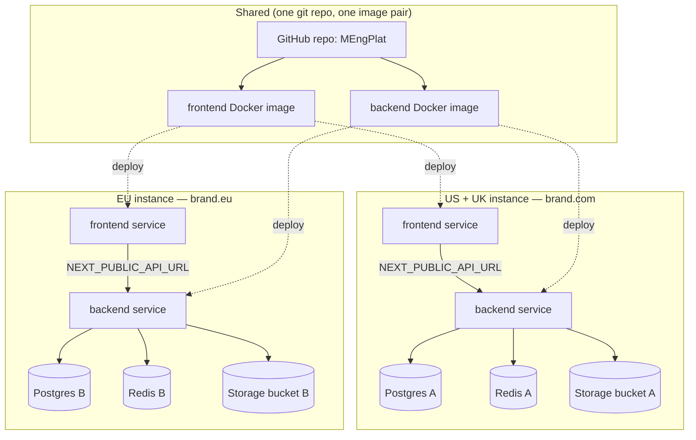

# Multi-geography rehosting: same app, two independent instances

**Status:** exploratory — not a committed slice. Captures a proposed plan for listing the same
product under a second geography (different domain, different data, different seating/images/
content) that does not interact or overlap with the first instance, while keeping one codebase
that is agnostic to which geography it's running in.

**Concrete split as of 2026-08-18:** two instances — **US + UK** together on one instance, **EU**
on a separate instance. Driver for keeping them apart is **GDPR data residency**: EU personal data
must stay on EU-hosted infrastructure and not be processed by the US/UK backend. See §9.

> Note on terminology: this repo is Next.js (frontend) + FastAPI (backend), not WordPress — there
> is no WordPress anywhere in the stack. Read "same WordPress between both brands" as "same
> underlying codebase/app powering both brands," which is exactly what this plan delivers: one
> git repo, one Docker image pair, deployed twice.

## 1. What "two instances that don't overlap" actually means here

The two geographies must share **zero** runtime state:

- Separate database (own Postgres — own businesses, reviews, users, admin accounts)
- Separate cache (own Redis)
- Separate file storage (own bucket/prefix — review photos, uploads)
- Separate domain (own DNS, own TLS cert, own CORS origin)
- Separate auth boundary (a JWT minted by instance A must not validate against instance B)

They may safely **share**:

- The git repo and Docker images (frontend + backend) — same code, different config
- The AI provider account/keys (optional — can also be split per instance for cost tracking)
- The Google OAuth client ID (Google allows multiple **Authorized JavaScript origins** on one
  client — add both domains to the same client, or use two clients if you want separate
  consent-screen branding)
- CI/CD pipeline definitions (same workflows, parameterized per deploy target)

## 2. Why this is a config problem, not a rewrite

[`backend/app/config.py`](../../backend/app/config.py) is a single `Settings` object sourced
entirely from environment variables (`DATABASE_URL`, `REDIS_URL`, `SECRET_KEY`, `CORS_ORIGINS`,
`STORAGE_*`, `AI_*`, `GOOGLE_CLIENT_ID`, …) — there is no tenant/geography concept baked into the
code, and no code path reads a hardcoded connection string, bucket name, or domain. The frontend
is the same: `NEXT_PUBLIC_API_URL` (build-time) and `API_URL_INTERNAL` (runtime, SSR) are the only
things that point it at a backend — see [README §10 Deployment](../../README.md#10-deployment).

Concretely, this means: **the existing Railway deployment pattern already does 90% of this.**
[README §10 Option D](../../README.md#option-d--railway-chosen-partially-wired-up) is "one
Railway project, one Postgres, one Redis, one backend service, one frontend service, wired
together by env vars." Standing up a second geography is running that same recipe again in a
**second, fully independent Railway project** with its own Postgres/Redis/domains — not a second
code path.

## 3. Proposed architecture

No arrows cross between `GeoA` and `GeoB` — that's the "don't interact, don't overlap" requirement
satisfied structurally, not by an application-level tenant filter. This also sidesteps an entire
class of bugs (forgetting a `WHERE tenant_id = ...` clause) that a shared-database multi-tenant
design would risk.

## 4. Rollout plan

1. **Provision per-geography infrastructure.** Second Railway project (or Render/Vercel/Neon
   stack per [Option C](../../README.md#option-c--vercel--render--neon--upstash)): Postgres,
   Redis, storage bucket, two custom domains (`app-fe` + `app-api` per geography, or a single
   domain with the frontend proxying `/api` — either works, CORS just needs to match whichever is
   chosen).
2. **Generate a distinct `SECRET_KEY` per geography.** Must differ — this is what makes a token
   minted in one geography invalid in the other, even though the JWT algorithm and claim shape are
   identical. Never reuse instance A's key as a "shared" key.
3. **Point `CORS_ORIGINS` at only that geography's frontend domain.** Already a plain env var
   (`backend/app/config.py`) — no code change.
4. **Seed geography-specific data.** `backend/scripts/seed_chennai.py` and `seed_us.py` are
   already split by geography (see [README §12 repo layout](../../README.md#12-repo-layout--conventions)
   — `scripts/seed.py` calls both today for the single-instance demo). For two independent
   instances, run **only** the relevant regional seed script against each database — don't call
   `seed.py`'s combined path in production.
5. **File storage.** Set `STORAGE_PROVIDER=s3` with a bucket per geography (`STORAGE_S3_BUCKET`,
   `STORAGE_S3_REGION`, optionally `STORAGE_S3_ENDPOINT_URL` for a region-local S3-compatible
   provider) — see [README §10 File storage in production](../../README.md#file-storage-in-production).
   Do not point both geographies at the same bucket even with different prefixes; a bucket-level
   IAM mistake would then leak across geographies.
6. **AI provider keys.** Reuse the same vendor account via `AI_PROVIDERS__<NAME>__*` overrides
   (`backend/app/config.py`), or split per geography if per-region cost attribution or data
   residency (e.g. not sending EU/IN customer text to a US-region model endpoint) matters.
7. **CI/CD.** Same GitHub Actions workflows, parameterized by which Railway project/service a
   given push deploys to (environment-scoped secrets, one job per geography, or a manual dispatch
   input naming the target). No workflow duplication needed — see
   [README §10 CI/CD](../../README.md#cicd) for current state (dispatch-only today, not yet
   auto-deploying either geography).

## 5. Code that is *not* yet geography-agnostic (fix before/while rolling out)

Grep turned up one real coupling point and one category to audit, not a rewrite:

- **`FEATURED_CURRENCY = "INR"`** is hardcoded in
  [`backend/app/services/payments/sku.py`](../../backend/app/services/payments/sku.py) and flows
  into `featured.py`'s payment records regardless of which geography made the request. A
  US-hosted instance selling a featured-listing SKU would record the charge as INR. This needs to
  become a `Settings` field (e.g. `FEATURED_CURRENCY` env var, defaulting to `INR` to match
  current behavior) read per-deployment, not a shared constant — same pattern as `AI_PROVIDER`.
  The Razorpay payment provider ([`razorpay.py`](../../backend/app/services/payments/razorpay.py))
  is itself India-specific; a US instance would need a different `PaymentProvider` implementation
  (the port already exists at `services/payments/base.py`, matching the `services/ai/` and
  `services/storage/` pattern called out in [CLAUDE.md](../../CLAUDE.md) — "new external
  integrations get a `Protocol` + factory").
- **Distance/geo math** (`backend/app/services/geo.py`) is hardcoded to kilometers
  (`haversine_km`, `radius_km`). Fine if every geography you launch uses metric; if a
  mile-preferring market is ever added, this needs a unit setting, not a rewrite — flag, don't fix
  preemptively.
- **Frontend currency/number formatting** — several pages format prices inline (`admin/businesses/
  [id]/page.tsx`, `businesses/[slug]/page.tsx`, `search/page.tsx`, etc.). Worth a quick pass to
  confirm formatting reads from a config value (or `Intl.NumberFormat` with a locale prop) rather
  than a hardcoded `₹`/`$` glyph, so the same frontend build genuinely renders correctly for
  either geography's `NEXT_PUBLIC_API_URL` target. Not yet audited line-by-line — do this as part
  of whichever slice implements geography B, not now.

Everything else that looked geography-adjacent in a repo-wide grep (`auth.py`, `dashboard.py`,
`maps.py`, `search.py`, `models/__init__.py`) turned out to be incidental matches (e.g. `local`
substring, `unit` substring) rather than actual hardcoded geography assumptions.

## 6. What this plan deliberately does *not* propose

- **No shared multi-tenant database with a `region`/`tenant_id` column.** That would violate the
  "don't interact, don't overlap" requirement at the storage layer and adds real risk (cross-tenant
  query bugs) for no benefit when the two brands don't need to share data anyway.
  Fully-separate databases per geography is simpler and strictly safer here.
- **No dynamic runtime geography switch inside one running instance.** Each deployed instance is
  configured once (env vars) for exactly one geography, the same way today's single Railway
  deployment is configured once for the current demo. This is deploy-time selection, not
  request-time.

## 7. Effort estimate

Almost entirely **infrastructure + config**, not application code, once §5's two fixes land:

- Infra provisioning (second Postgres/Redis/bucket/domains): hours, mostly clicking through
  dashboards — same steps as [README §10 Option D](../../README.md#option-d--railway-chosen-partially-wired-up)
  repeated.
- `FEATURED_CURRENCY` → `Settings` field + a non-INR `PaymentProvider` (or leave payments
  disabled/mock for geography B at launch): a small, real slice — worth running through the
  normal PM → Architect → Builder → Tester cycle ([CLAUDE.md](../../CLAUDE.md) multi-agent
  workflow) rather than a quick patch, since it touches money-handling code.
- Frontend currency-formatting audit: small, can ride along with the above slice.

## 8. Open questions for whoever picks this up

- Two Google OAuth clients (separate consent-screen branding per geography) or one client with
  both origins allow-listed?
- Shared AI vendor account (simpler billing) or split per geography (cleaner cost attribution,
  avoids sending one geography's customer text through an endpoint associated with the other)?
- Is a payment provider even needed at geography-B launch, or does the featured-listing SKU stay
  disabled there until a real non-Razorpay `PaymentProvider` is built?

## 9. Restricting cross-country access — geo-redirect + GDPR data residency

Decided: soft geo-redirect (send a visitor to the right domain, don't hard-block), driven by a
**GDPR data-residency** requirement — EU personal data must stay on EU-hosted infrastructure.

### 9.1 Two different problems, two different fixes

This request is actually two separate things that are easy to conflate:

| | What it does | What it does *not* do |
|---|---|---|
| **Geo-redirect** (§9.2) | Sends a visitor's browser to the domain matching their detected country, so an EU visitor lands on `brand.eu` instead of `brand.com` | Does **not** stop anyone determined (VPN, manual URL entry, API calls) from reaching the "wrong" instance. It is UX, not a security boundary. |
| **Data residency** (§9.3) | Ensures EU personal data is actually stored and processed only on EU-hosted infra | This is the actual GDPR control. It has to hold **even if the redirect fails or is bypassed** — the compliance obligation is about where data lives and who processes it, not about who can view a public page. |

Treat §9.2 as a nice-to-have UX layer and §9.3 as the real requirement. A redirect alone is
**not** GDPR compliance — don't let it get reported as "done" for the compliance line item.

### 9.2 Geo-redirect implementation

Neither Railway nor a bare frontend/backend service does IP→country lookup on its own. The
standard fix is to put a CDN/edge layer in front of both domains — recommend **Cloudflare** (free
tier is enough for this): once both `brand.com` and `brand.eu` are proxied through Cloudflare, every
request arrives with a `CF-IPCountry` header, and either:

- **Cloudflare Redirect Rule** (no application code, cheapest to run): if `cf.ipcountry` is an EU
  member-state code and host is `brand.com` → 302 to `brand.eu` (and the mirror rule the other
  way for `US`/`GB` hitting `brand.eu`). Anything outside both lists (e.g. a visitor from Japan)
  falls through to whichever domain they typed — pick one as the default, or show a lightweight
  country chooser instead of guessing.
- **Next.js middleware** reading the forwarded country header, if you'd rather keep the logic in
  the repo — simpler to test alongside the rest of `frontend/`, at the cost of one extra origin
  hop Cloudflare's rule engine would have avoided.

Either way this is additive infra, not a change to `backend/app/config.py`'s per-instance model —
`CORS_ORIGINS` on each backend still only accepts its own frontend's domain regardless of how the
visitor arrived there.

### 9.3 The actual GDPR requirement — data residency, not traffic blocking

For the EU instance specifically, "keep the data in-country" means, in order of how load-bearing
each one is:

1. **Database, cache, and file storage physically hosted in an EU region.** Not just "a separate
   Postgres" (already true per §1) but a Postgres/Redis/bucket whose provider region is EU (e.g.
   Railway EU region, or Neon/AWS `eu-west-1` if using Option C). This is the one that actually
   satisfies "data hosted in respective countries."
2. **No EU personal data leaving the EU instance via a shared vendor call.** §4 point 6 already
   flagged AI-provider key sharing as optional — for the EU instance this stops being optional:
   either the AI provider call is made from an EU-region endpoint with a GDPR-compliant data
   processing agreement (most major vendors offer this), or the EU instance uses a different
   provider/region than the US+UK instance. Same logic applies to any logging, analytics, or
   error-tracking vendor (e.g. Sentry) wired up later — check its region setting per instance,
   don't assume the default (usually US) is fine for the EU one.
3. **Backups stay in-region.** Whatever backup mechanism is set up for the EU Postgres must not
   default to a US-region snapshot bucket.
4. **No cross-instance operational access as a side channel.** An admin console, support tool, or
   CI job that can query both instances' databases from one place is itself a way EU data could
   end up handled outside the EU boundary — worth a deliberate decision (e.g. separate admin
   credentials per instance) rather than an oversight.

None of this requires new application code beyond what §5 already lists — it's a hosting-region
choice at provisioning time (§4 step 1) plus a vendor/config check per external integration, not a
`region` flag anywhere in `backend/`.

### 9.4 Caveat: UK is grouped with US here, but UK-GDPR still applies to UK users

Flagging honestly rather than staying silent: post-Brexit, the UK has its own **UK GDPR**, which
tracks the EU regulation closely and imposes similar data-residency-adjacent obligations
(adequacy-based transfer rules, not identical to "must stay in the UK," but not nothing either).
Putting the UK on the same instance as the US doesn't make UK-GDPR obligations disappear for UK
users' data — it just means that instance now needs to satisfy US expectations (none, federally)
*and* UK-GDPR simultaneously. That's a product/legal call, not a technical one — worth confirming
with whoever owns compliance before treating "US + UK together" as the final grouping, rather than
assuming it by default here.

### 9.5 Effort estimate for this piece

- Cloudflare in front of both domains + two redirect rules: an hour or two, pure infra.
- Confirming/moving EU Postgres+Redis+storage to an EU provider region: infra provisioning step,
  no code — do this *during* §4 step 1 for the EU instance, not as a retrofit.
- AI vendor / logging vendor region-and-DPA check for the EU instance: a short audit, not a
  slice — but block launch on it, since this is the part that's actually load-bearing for GDPR.
