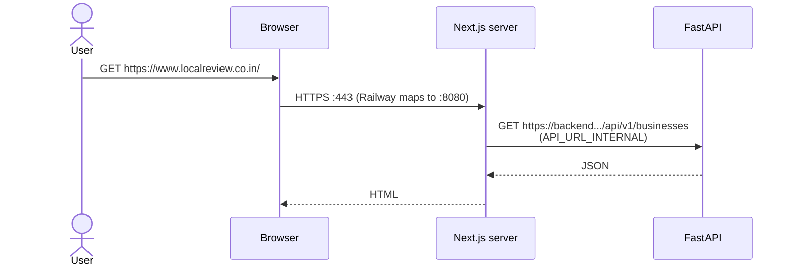
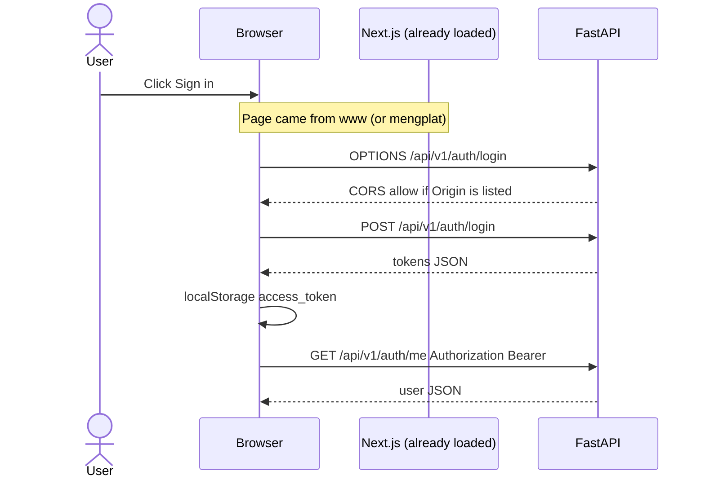

# localreview.co.in — Railway + Namecheap runbook

Personal reference from the 2026-08-16 custom-domain pass. Not product docs (`README.md` stays the source of truth for the app).

## Current status (confirm)

| Check | Status | Meaning |
| --- | --- | --- |
| CNAME `www` → `5vtkfdlq.up.railway.app` | **OK** (Railway green; public DNS matches) | Traffic reaches Railway. That is why you see the purple “train has not arrived” page, not Namecheap parking. |
| TXT `_railway-verify.www` | **Not OK** (Railway yellow; Google DNS: name does not exist) | Ownership not proven. No cert, **Not secure**, station 404, AV often blocks the first visit. |
| Internal port **8080** on frontend | **OK** | Railway `$PORT`. Public HTTPS is still **443**. Do not put 8080/3000/8000 in Namecheap. |
| `https://mengplat.up.railway.app` | **OK** to use now | Same frontend service. Use this until `www` is **Active**. |

**Is the yellow TXT an issue?** Yes, **for the custom domain only**. The app on the Railway URL can work. `www.localreview.co.in` will not be a real HTTPS site until that TXT exists and Railway shows **Active**.

---

## Sequence we followed

1. Domain is on **Namecheap**. Hosting is **Railway frontend** (Next.js), not the FastAPI service.
2. Railway **Settings → Public Networking → Custom domain** `www.localreview.co.in`.
3. Railway showed two records. **No port** in DNS.
4. Namecheap **Advanced DNS** — removed parking:
   - Deleted CNAME `www` → `parkingpage.namecheap.com`
   - Deleted URL Redirect `@` → `http://www…` once **ALIAS** `@` was added (two `@` records fight).
5. Namecheap records that belong:

   | Type | Host | Value |
   | --- | --- | --- |
   | CNAME | `www` | `5vtkfdlq.up.railway.app` (must match **this** Railway modal, not an older hostname such as `is360rcb…`) |
   | TXT | `_railway-verify.www` | full `railway-verify=…` from the **www** modal (not Host `_railway-verify` alone — that is apex) |
   | ALIAS | `@` | same Railway hostname **only if** you also add apex `localreview.co.in` in Railway |

6. Public DNS check: `www.localreview.co.in` CNAME = `5vtkfdlq.up.railway.app`. TXT `_railway-verify.www.localreview.co.in` was still **missing**.
7. Browser: `https://www.localreview.co.in` → Railway 404 + Not secure. Expected until TXT verifies.
8. Antivirus block: typical for new domain + missing cert + old parking reputation. Should ease after padlock is green.

**Still to do:** paste TXT host `_railway-verify.www` + full token → Save → wait minutes–hours → Railway **Active** → padlock on `https://www.localreview.co.in`.

---

## Ports (do not mix these up)

| Place | Port | Type it? |
| --- | --- | --- |
| Browser / custom domain | 443 | No |
| Railway Networking (frontend) | **8080** (`$PORT`) | Yes, container target only |
| Local Docker | 3000 frontend, 8000 API | Local only |
| Namecheap | — | Never |

---

## Backend vs frontend env

**Frontend** (same app, two public names after DNS is green):

- `https://www.localreview.co.in`
- `https://mengplat.up.railway.app`

You do **not** QA every change twice. One deploy updates both. Daily URL = custom domain once Active.

Variables (must be the **backend** HTTPS host, not the website):

- `NEXT_PUBLIC_API_URL` = `https://<backend>.up.railway.app` (baked at **build**; redeploy after change)
- `API_URL_INTERNAL` = same (SSR at runtime)
- Yellow **i** in Railway = often “build-time / not in start command”, not “invalid”

**Backend** Variables:

- `CORS_ORIGINS` = **list** of browser origins, e.g.  
  `https://www.localreview.co.in,https://localreview.co.in,https://mengplat.up.railway.app`
- `PUBLIC_APP_URL` = **one** origin for email links, e.g. `https://www.localreview.co.in`

CORS = who may call the API. `PUBLIC_APP_URL` = which link goes in the reset email. Do **not** attach the custom domain to the **backend** service.

---

## Flow (short)

```text
User → https://www.localreview.co.in
     → Namecheap CNAME → Railway edge :443
     → TXT verified → cert + route
     → frontend container :8080
     → browser calls NEXT_PUBLIC_API_URL (backend)
     → backend CORS must allow that page's origin
```

Until TXT is green, the chain stops at Railway edge (station 404).

---

## Next.js ↔ backend (how each call works)

There is **no proxy** in Next.js that rewrites `/api` to FastAPI. `frontend/src/lib/api.ts` always calls the **backend public HTTPS URL**. The website origin and the API origin are **two different hosts**.

```text
Browser  →  https://www.localreview.co.in     →  Next.js  (frontend service, :8080)
Browser  →  https://<backend>.up.railway.app  →  FastAPI  (backend service, :8080)
Next.js server (SSR)  →  same backend URL via API_URL_INTERNAL
```

Those two **8080**s are not the same port. Each Railway service has its own container and its own `$PORT` (often both show 8080). The browser never dials 8080; it uses **443** on each hostname.

### Which URL Next.js uses (`api.ts`)

| Who is running the fetch | Variable | When it is set |
| --- | --- | --- |
| **Browser** (login, dashboard, collect, `"use client"`) | `NEXT_PUBLIC_API_URL` | Baked in at `npm run build`. Change it → **redeploy frontend**. |
| **Next.js server** (home, search, business profile SSR) | `API_URL_INTERNAL`, else `NEXT_PUBLIC_API_URL` | Read at **runtime** in the frontend container. |

Code: if `window` is undefined → server; else → client. Production SSR that still hits `localhost:8000` logs an error and Featured stays empty.

Both should be:

```text
https://<backend>.up.railway.app
```

No path, no `/api/v1`, no port. Paths are appended in code (`/api/v1/auth/login`, etc.).

### Path A — first paint (SSR: home / search)

The HTML is built **on the frontend server**, then sent to the browser. The browser does **not** show `GET /api/v1/businesses` for that first paint.

```text
1. User → https://www.localreview.co.in/
2. Namecheap CNAME → Railway frontend :443 → Next :8080
3. Next Server Component fetch
      API_URL_INTERNAL + /api/v1/businesses/...
      → Railway backend :443 → uvicorn :8080
4. FastAPI JSON → Next renders HTML
5. HTML/JS/CSS → browser
```

CORS does **not** apply here. This is server-to-server (Next container → API container). No `Origin` from the user’s browser.



### Path B — in-page actions (browser → API)

Login, merchant dashboard, reviews, WhatsApp card, etc. run in the **browser**. JS calls FastAPI **directly**.

```text
1. Page already loaded from www.localreview.co.in
2. Browser JS: fetch(NEXT_PUBLIC_API_URL + /api/v1/...)
   Header Origin: https://www.localreview.co.in
   Header Authorization: Bearer <access_token> when logged in
3. Browser may send OPTIONS first (CORS preflight)
4. FastAPI checks CORS_ORIGINS for that Origin
   Allow → JSON
   Deny → browser blocks; Network tab shows CORS error
5. JSON → React updates the page
```

If the user opened **`https://mengplat.up.railway.app`** instead, `Origin` is that Railway URL. It must also be in `CORS_ORIGINS`. Same backend, different allowed website.



Tokens live in **localStorage** on the frontend origin. They are sent to the API as headers, not as cookies (MVP). Changing website host (`www` vs `mengplat`) is a **different origin**, so storage is separate — you log in again on the other URL.

### Path C — email links (backend → user, no Next in the middle)

Forgot-password email is built on the **backend**:

```text
PUBLIC_APP_URL + /reset-password?token=...
```

That is why `PUBLIC_APP_URL` is a **single** frontend origin (`https://www.localreview.co.in`). The API does not know which of the two website URLs the user had open.

### What FastAPI does with a request

1. TLS ends at Railway (443) → process on `$PORT` (8080).
2. CORS middleware: is `Origin` in `CORS_ORIGINS`? (browser calls only)
3. Router under `/api/v1/...`
4. If the route needs a user: JWT from `Authorization`
5. Service layer + Postgres/Redis
6. JSON back the same path

The frontend never “listens” for the backend. The backend only **answers** HTTP. Next.js answers **page** HTTP; FastAPI answers **API** HTTP.

### Two website URLs, one API

```text
www.localreview.co.in  ──┐
                         ├── Next.js (one service, one :8080) ─┐
mengplat.up.railway.app ─┘                                      │
                                                                ▼
                                              FastAPI (other service, other :8080)
                                              public: https://<backend>.up.railway.app
```

Validate features on **one** website URL. The API is always the backend host. Do not point `localreview.co.in` at the backend.

---

## Why `www` vs apex


- `www.localreview.co.in` — CNAME (what we provisioned).
- `localreview.co.in` (`@`) — optional; needs ALIAS + a second Railway custom domain. Not required if everyone uses `www`.
