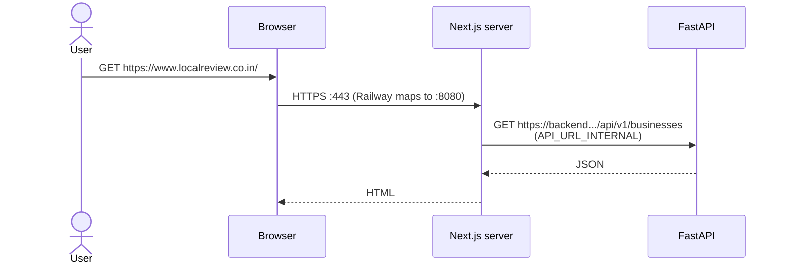
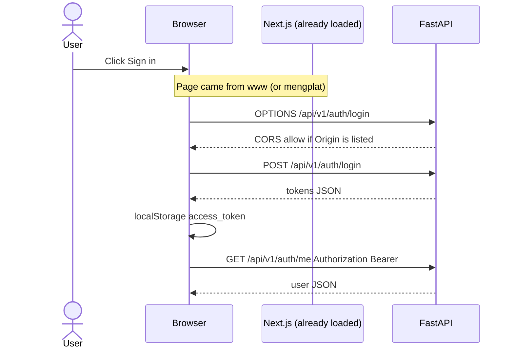

# localreview.co.in — Railway + Namecheap runbook

Personal reference from the 2026-08-16 custom-domain pass. Not product docs (`README.md` stays the source of truth for the app).

## Current status (2026-08-17 ~00:14 IST)

| Check | Status | Meaning |
| --- | --- | --- |
| CNAME `www` → `5vtkfdlq.up.railway.app` | **OK** | Public DNS (8.8.8.8 / 1.1.1.1). |
| TXT `_railway-verify.www` | **OK** | `railway-verify=8c2937…` (single prefix). |
| TLS on `:443` | **OK on the wire** | Let’s Encrypt `CN=www.localreview.co.in`, issuer `YR1`, valid 2026-08-16 → 2026-11-14. |
| Browser | **App loads** | `https://www.localreview.co.in` shows MerchantHub AI (not Railway station 404). Red **Not secure** in an old tab is cache or antivirus, not a missing cert. |
| Internal port **8080** on frontend | **OK** | Railway `$PORT`. Public HTTPS is still **443**. |
| Backend `CORS_ORIGINS` / `PUBLIC_APP_URL` | **Still to do** | Login from www needs www in CORS. |

**How this was known:** nothing was read from Namecheap or Railway’s UI. Checks were **public DNS** (`nslookup`) then a **TLS handshake** to port 443 (PowerShell `SslStream`). Details below.

---

## Sequence we followed

1. Domain is on **Namecheap**. Hosting is **Railway frontend** (Next.js), not the FastAPI service.
2. Railway **Settings → Public Networking → Custom domain** `www.localreview.co.in`.
3. Railway showed two records. **No port** in DNS.
4. Namecheap **Advanced DNS** — removed parking:
   - Deleted CNAME `www` → `parkingpage.namecheap.com`
   - Deleted URL Redirect `@` → `http://www…` once **ALIAS** `@` was added (two `@` records fight).
5. Namecheap records that belong:

   | Type | Host | Value |
   | --- | --- | --- |
   | CNAME | `www` | `5vtkfdlq.up.railway.app` (must match **this** Railway modal, not an older hostname such as `is360rcb…`) |
   | TXT | `_railway-verify.www` | full `railway-verify=…` from the **www** modal (not Host `_railway-verify` alone — that is apex) |
   | ALIAS | `@` | same Railway hostname **only if** you also add apex `localreview.co.in` in Railway |

6. Public DNS check: `www.localreview.co.in` CNAME = `5vtkfdlq.up.railway.app`. TXT `_railway-verify.www.localreview.co.in` was still **missing**.
7. Browser: `https://www.localreview.co.in` → Railway 404 + Not secure. Expected until TXT verifies.
8. Antivirus block: typical for new domain + missing cert + old parking reputation.

**Still to do (app, not DNS):** set backend `CORS_ORIGINS` to include `https://www.localreview.co.in` (and apex / `mengplat` if you still use them). Set `PUBLIC_APP_URL` to `https://www.localreview.co.in`. If the padlock stays red, use incognito or allow the domain in antivirus.

---

## Trail of DNS / TLS changes (what we actually observed)

Namecheap **Host** is only the left labels. The zone `localreview.co.in` is always appended. Railway’s **www** check looks up one exact name; a record on a sibling name does not count.

| When | Query | Result | What it meant |
| --- | --- | --- | --- |
| Early | `CNAME www.localreview.co.in` | → `5vtkfdlq.up.railway.app` | Routing OK. Browser hit Railway (station 404), not Namecheap parking. |
| Early | `TXT _railway-verify.www.localreview.co.in` | **NXDOMAIN** | www ownership not published. No cert. |
| Early | `TXT _railway-verify.localreview.co.in` | `railway-verify=8c2937…` | Token was on **apex** (Host `_railway-verify`), not www (Host `_railway-verify.www`). |
| After first TXT fix | `TXT _railway-verify.www…` @ 1.1.1.1 | `railway-verify=railway-verify=8c2937…` | **Name** existed; **value** doubled the prefix. Railway string-compares; mismatch. |
| Same time | Apex TXT | **NXDOMAIN** | Apex verify row was removed or moved. |
| After second TXT fix | `TXT _railway-verify.www…` @ 1.1.1.1 and 8.8.8.8 | `railway-verify=8c2937…` (one prefix) | DNS shape Railway needs. |
| After Railway issued cert | TLS `:443` `www.localreview.co.in` | `CN=www.localreview.co.in`, Let’s Encrypt `YR1` | Edge has a real cert. Browser **Not secure** ≠ missing cert. |
| Same time | Browser | MerchantHub AI title | Custom domain attached to the frontend service. |

### Why NXDOMAIN vs “wrong value” vs “wrong name”

- **NXDOMAIN** — that FQDN is not in the zone. Waiting does not create it.
- **Wrong Host** — `_railway-verify` publishes `_railway-verify.localreview.co.in`. Railway www wants `_railway-verify.www.localreview.co.in`.
- **Doubled prefix** — Railway modal already includes `railway-verify=`. Pasting that into a field that also prepends `railway-verify=` yields `railway-verify=railway-verify=…`.
- **TLS vs browser** — a Let’s Encrypt cert on the wire can coexist with a red address bar if the tab cached the old failure or AV intercepts HTTPS.

---

## Validation steps (repeat these)

Use **public resolvers** (`8.8.8.8` Google, `1.1.1.1` Cloudflare) so you are not looking at a stale local cache. `nslookup` is a DNS client: UDP query for **name + type**. It does not talk to HTTP, Railway, or Namecheap’s website.

### 1. Routing — CNAME

```powershell
nslookup -type=CNAME www.localreview.co.in 8.8.8.8
```

Expect: `canonical name = 5vtkfdlq.up.railway.app` (must match **this** frontend’s Railway hostname).

### 2. Ownership — TXT for **www** (not apex)

```powershell
nslookup -type=TXT _railway-verify.www.localreview.co.in 1.1.1.1
nslookup -type=TXT _railway-verify.www.localreview.co.in 8.8.8.8
```

Expect exactly one prefix:

```text
_railway-verify.www.localreview.co.in  text =
    "railway-verify=<hex from the Railway www modal>"
```

Interpret:

| Answer | Conclusion |
| --- | --- |
| Non-existent domain / NXDOMAIN | Namecheap Host is not `_railway-verify.www` (or not saved / not propagated). |
| `railway-verify=railway-verify=…` | Doubled prefix; edit the TXT value. |
| `railway-verify=<hex>` but Railway stays yellow | Hex may be the **apex** token. Copy from the **www** modal. |
| Same TXT on both 1.1.1.1 and 8.8.8.8 | Not a single-resolver cache issue. |

Apex (only if you also added `localreview.co.in` in Railway):

```powershell
nslookup -type=TXT _railway-verify.localreview.co.in 8.8.8.8
```

That name does **not** satisfy the www check.

### 3. TLS — what is on port 443 (not what the tab cached)

`openssl s_client` was not on PATH. Equivalent in PowerShell: TCP connect to **443**, TLS handshake with SNI `www.localreview.co.in`, read the peer certificate.

```powershell
$tcp = New-Object System.Net.Sockets.TcpClient("www.localreview.co.in", 443)
$ssl = New-Object System.Net.Security.SslStream($tcp.GetStream(), $false, ({ $true }))
$ssl.AuthenticateAsClient("www.localreview.co.in")
$cert = New-Object System.Security.Cryptography.X509Certificates.X509Certificate2($ssl.RemoteCertificate)
"Subject: $($cert.Subject)"
"Issuer: $($cert.Issuer)"
"NotBefore: $($cert.NotBefore)"
"NotAfter: $($cert.NotAfter)"
$ssl.Close(); $tcp.Close()
```

Observed 2026-08-16:

```text
Subject: CN=www.localreview.co.in
Issuer:  CN=YR1, O=Let's Encrypt, C=US
NotBefore: 08/16/2026 23:13:26
NotAfter:  11/14/2026 23:13:25
```

Notes:

- `({ $true })` **accepts any cert** so the handshake still runs when the OS distrusts the chain. It answers “what did the server present?”, not “does Windows trust it?”.
- **SNI** (`AuthenticateAsClient("www.localreview.co.in")`) is required; Railway serves many hostnames on one IP.
- Browser **Not secure** after this result: open **incognito**. If the padlock is fine there, the old tab cached the failure. If still red, click the badge: issuer should be Let’s Encrypt; an antivirus product as issuer means TLS interception.

If `openssl` is installed later:

```text
openssl s_client -connect www.localreview.co.in:443 -servername www.localreview.co.in
```

Look at `subject=`, `issuer=`, `Verify return code`.

### 4. Where you are (map)

| You see | Stage |
| --- | --- |
| CNAME OK, TXT NXDOMAIN, station 404 | Routing only |
| TXT doubled prefix | Name OK, value wrong |
| TXT single prefix, station 404 | Wait for Railway to attach + issue cert |
| MerchantHub AI + Let’s Encrypt on :443 | Domain live; padlock/cache/AV leftover |
| Login CORS errors from www | Backend `CORS_ORIGINS` missing www |

---

## Ports (do not mix these up)

| Place | Port | Type it? |
| --- | --- | --- |
| Browser / custom domain | 443 | No |
| Railway Networking (frontend) | **8080** (`$PORT`) | Yes, container target only |
| Local Docker | 3000 frontend, 8000 API | Local only |
| Namecheap | — | Never |

---

## Backend vs frontend env

**Frontend** (same app, two public names after DNS is green):

- `https://www.localreview.co.in`
- `https://mengplat.up.railway.app`

You do **not** QA every change twice. One deploy updates both. Daily URL = custom domain once Active.

Variables (must be the **backend** HTTPS host, not the website):

- `NEXT_PUBLIC_API_URL` = `https://<backend>.up.railway.app` (baked at **build**; redeploy after change)
- `API_URL_INTERNAL` = same (SSR at runtime)
- Yellow **i** in Railway = often “build-time / not in start command”, not “invalid”

**Backend** Variables:

- `CORS_ORIGINS` = **list** of browser origins, e.g.  
  `https://www.localreview.co.in,https://localreview.co.in,https://mengplat.up.railway.app`
- `PUBLIC_APP_URL` = **one** origin for email links, e.g. `https://www.localreview.co.in`

CORS = who may call the API. `PUBLIC_APP_URL` = which link goes in the reset email. Do **not** attach the custom domain to the **backend** service.

---

## Flow (short)

```text
User → https://www.localreview.co.in
     → Namecheap CNAME → Railway edge :443
     → TXT verified → cert + route
     → frontend container :8080
     → browser calls NEXT_PUBLIC_API_URL (backend)
     → backend CORS must allow that page's origin
```

Until TXT is correct, the chain stops at Railway edge (station 404). After TXT + Let’s Encrypt, the chain reaches Next.js; remaining work is CORS / `PUBLIC_APP_URL` and a clean browser trust path.

---

## Next.js ↔ backend (how each call works)

There is **no proxy** in Next.js that rewrites `/api` to FastAPI. `frontend/src/lib/api.ts` always calls the **backend public HTTPS URL**. The website origin and the API origin are **two different hosts**.

```text
Browser  →  https://www.localreview.co.in     →  Next.js  (frontend service, :8080)
Browser  →  https://<backend>.up.railway.app  →  FastAPI  (backend service, :8080)
Next.js server (SSR)  →  same backend URL via API_URL_INTERNAL
```

Those two **8080**s are not the same port. Each Railway service has its own container and its own `$PORT` (often both show 8080). The browser never dials 8080; it uses **443** on each hostname.

### Which URL Next.js uses (`api.ts`)

| Who is running the fetch | Variable | When it is set |
| --- | --- | --- |
| **Browser** (login, dashboard, collect, `"use client"`) | `NEXT_PUBLIC_API_URL` | Baked in at `npm run build`. Change it → **redeploy frontend**. |
| **Next.js server** (home, search, business profile SSR) | `API_URL_INTERNAL`, else `NEXT_PUBLIC_API_URL` | Read at **runtime** in the frontend container. |

Code: if `window` is undefined → server; else → client. Production SSR that still hits `localhost:8000` logs an error and Featured stays empty.

Both should be:

```text
https://<backend>.up.railway.app
```

No path, no `/api/v1`, no port. Paths are appended in code (`/api/v1/auth/login`, etc.).

### Path A — first paint (SSR: home / search)

The HTML is built **on the frontend server**, then sent to the browser. The browser does **not** show `GET /api/v1/businesses` for that first paint.

```text
1. User → https://www.localreview.co.in/
2. Namecheap CNAME → Railway frontend :443 → Next :8080
3. Next Server Component fetch
      API_URL_INTERNAL + /api/v1/businesses/...
      → Railway backend :443 → uvicorn :8080
4. FastAPI JSON → Next renders HTML
5. HTML/JS/CSS → browser
```

CORS does **not** apply here. This is server-to-server (Next container → API container). No `Origin` from the user’s browser.



### Path B — in-page actions (browser → API)

Login, merchant dashboard, reviews, WhatsApp card, etc. run in the **browser**. JS calls FastAPI **directly**.

```text
1. Page already loaded from www.localreview.co.in
2. Browser JS: fetch(NEXT_PUBLIC_API_URL + /api/v1/...)
   Header Origin: https://www.localreview.co.in
   Header Authorization: Bearer <access_token> when logged in
3. Browser may send OPTIONS first (CORS preflight)
4. FastAPI checks CORS_ORIGINS for that Origin
   Allow → JSON
   Deny → browser blocks; Network tab shows CORS error
5. JSON → React updates the page
```

If the user opened **`https://mengplat.up.railway.app`** instead, `Origin` is that Railway URL. It must also be in `CORS_ORIGINS`. Same backend, different allowed website.



Tokens live in **localStorage** on the frontend origin. They are sent to the API as headers, not as cookies (MVP). Changing website host (`www` vs `mengplat`) is a **different origin**, so storage is separate — you log in again on the other URL.

### Path C — email links (backend → user, no Next in the middle)

Forgot-password email is built on the **backend**:

```text
PUBLIC_APP_URL + /reset-password?token=...
```

That is why `PUBLIC_APP_URL` is a **single** frontend origin (`https://www.localreview.co.in`). The API does not know which of the two website URLs the user had open.

### What FastAPI does with a request

1. TLS ends at Railway (443) → process on `$PORT` (8080).
2. CORS middleware: is `Origin` in `CORS_ORIGINS`? (browser calls only)
3. Router under `/api/v1/...`
4. If the route needs a user: JWT from `Authorization`
5. Service layer + Postgres/Redis
6. JSON back the same path

The frontend never “listens” for the backend. The backend only **answers** HTTP. Next.js answers **page** HTTP; FastAPI answers **API** HTTP.

### Two website URLs, one API

```text
www.localreview.co.in  ──┐
                         ├── Next.js (one service, one :8080) ─┐
mengplat.up.railway.app ─┘                                      │
                                                                ▼
                                              FastAPI (other service, other :8080)
                                              public: https://<backend>.up.railway.app
```

Validate features on **one** website URL. The API is always the backend host. Do not point `localreview.co.in` at the backend.

---

## Why `www` vs apex


- `www.localreview.co.in` — CNAME (what we provisioned).
- `localreview.co.in` (`@`) — optional; needs ALIAS + a second Railway custom domain. Not required if everyone uses `www`.
